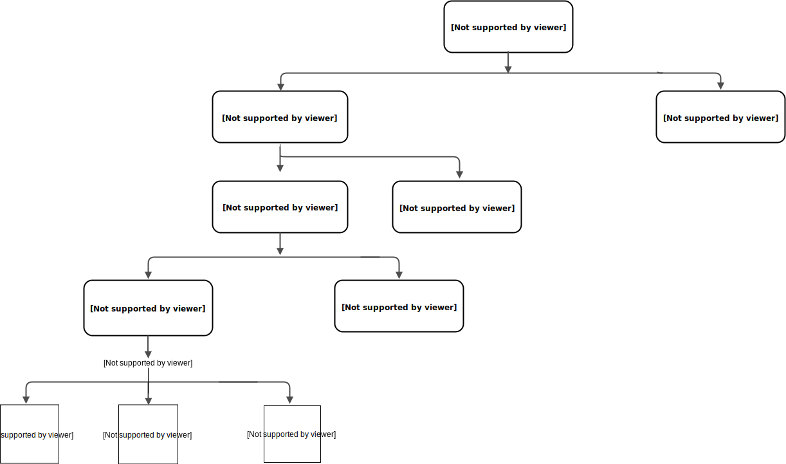

.. _2017_cause_lower_respiratory_infections:

============================
Lower Respiratory Infections
============================

Disease Description
-------------------

Lower respiratory infections(*LRI*), principally clinician-diagnosed pneumonia
and bronchiolitis, is a major global killer of both children and adults. Symptoms
include shortness of breath, weakness, fever, coughing and fatigue. It is important to check for a fever. Symptoms can last about 7 days and the infection is contagious
to others shortly before and while experiencing symptoms. It is mainly
caused by four microorganisms - Streptococcus pneumoniae(*pneumococcal
pneumonia*), Haemophilus influenzae type B(*Hib*),influenza, and respiratory
syncytial virus(*RCV*). LRI can be caused by multiple pathogens and the pathogens may co-infect.
Pneumococcal pneumonia is the largest cause of LRI
mortality. [Wikipedia]_, [GBD-2017-YLD-Capstone-Appendix-1]_

Modeling LRI in GBD 2017
------------------------

The GBD 2017 defined the time to recovery for LRI as an average of 10 days(*5-15 days*),
which corresponds with a remission 36.5.

GBD hierarchy
-------------

c_{} - cause_{gbd_id}

s_{} - sequelae_{gbd_id}

Cause Model Diagram
-------------------

.. image:: lri_disease_model.svg

Data Description
----------------
.. list-table:: **Definition**
   :widths: 5 30
   :header-rows: 1

   * - State
     - Definition
   * - I
     - Currently infected and having the condition
   * - S
     - Susceptible but does not currently have LRI

Model Assumptions and Limitations
---------------------------------
There is substantial additional effort in GBD to divide LRI
burden into the aetiologies of LRI, but we have not included
aetiologies in this simple model.

There are three sequelae associated with LRI. We do not consider Guillain-Barré syndrome
in this model because the prevalence of it is too low to affect the overall disability weight.

Validation Criteria
-------------------

.. todo::

   Describe tests for model validation.

References
----------

.. [Wikipedia] Lower respiratory tact infection. From Wikipedia, the Free Encyclopedia.
   Retrieved 22 Nov 2019.
   https://en.wikipedia.org/wiki/Lower_respiratory_tract_infection

.. [GBD-2017-YLD-Capstone-Appendix-1]
   Supplement to: `GBD 2017 Disease and Injury Incidence and Prevalence
   Collaborators. Global, regional, and national incidence, prevalence, and
   years lived with disability for 354 diseases and injuries for 195 countries
   and territories, 1990–2017: a systematic analysis for the Global Burden of
   Disease Study 2017. Lancet 2018; 392: 1789–858 <DOI for YLD Capstone_>`_
   (pp. 246-7)

<<<<<<< HEAD
   (Direct links to the YLD Appendix hosted on `Lancet.com <YLD appendix on Lancet.com_>`_
=======
   (Direct links to the YLD Appendix hosted on `Lancet.com <YLD appendix on Lancet.com_>`_
>>>>>>> 870cf794cbb8c655fb0884d185a0de251ac49d49
   and `ScienceDirect <YLD appendix on ScienceDirect_>`_)

.. _YLD appendix on Lancet.com: https://www.thelancet.com/cms/10.1016/S0140-6736(18)32279-7/attachment/6db5ab28-cdf3-4009-b10f-b87f9bbdf8a9/mmc1.pdf
.. _YLD appendix on ScienceDirect: https://ars.els-cdn.com/content/image/1-s2.0-S0140673618322797-mmc1.pdf
.. _DOI for YLD Capstone: https://doi.org/10.1016/S0140-6736(18)32279-7
