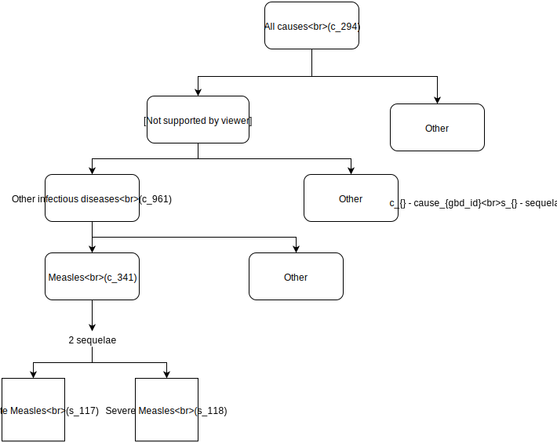

.. _2017_cause_measles:

.. |br| raw:: html
   
    
   
=======
Measles
=======

Disease Description
-------------------

Measles_ is a highly contagious, serious disease caused by the measles virus
(*Measles morbillivirus*). Symptoms usually develop 10-12 days after exposure to
the virus, and last 7-10 days. Symptoms include fever, cough, runny nose,
conjunctivitis, characteristic white spots inside the cheek (called Koplik's
spots), and a red, flat, blotchy skin rash that develops on average 14 days
after exposure to the virus (range, 7-21 days) and lasts 5-6 days. Recovery from
measles confers lifelong immunity. [WHO]_, [CDC]_, [Wikipedia]_,
[GBD-2017-YLD-Capstone-Appendix-1]_

Most measles-related deaths are caused by complications associated with the
disease. The most serious complications include blindness, encephalitis, severe
diarrhea, ear infections, and pneumonia. Serious complications are more common
in children under the age of 5 or adults over the age of 30, especially those
with vitamin A deficiency or those whose immune systems have been weakened by
HIV/AIDS or other diseases [WHO]_.

Measles is spread by coughing and sneezing, close personal contact, or direct
contact with infected nasal or throat secretions. The virus remains active and
contagious in the air or on infected surfaces for up to 2 hours. It can be
transmitted by an infected person from 4 days prior to the onset of the rash to
4 days after the rash erupts [WHO]_, [CDC]_, [Wikipedia]_.

Before the introduction of a measles vaccine in 1963 and widespread vaccination,
major epidemics occurred approximately every 2–3 years, and measles caused an
estimated 2.6 million deaths each year. Despite the availability of a vaccine,
approximately 110,000 people died from measles in 2017, mostly children under
the age of 5 years. However, due to accelerated immunization activities, global
measles deaths have decreased 80% during the period 2000–2017, from an estimated
545,000 to  110,000, and measles vaccination prevented an estimated  21.1
million deaths during 2000–2017 [WHO]_.

The `ICD 10`_ codes for measles are B05-B05.9, Z24.4, and ICD 9 codes are
055-055.9, 484.0, V04.2, V73.2 [GBD-2017-YLD-Capstone-Appendix-1]_.

.. _measles: https://en.wikipedia.org/wiki/Measles
.. _ICD 10: https://en.wikipedia.org/wiki/ICD-10

.. todo::

   Add data about global vaccine coverage and efficacy. Perhaps start with these references:

   - https://www.who.int/gho/mdg/child_mortality/situation_trends_measles_immunization/en/

   - https://www.who.int/immunization/newsroom/measles-data-2019/en/

   Also perhaps note this recent New York Times article (Oct 31, 2019):

     `Measles Makes Your Immune System’s Memory Forget Defenses Against Other Illnesses <https://www.nytimes.com/2019/10/31/health/measles-vaccine-immune-system.html?action=click&amp;module=News&amp;pgtype=Homepage>`_:
     New research shows the virus can have devastating effects on the immune system that persist much longer than the illness itself.

Modeling Measles in GBD 2017
----------------------------

.. todo::

   Add relevant detail about measles modeling process from
   [GBD-2017-YLD-Capstone-Appendix-1]_ and from the `CoD Capstone
   <http://dx.doi.org/10.1016/S0140-6736(18)32203-7>`_ Appendix. Note that each
   country's vaccine coverage went into the estimation of measles incidence
   rates, which are then multiplied by an average disease duration of 10 days to
   compute prevalence.

   Describe enough of the data sources and modeling process to verify that even
   though  measles can lead to diarrhea or other causes that we include in our
   Vivarium models, we won't be double counting mortality and morbidity from
   these causes. For example, a death caused by diarrheal dehydration due to
   measles should be counted in the GBD as a death due to measles, not as a
   death due to diarrheal diseases.

   The relationship with vitamin A deficiency may also be important for our
   models.

   Make sure to check on measles sequelae as well. Our models so far have not paid much attention to the nonfatal side, but it looks like some of the complications can persist well after someone recovers from measles, so maybe that's important to think about.

GBD Hierarchy
-------------

**Hierarchy Diagram:**

   

Cause Model Diagram
-------------------

.. image:: measles_cause_model.svg
	:width: 600
	:alt: Simple SIR Measles cause model diagram

Model Assumptions and Limitations
---------------------------------

This model is designed to be used for estimating DALYs due to measles that are
averted from a country-level intervention (e.g. food fortification or
supplementation given to a percentage of the population) that can reduce measles
incidence as a downstream effect.

In particular, there are various uses for which this model is **not** suitable.
For example:

1. The simple measles model described here does not explicitly incorporate
vaccine coverage or efficacy, hence cannot be used to model the impact of a
vaccination campaign.

2. This model uses country-level data, and cannot be used to model local measles
outbreaks due to lack of vaccination in small communities.

.. todo::

   Describe more assumptions and limitations of the model.

Data Description
----------------

.. list-table:: Definitions
   :widths: 25 50
   :header-rows: 1

   * - State
     - Definition
   * - S
     - Susceptible to measles
   * - I
     - Infected with measles
   * - R
     - Recovered from measles

.. list-table:: States Data
   :widths: 20 25 30 30
   :header-rows: 1
   
   * - State
     - Measure
     - Value
     - Notes
   * - S
     - prevalence
     - 1-prevalence_c341
     - 
   * - S
     - excess mortality |br| rate
     - 0
     - 
   * - S
     - disabilty weights
     - 0
     -
   * - I
     - prevalence
     - prevalence_c341
     - 
   * - I
     - excess mortality |br| rate
     - :math:`\frac{\text{deaths_c341}}{\text{population * prevalence_c341}}`
     - 
   * - I
     - disability weights
     - disability_weight_s117* |br| prevalence_s117+ |br| disability_weight_s118* |br| prevalence_s118
     - GBD assumes 50% of measles |br| cases as severe and other 50% |br| as moderate |br| [GBD-2017-YLD-Capstone-Appendix-1]_.
   * - R
     - prevalence
     - 0
     - Clearly room for improvement. |br| This is done to simplify the model |br| as the focus is on LSFF but not |br| on measles.
   * - R
     - excess mortality |br| rate
     - 0
     - 
   * - R
     - disabilty weights
     - 0
     - 
   * - ALL
     - cause specific |br| mortality rate
     - :math:`\frac{\text{deaths_c341}}{\text{population}}`
     - 

.. list-table:: Transition Data
   :widths: 10 10 10 30 30
   :header-rows: 1
   
   * - Transition
     - Source 
     - Sink 
     - Value
     - Notes
   * - i
     - S
     - I
     - incidence_rate_c341
     - Incidence rate in |br| total population
   * - r
     - I
     - R
     - remission_rate_c341 |br| :math:`= \frac{\text{1}}{\text{10 person-days * 365 person-days}}` |br| :math:`= 36.5`
     - GBD assumes average |br| case duration as 10 days |br| [GBD-2017-YLD-Capstone-Appendix-1]_. |br| So remission is approximated |br| to this calculation. 

.. list-table:: Data Sources
   :widths: 20 25 25 25
   :header-rows: 1
   
   * - Measure
     - Sources
     - Description
     - Notes
   * - prevalence_c341
     - COMO
     - Prevalence of cause measles
     - 
   * - deaths_c341
     - CoDCorrect
     - Deaths from measles
     - 
   * - population
     - Demography
     - Mid-year population for |br| given country
     - 
   * - incidence_rate_c341
     - COMO
     - Incidence rate for measles
     - 
   * - remission_rate_c341
     - Calculation
     - Remission rate for measles
     - 
   * - disability_weight_{sid}
     - GBD YLD Appendix
     - Disability weights associated |br| with each sequelae
     - 
   * - prevalence_{sid}
     - COMO
     - Prevalence of each sequelae
     - 

Validation Criteria
-------------------

.. todo::

   Describe tests for model validation.

References
----------

.. [WHO] Measles Fact Sheet. World Health Organization, 9 May 2019.
   Retrieved 13 Nov 2019.
   https://www.who.int/news-room/fact-sheets/detail/measles

.. [CDC] Chapter 13: Measles.
   :title:`Epidemiology and Prevention of Vaccine-Preventable Diseases
   (The Pink Book, 13th Edition)`.
   Centers for Disease Control and Prevention, 2015.
   Retrieved 13 Nov 2019.
   https://www.cdc.gov/vaccines/pubs/pinkbook/meas.html

.. [Wikipedia] Measles. From Wikipedia, the Free Encyclopedia.
   Retrieved 13 Nov 2019.
   https://en.wikipedia.org/wiki/Measles

.. [GBD-2017-YLD-Capstone-Appendix-1]
   Supplement to: `GBD 2017 Disease and Injury Incidence and Prevalence
   Collaborators. Global, regional, and national incidence, prevalence, and
   years lived with disability for 354 diseases and injuries for 195 countries
   and territories, 1990–2017: a systematic analysis for the Global Burden of
   Disease Study 2017. Lancet 2018; 392: 1789–858 <DOI for YLD Capstone_>`_
   (pp. 246-7)

   (Direct links to the YLD Appendix hosted on `Lancet.com <YLD appendix on Lancet.com_>`_ and `ScienceDirect <YLD appendix on ScienceDirect_>`_)

.. _YLD appendix on Lancet.com: https://www.thelancet.com/cms/10.1016/S0140-6736(18)32279-7/attachment/6db5ab28-cdf3-4009-b10f-b87f9bbdf8a9/mmc1.pdf
.. _YLD appendix on ScienceDirect: https://ars.els-cdn.com/content/image/1-s2.0-S0140673618322797-mmc1.pdf
.. _DOI for YLD Capstone: https://doi.org/10.1016/S0140-6736(18)32279-7
