.. _2017_cause_neural_tube_defects:

===================
Neural Tube Defects
===================

Disease Description
-------------------

Neural tube defects occur when the neural tube fails to close completely during
development. The GBD 2017 case definition includes **spina bifida**, in which
part of the spinal cord and/or meninges are uncovered by skin;
**encephalocele**, a congenital defect characterized by sac-like protrusions of
the brain and meninges through openings in the skull; and **anencephaly**, the
absence of a major portion of the brain, skull, and scalp. *Spina bifida
occulta*, a much less severe form of spina bifida where the defect in vertebral
column remains covered by skin, is excluded from the GBD case definition of
spina bifida.

All infants born with anencephaly die during the first few weeks of life, as
there is no remission and no cure for this condition. Infants born with spina
bifida or encephalocele typically require surgical intervention during the first
few weeks of life, and thereafter may experience a range of neural and motor
complications. The GBD 2017 case definitions of spina bifida and encephalocele
do not consider surgical intervention for either condition as remission.

Spina bifida corresponds to the ICD-10_ codes Q05.0, Q05.4,Q05.6, Q05.7, Q05.8,
and Q05.9. Encephalocele corresponds to the ICD-10 codes Q01.2, Q01.8, and
Q01.9. Anencephaly corresponds to the ICD-10 codes Q00.0 and Q00.2.
[GBD-2017-YLD-Capstone-Appendix-1-Neural-Tube-Defects]_

.. _ICD-10: https://en.wikipedia.org/wiki/ICD-10

.. todo::

   Add more information and references. In particular, find data about global prevalence and relation to folic acid during pregnancy.

Modeling Neural Tube Defects in GBD 2017
----------------------------------------

Congenital Anomalies in GBD 2017
++++++++++++++++++++++++++++++++

GBD 2017 uses similar modeling strategies to estimate the prevalence and
resulting disability and mortality of the following eight categories of
congenital anomalies: neural tube defects; congenital heart anomalies; orofacial
clefts; chromosomal disorders; congenital musculoskeletal anomalies; congenital
urogenital anomalies; congenital digestive anomalies; and other congenital birth
defects.

The GBD case definition of congenital anomalies includes any condition present
at birth that is a result of abnormalities of embryonic development, excluding
those that are directly the result of infections or substance abuse (e.g. fetal
alcohol syndrome, congenital syphilis) and excludes minor anomalies as they are
defined by EUROCAT. Further, our GBD case definition includes only live births
and excludes all terminations of pregnancy following prenatal diagnosis and
stillbirths.

Modeling Strategy for Neural Tube Defects
+++++++++++++++++++++++++++++++++++++++++

In GBD 2017, spina bifida, encephalocele, and anencephaly are each modeled
separately and then fit to a total model of all neural tube defects.

.. todo::

   Add relevant detail about NTD modeling process from
   [GBD-2017-YLD-Capstone-Appendix-1-Neural-Tube-Defects]_ and from the `CoD Capstone
   <http://dx.doi.org/10.1016/S0140-6736(18)32203-7>`_ Appendix.

Cause Hierarchy
+++++++++++++++

.. todo::

   Make cause hierarchy diagram.

     | cause id = 642
     | level = 4

Sequelae and health states associated with Neural Tube Defects
++++++++++++++++++++++++++++++++++++++++++++++++++++++++++++++

The Neural Tube Defects cause has 85 sequelae, which can be summarized as follows:

- All infants with anencephaly are assigned the health state of severe motor and
  cognitive impairment.
- Cases of spina bifida and encephalocele are split into
  every combination of mild, moderate and severe motor impairment, all severities
  of intellectual disability, and urinary incontinence.
- The proportions of the various sequelae were
  calculated using a pooled analysis of available literature on the long-term
  outcomes in cohorts of individuals born with each sub-type of neural tube
  defects.
- The distribution of health states associated with encephalocele was
  derived separately from the distribution of health states associated with spina
  bifida, although these two categories of neural tube defects are associated with
  the same list of long-term outcome sequela.

Cause Model Diagram
-------------------

There are two possible states for this cause, "with-condition" and
"without-condition":

There is no transition between the states; each person is born into one state or
the other and permanently stays in that state. Thus, incidence and remission
rates are zero.

GBD 2017 estimates the prevalence of neural tube defects for every year, sex,
age, and location combination. These prevalence values can be used to initialize
the model with the correct fraction of people in each of the two model states.

People born into the simulation should enter the "with-condition" state
according to the birth prevalence of neural tube defects; if this data is
unavailable, we can estimate the birth prevalence using the prevalence and
mortality rates in the early neonatal age group.

.. todo::

    Look into data sources. In particular, is birth prevalence data available,
    or do we need to estimate it using prevalence among the early neonatal age
    group?

Data Description
----------------

State and Transition Data Tables
++++++++++++++++++++++++++++++++

.. list-table:: State Definitions
   :widths: 1, 5, 10
   :header-rows: 1

   * - State
     - State Name
     - Definition
   * - C
     - With **C**\ ondition
     - Born with neural tube defects
   * - F
     - **F**\ ree of Condition
     - Born without neural tube defects

.. list-table:: State Data
   :widths: 1, 5, 5, 10
   :header-rows: 1

   * - State
     - Measure
     - Value
     - Notes
   * - C
     - Prevalence
     - prevalence_c642
     -
   * - C
     - Birth prevalence
     - birth_prevalence_c642
     -
   * - C
     - Excess mortality rate
     - :math:`\frac{\text{deaths_c642}}{\text{population } \times \text{ prevalence_c642}}`
     -
   * - C
     - Disability weight
     - :math:`\displaystyle{\sum_{s\in \text{sequelae_c642}}} \scriptstyle{\text{disability_weight}_s \times \text{ prevalence}_s}`
     - Average disability weight over all sequelae
   * - F
     - Proportion of population
     - 1 -- prevalence_c642
     -
   * - F
     - Proportion of births
     - 1 -- birth_prevalence_c642
     -
   * - F
     - Excess mortality rate
     - 0
     -
   * - F
     - Disability weight
     - 0
     -
   * - All
     - Cause-specific mortality rate
     - cause_specific_mortality_rate_c642
     -

.. list-table:: Transition Data
   :widths: 1, 1, 1, 5, 10
   :header-rows: 1

   * - Transition
     - Source State
     - Sink State
     - Value
     - Notes
   * - N/A
     - N/A
     - N/A
     - N/A
     - N/A

.. list-table:: Data Sources
   :widths: 1, 3, 10
   :header-rows: 1

   * - Value
     - Source
     - Notes
   * - prevalence_c642
     -
     -
   * - birth_prevalence_c642
     -
     -
   * - deaths_c642
     -
     -
   * - population
     -
     -
   * - cause_specific_mortality_rate_c642
     -
     -

Restrictions
++++++++++++

.. todo::

   Describe data restrictions. For example:

     yll_age_group_id_start=2,
     yll_age_group_id_end=17,

     yld_age_group_id_start=2,
     yld_age_group_id_end=235,

Model Assumptions and Limitations
---------------------------------

This model is designed to be used for estimating DALYs due to NTDs that are
averted from an intervention that directly reduces the prevalence of neural tube
defects, such as large-scale fortification of flour with folic acid, or targeted
folic acid supplementation during pregnancy.

Validation Criteria
-------------------

.. todo::

   Describe tests for model validation.

References
----------

.. [GBD-2017-YLD-Capstone-Appendix-1-Neural-Tube-Defects]
   Supplement to: `GBD 2017 Disease and Injury Incidence and Prevalence
   Collaborators. Global, regional, and national incidence, prevalence, and
   years lived with disability for 354 diseases and injuries for 195 countries
   and territories, 1990–2017: a systematic analysis for the Global Burden of
   Disease Study 2017. Lancet 2018; 392: 1789–858 <DOI for YLD Capstone_>`_
   (pp. 658-694)

   (Direct links to the YLD Appendix hosted on `Lancet.com <YLD appendix on Lancet.com_>`_ and `ScienceDirect <YLD appendix on ScienceDirect_>`_)

.. _YLD appendix on Lancet.com: https://www.thelancet.com/cms/10.1016/S0140-6736(18)32279-7/attachment/6db5ab28-cdf3-4009-b10f-b87f9bbdf8a9/mmc1.pdf
.. _YLD appendix on ScienceDirect: https://ars.els-cdn.com/content/image/1-s2.0-S0140673618322797-mmc1.pdf
.. _DOI for YLD Capstone: https://doi.org/10.1016/S0140-6736(18)32279-7
