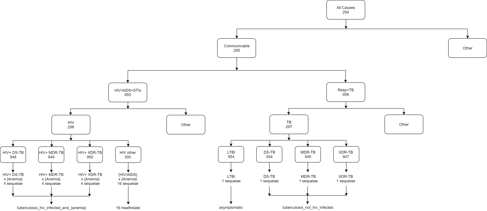

.. _cause_model_validation:

========================================
TB/HIV model validation and verification
========================================

Obejective
----------
External
	- Model results should be checked against local TB epidemiology
		- e.g. rate of decline in burden of disease should be compared
		  with historical evidence.
	- Compare our results (e.g. ICERs) to similar models or empirical
	  assessments where possible
Internal
	- Calibrate simulation baseline against GBD 2017 results
		- Sim outputs mean should perfectly match GBD results
		- Sim outputs uncertainty should wider than GBD results
			- Stochastic + individual heterogeneity

logic
-----
- Parent cause is the sum of child causes
	- Fatal: Deaths (CSMR, Excess MR), YLLs
	- Non-fatal: Cases, YLDs, Prevalence, Incidence
	- DALYs = YLLs + YLDs
- By location-/age-/sex-
- Start from count space
- We expect that active TB cases < LTBI cases when LTBI prevalence
  as denominator

Cause hierarchy
---------------

How GBD post-processing results
-------------------------------
GBD starts from All-form TB results
	1. Find proportion of HIV+ cases among all TB cases
	2. Disaggregate into HIV+ TB and HIV- TB
	3. Find proportion of drug-resistant cases among HIV+ TB cases
	   and HIV- TB cases
	4. Disaggregate into:
		- drug-susceptible TB, multidrug-resistant TB, and extensively
		  drug-resistant TB
		- HIV+ drug-susceptible TB, HIV+ multidrug-resistant TB,
		  and HIV+ extensively drug-resistant TB

Formula
-------
For certain location-/age-/sex-
	- Deaths due to all causes equal to sum of:
		- Deaths due to all-form TB (aggregate all child active TB causes)
		- Deaths due to HIV resulting in other diseases
		- Deaths due to other causes
Apply the formula to other measures (e.g. DALYs)

Steps of model verification
---------------------------
- Step 1 (do it before and after simulation runs)
	- CSMR = Sum(Prev_s * ExcessMR_s)
		- e.g. IHD model has three states: S, MI, Chronic
	- Prev ~ Incidence / (Remission + Excess MR)
	- Plot data
- Step 2 (do it after simulation runs)
	- Constrained verification
		- e.g. compare (disease counts / person time) to incidence in GBD
	- Unconstrained verification
		- CSMR
		- YLLs
		- YLDs

Minimal model verification
--------------------------

Model verification workflow
---------------------------
1. Minimal model - [1]
2. [1] + household contacts - [2]
3. Full model - [3] (depends on project timeline)
	- [2] + baseline treatment + intervention + drug susceptibility
	- [2] + drug susceptibility + baseline treatment + intervention

