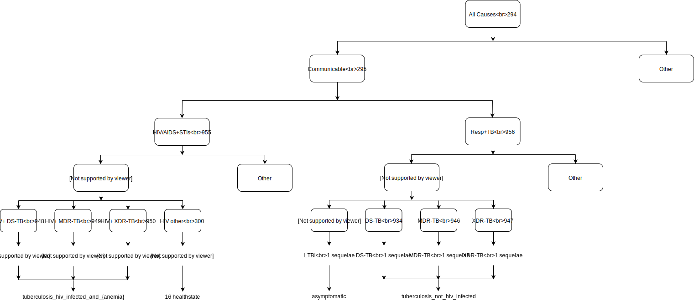
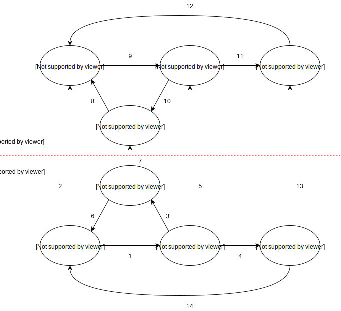

.. _tuberculosis_model:

=====================
Modeling Tuberculosis
=====================

TB Overview
-----------
Tuberculosis (TB) is a disease caused by the bacteria Mycobacterium
tuberculosis. It most commonly affects the lungs, although it can affect
other parts of the body. TB can be fatal if not recognized and treated.
It also can spread from person to person to infect others. Anyone who 
inhales the airborne droplets that contains TB bacteria is called a "contact".
A contact can be someone who living with the person who has infectious TB,
like a family member, friend, or coworker. `UpToDate <https://www.uptodate.com/
contents/tuberculosis-beyond-the-basics>`_

What is Latent TB?
------------------
Latent tuberculosis infection (LTBI) is defined as a state of persistent
immune response to stimulation by Mycobacterium tuberculosis antigens with
no evidence of clinically manifest active TB. (WHO)

What is Active TB?
------------------
Active tuberculosis, also known as reactivation TB. It occurs when individual's
immune system becomes weakened and is no longer able to contain the latent bacteria;
then the TB bacteria become "active", overwhelm the immune system and cause a person
to become ill. (UpToDate) In GBD, Active TB consist of 6 causes: Drug-susceptible
TB, Multidrug-resistant TB, Extensively drug-resistant TB, HIV/AIDS - Drug-susceptible
TB, HIV/AIDS - Multidrug-resistant TB, and HIV/AIDS - Extensively drug-resistant TB.

TB Progression
--------------
Active TB disease developed within 2 years called fast progression, Individuals
who do not have rapid progression are classified as having slow-progressing latent
tuberculosis infection. With latent infection, individuals experience no adverse
health effects and will not transmit Mycobacterium tuberculosis, but they face
an ongoing risk of developing active tuberculosis through reactivation.

What is TB/HIV model?
---------------------
It's a complex joint model that includes both tuberculosis and HIV/AIDS in the model.
We model TB and HIV together since GBD 2017 TB model only involves HIV negative TB portion
and we intend to model the impact of HIV on TB as well.  

GBD hierarchy
-------------

- {Anemia} = [no_anemia, mild_anemia, moderate_anemia, severe_anemia]
- {HIV/AIDS} = [early_hiv, symptomatic_hiv, hiv_aids_with_art, aids]

Cause model diagram
------------------------

Data sources
------------
.. csv-table:: *State Measures*
   :file: state_inputs.csv
   :header-rows: 1

.. csv-table:: *Transitions*
   :file: transitions.csv
   :header-rows: 1

The most recent model inputs documentation lives at
`J:/Project/simulation_science/latent_tuberculosis_infection/report/model_inputs_researcher_ltbi.docx`

========================================
TB/HIV model validation and verification
========================================

Obejective
----------
External
	- Model results should be checked against local TB epidemiology
		- e.g. rate of decline in burden of disease should be compared
		  with historical evidence.
	- Compare our results (e.g. ICERs) to similar models or empirical
	  assessments where possible
Internal
	- Calibrate simulation baseline against GBD 2017 results
		- Sim outputs mean should perfectly match GBD results.
		- Sim outputs uncertainty should be wider than GBD results,
		  because both stochastic and parametric uncertainty are included.

logic
-----
- Parent cause is the sum of child causes
	- Fatal: Deaths (CSMR, Excess MR), YLLs
	- Non-fatal: Cases, YLDs, Prevalence, Incidence
	- DALYs = YLLs + YLDs
- By location-/age-/sex-
- Start from count space
- We expect that total active TB cases less than LTBI cases for sim output
  of event count

How GBD post-processing results
-------------------------------
GBD starts from All-form TB results
	1. Find proportion of HIV+ cases among all TB cases
	2. Disaggregate into HIV+ TB and HIV- TB
	3. Find proportion of drug-resistant cases among HIV+ TB cases
	   and HIV- TB cases
	4. Disaggregate into:
		- drug-susceptible TB, multidrug-resistant TB, and extensively
		  drug-resistant TB
		- HIV+ drug-susceptible TB, HIV+ multidrug-resistant TB,
		  and HIV+ extensively drug-resistant TB

Formula
-------
For certain location-/age-/sex-
	- Deaths due to all causes equal to sum of:
		- Deaths due to all-form TB (aggregate all child active TB causes)
		- Deaths due to HIV resulting in other diseases
		- Deaths due to other causes
Apply the formula to other measures (e.g. DALYs)

Steps of model verification
---------------------------
- Step 1 (do it before and after simulation runs)
	- CSMR_297 + CSMR_298 = Sum(Prev_s * ExcessMR_s)
	- ylds_297 + ylds_298 = Sum(Prev_i * dw_i)
	- Prev ~ Incidence / (Remission + Excess MR)
	- Plot data
- Step 2 (do it after simulation runs)
	- Constrained verification
		- e.g. compare (disease counts / person time) to incidence in GBD
	- Unconstrained verification
		- CSMR
		- YLLs
		- YLDs