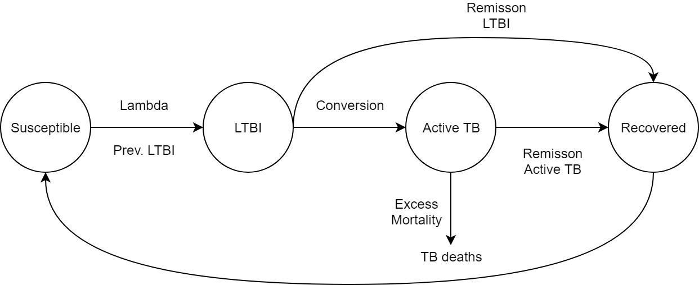
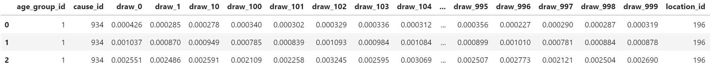

.. _tuberculosis_model:

=====================
Modeling tuberculosis
=====================

TB Overview
-----------
Tuberculosis (TB) is a disease caused by the bacteria Mycobacterium
tuberculosis. It most commonly affects the lungs, although it can affect
other parts of the body. TB can be fatal if not recognized and treated.
It also can spread from person to person to infect others. Anyone who 
inhales the airborne droplets that contains TB bacteria is called a "contact".
A contact can be someone who living with the person who has infectious TB,
like a family member, friend, or coworker. `UpToDate <https://www.uptodate.com/
contents/tuberculosis-beyond-the-basics>`_

What is Latent TB?
------------------
Latent tuberculosis infection (LTBI) is defined as a state of persistent
immune response to stimulation by Mycobacterium tuberculosis antigens with
no evidence of clinically manifest active TB. (WHO)

What is Active TB?
------------------
Active tuberculosis, also known as reactivation TB. It occurs when individual's
immune system becomes weakened and is no longer able to contain the latent bacteria;
then the TB bacteria become "active", overwhelm the immune system and cause a person
to become ill. (UpToDate) In GBD, Active TB consist of 6 causes: Drug-susceptible
TB, Multidrug-resistant TB, Extensively drug-resistant TB, HIV/AIDS - Drug-susceptible
TB, HIV/AIDS - Multidrug-resistant TB, and HIV/AIDS - Extensively drug-resistant TB.

TB Progression
--------------
Active TB disease developed within 2 years is called fast progression, Individuals
who do not have rapid progression are classified as having slow-progressing latent
tuberculosis infection. With latent infection, individuals experience no adverse
health effects and will not transmit Mycobacterium tuberculosis, but they face
an ongoing risk of developing active tuberculosis through reactivation.

TB cause model structure
------------------------

State
	- Susceptible: not infected with TB and not previously exposed
	- Recovered: non-TB infected and with a sequela of "had TB"
Initialization
	- Prev.LTBI: prevalence of latent TB infection
Transition
	- Lambda: force of infection for Mycobacterium tuberculosis
	- Conversion: transition probability from LTBI to Active TB
	- Remisson LTBI: measuring the "flow" of LTBI to Recovered
	- Remisson Active Tb: measuring the "flow" of Active TB to Recovered
	- Excess Mortality: Excess mortality of Active TB used to calculate TB related deaths

Common data sources
-------------------
Using ``get_measure`` pull simulation-prepared prevalence data for LTBI in South Africa.

.. code-block:: python

	from gbd_mapping import causes
	from vivarium_inputs import get_measure

	prev = get_measure(causes.latent_tuberculosis_infection, 'prevalence', 'South Africa')
	print(prev.head())

::

	   draw      location     sex  age_group_start  age_group_end  year_start  year_end     value
	0     0  South Africa  Female              0.0       0.019178        1990      1991  0.251492
	1     0  South Africa  Female              0.0       0.019178        1991      1992  0.246416
	2     0  South Africa  Female              0.0       0.019178        1992      1993  0.242721
	3     0  South Africa  Female              0.0       0.019178        1993      1994  0.240125
	4     0  South Africa  Female              0.0       0.019178        1994      1995  0.238365

Using ``get_draw`` pull gbd draw-level measures for Drug-susceptible TB in 2017 South Africa male under 5; for gbd_id_type="cause_id", sources come from codem, como, codcorrect, or dalynat.

.. code-block:: python

	from get_draws.api import get_draws

	data = get_draws('cause_id', 934, source='como', location_id=196, year_id=2017,
	                 age_group_id=1, sex_id=1, gbd_round_id=5)
	data

Using ``get_outputs`` pull gbd country-specific incidence rate for all active TB.

.. code-block:: python

	from db_queries import get_outputs

	incidence = get_outputs('cause', cause_id=[934,946,947,948,949,950], metric_id=3, 
	                        measure_id=6, location_id='lvl3', gbd_round_id=5)
	incidence.head().iloc[:, 6:]

.. image:: get_outputs_table.png
