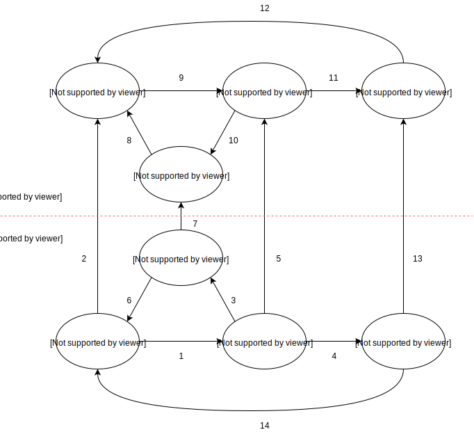

.. _tuberculosis_model:

=====================
Modeling Tuberculosis
=====================

TB Overview
-----------

TB Definitions
++++++++++++++
Tuberculosis (TB) is a disease caused by the bacteria Mycobacterium
tuberculosis. It most commonly affects the lungs, although it can affect
other parts of the body. TB can be fatal if not recognized and treated.
It also can spread from person to person to infect others. Anyone who 
inhales the airborne droplets that contains TB bacteria is called a "contact".
A contact can be someone who living with the person who has infectious TB,
like a family member, friend, or coworker. `UpToDate <https://www.uptodate.com/
contents/tuberculosis-beyond-the-basics>`_

What is Latent TB?
++++++++++++++++++
Latent tuberculosis infection (LTBI) is defined as a state of persistent
immune response to stimulation by Mycobacterium tuberculosis antigens with
no evidence of clinically manifest active TB. (WHO)

What is Active TB?
++++++++++++++++++
Active tuberculosis, also known as reactivation TB. It occurs when individual's
immune system becomes weakened and is no longer able to contain the latent bacteria;
then the TB bacteria become "active", overwhelm the immune system and cause a person
to become ill. (UpToDate) In GBD, Active TB consist of 6 causes: Drug-susceptible
TB, Multidrug-resistant TB, Extensively drug-resistant TB, HIV/AIDS - Drug-susceptible
TB, HIV/AIDS - Multidrug-resistant TB, and HIV/AIDS - Extensively drug-resistant TB.

TB Progression
++++++++++++++
Active TB disease developed within 2 years called fast progression, Individuals
who do not have rapid progression are classified as having slow-progressing latent
tuberculosis infection. With latent infection, individuals experience no adverse
health effects and will not transmit Mycobacterium tuberculosis, but they face
an ongoing risk of developing active tuberculosis through reactivation.

What is TB/HIV model?
+++++++++++++++++++++
It's a complex joint model that includes both tuberculosis and HIV/AIDS in the model.
We model TB and HIV together since GBD has also studied the impact of HIV on TB as well.
Note that we have excluded the active TB drug resistance for our model and GBD predicted
the proportion of new TB cases with MDR-TB or XDR-TB by ST-GPR.
(GBD appendix: 03_Hmwe_TB_Nonfatal2017_resub)  

GBD hierarchy
-------------
.. csv-table:: **Hierarchy**
   :file: cause_hierarchy.csv
   :header-rows: 1

- {Anemia} = [no_anemia, mild_anemia, moderate_anemia, severe_anemia]
- {HIV/AIDS} = [early_hiv, symptomatic_hiv, hiv_aids_with_art, aids]
The causes in the GBD at any level of hierarchy are mutually exclusive
and collectively exhaustive. 

Cause model diagram
-------------------

Data sources
------------
.. csv-table:: **Abbreviations**
   :file: abbreviations.csv
   :header-rows: 1

.. csv-table:: **State Measures**
   :file: state_inputs.csv
   :header-rows: 1

.. csv-table:: **Transitions**
   :file: transitions.csv
   :header-rows: 1

Modeling strategy for non-standard data sources
-----------------------------------------------
LTBI incidence calculation
 - We ran dismod_mr 1.1.0 and used LTBI prevalence, excess MR (equivalent to 
   AcTB incidence / LTBI prevalence), remission (zero), and all causes CSMR as 
   inputs to back calculate the LTBI incidence data that are not exist in GBD. 
   Then we load the location-/age-/sex-/year-/draw- specific LTBI incidence 
   estimates into the artifact. (Note that the age range for estimated LTBI
   incidence is 0 to 100 and age interval equal to one.)
TB remission
 - The current model applied all-form active TB remission (dismod_id=9422)
   to inform the transition flow from HIV positive active TB and HIV negative
   active TB back to susceptible. The future plan is to disaggregate the all-form
   active TB remission by HIV status based on TB duration data. (WHO)

TB/HIV model validation and verification
----------------------------------------

Obejective
++++++++++
External
    - Model results should be checked against local TB epidemiology
        - e.g. rate of decline in burden of disease should be compared
          with historical evidence.
    - Compare our results (e.g. ICERs) to similar models or empirical
      assessments where possible
Internal
    - Calibrate simulation baseline against GBD 2017 results
        - Sim outputs mean should perfectly match GBD results.
        - Sim outputs uncertainty should be wider than GBD results,
          because both stochastic and parametric uncertainty are included.

logic
+++++
- Parent cause is the sum of child causes
    - Fatal: Deaths (CSMR, Excess MR), YLLs
    - Non-fatal: Cases, YLDs, Prevalence, Incidence
    - DALYs = YLLs + YLDs
- By location-/age-/sex-
- Start from count space
- We expect that total active TB cases less than LTBI cases for sim output
  of event count

How GBD post-processing results
+++++++++++++++++++++++++++++++
GBD starts from All-form TB results
    1. Find proportion of HIV+ cases among all TB cases
    2. Disaggregate into HIV+ TB and HIV- TB
    3. Find proportion of drug-resistant cases among HIV+ TB cases
       and HIV- TB cases
    4. Disaggregate into:
        - drug-susceptible TB, multidrug-resistant TB, and extensively
          drug-resistant TB
        - HIV+ drug-susceptible TB, HIV+ multidrug-resistant TB,
          and HIV+ extensively drug-resistant TB

Formula
+++++++
For certain location-/age-/sex-
    - Deaths due to all causes equal to sum of:
        - Deaths due to all-form TB (aggregate all child active TB causes)
        - Deaths due to HIV resulting in other diseases
        - Deaths due to other causes
Apply the formula to other measures (e.g. DALYs)

Steps of model verification
+++++++++++++++++++++++++++
1. Set hypothesis
    - The sum of the prevalences of all model states should equal
      to the GBD TB prevalence plus HIV prevalence. (Pre_297 + Prev_298
      = Sum(Prev_s))
    - The sum of the cause-specific mortality of all model states
      should equal to the GBD TB CSMR plus HIV CSMR. (CSMR_297 + 
      CSMR_298 = Sum(Prev_s * ExcessMR_s))
    - The prevalence weighted sum of the disability weight of all model states
      should equal to the GBD TB YLDs plus HIV YLDs. (ylds_297 + ylds_298 
      = Sum(Prev_s * dw_s))
2. Check for proposed hypothesis (e.g. prevalence for the whole model)
    - **Data:** Once the model input data is produced and put in the artifact,
      produce a graph of the sum of the input data prevalences and compare
      it to the GBD data not in the model.
    - **Sim initialization:** Initialize a simulation using the model input data
      and count the disease event to make sure it matches with GBD data 
      not in the model.
    - **Historical calibration:** Run a simulation from 2012 to 2017 and count
      the disease event at the end of the sim to make sure it matches with
      GBD data not in the model.
    - **Baseline verification:** Run a simulation from 2020 to 2025 and count
      the disease event at the end of the sim to make sure the baseline
      model outcomes match with GBD 2017 results.

