.. _2017_concept_model_vivarium_conic_lsff:

=============================================
Vivarium CoNIC Large Scale Food Fortification
=============================================

Model Overview
--------------

Objective
+++++++++

Intervention Definitions
++++++++++++++++++++++++

Questions of Interest
+++++++++++++++++++++

Scope of Modeling
+++++++++++++++++

Concept Model Diagram
---------------------

Model Components
----------------

Time
++++

* Start and end year: **2020 -- 2025**
* Simulation time step: **1 day** to capture short timeframe of diarrheal
  diseases and neonatal causes

Demographics
++++++++++++

* Locations: **Nigeria, India, Ethiopia**
* Population: **Prospective open cohort of 0-5 year-olds**
* Size of largest starting population: **100,000 simulants**
* Youngest start-age and oldest end-age: **0 -- 5 years**
* Exit age (at what age to stop tracking simulants): **5 years**
* Fertility: **Crude birth rate**

GBD Causes
++++++++++

* :ref:`Measles <2017_cause_measles>`

* :ref:`Diarrheal Diseases <2017_cause_diarrhea>`

* :ref:`Neural Tube Defects <2017_cause_neural_tube_defects>`

* :ref:`Lower Respiratory Infections <2017_cause_lower_respiratory_infections>`

* :ref:`Neonatal Encephalopathy <2017_cause_neonatal_encephalopathy>`

* :ref:`Neonatal Sepsis <2017_cause_neonatal_sepsis>`

* :ref:`Neonatal Jaundice <2017_cause_neonatal_jaundice>`

* :ref:`Other Neonatal Disorders <2017_cause_neonatal_other>`
  (Probably omit this cause, as we don't seem to have enough data to model it)

GBD Risks
+++++++++

* :ref:`Low Birth Weight and Short Gestation <2017_risk_lbwsg>`

PAF-of-1 Cause/Risk Pairs
+++++++++++++++++++++++++

* :ref:`Vitamin A Deficiency / Vitamin A Deficiency <2017_cause_vitamin_a_deficiency>`

* :ref:`Dietary Iron Deficiency / Iron Deficiency <2017_cause_iron_deficiency>`

Risk-Outcome Relationships
++++++++++++++++++++++++++

Coverage Gap Framework
++++++++++++++++++++++

Interventions
+++++++++++++

Vitamin A Fortification
~~~~~~~~~~~~~~~~~~~~~~~

Iron Fortification
~~~~~~~~~~~~~~~~~~

Folic Acid Fortification
~~~~~~~~~~~~~~~~~~~~~~~~

Desired Model Outputs
---------------------

Stratification
++++++++++++++

Stratify by **location, age, sex, and year**.

Observers
+++++++++

Verification and Validation Strategy
------------------------------------
