.. _2017_concept_model_iron_fortification:

================================
Iron Fortification Concept Model
================================

Intervention Definition
-----------------------

Case Definitions
++++++++++++++++

CONIC case definition(s)
  From 2019-08-01 email from BMGF: We want to model “staple food fortification
  (e.g., vitamin A, iron, other nutrients if you have them)” “it would be over
  3-5 years (e.g., going from 0 to universal or 80% coverage over this period)”

LIST case definition(s), if applicable
  [Check the `Lives Saved Tool (LiST) <https://www.livessavedtool.org/>`_ to see if there's anything comparable.]

Definition from systematic review (Gera et al. 2012)
  “The intervention was additional dietary iron through the route of food
  fortification or biofortification. Food for the purpose of this systematic
  review was defined as a usually consumed dietary item in the population,
  either in a raw or cooked form. Use of iron as a separate additive to dietary
  items (eg, as sprinkles) was not considered food fortification.”

Intervention Targets
++++++++++++++++++++

Case definition(s) and/or proximal GBD outcomes mortality/disability, diseases, risks, important covariates, related targets)
  Iron Deficiency Anemia impairment, which includes dietary iron deficiency as
  well as hemorrhagic causes that may be responsive to iron supplementation.

Other important outcomes of the intervention
  If we can find sufficient data, for the full model we will want to add in an
  effect on low birth weight (which then affects neonatal causes, LRI, and
  diarrheal diseases).

How well does GBD capture intervention targets (eg. missing risks, aggregate causes, etc.)?
  [Check this]

Concept Model Diagram
---------------------

Full model for iron fortification
+++++++++++++++++++++++++++++++++

Detail of iron fortification without LBW components
+++++++++++++++++++++++++++++++++++++++++++++++++++++

.. todo::

   Add Coverage Gap Component. Add specific neonatal causes.

Demographics
------------

Population
++++++++++

One of: Prospective, Retrospective, Both
  Prospective

Earliest likely start year, earliest likely end year (approximate)
  2020 - 2024

Smallest simulation time step (approximate)
  1 day to capture short timeframe of neonatal causes and diarrheal diseases. If
  omitting the LBWSG component, time step could be longer, e.g. 1 week.

Locations of Interest (the most likely 1-5 countries to be modeled, or if you need custom locations)
  Nigeria, India, Ethiopia

Size of largest starting population (approximate)
  100,000

Youngest start-age & oldest end-age
  0 - 5 years old

Exit age (at what age to stop tracking simulants)
  5 years

Fertility
+++++++++

Fertility (one of: None, Deterministic, Crude Birth Rate, Age-Specific Fertility)
  Crude Birth Rate

Other
+++++

Extenuating Circumstances (shocks, etc.) (if applicable)
  None

Other population Restrictions (if applicable)
  None

Minimal Model Implementation
----------------------------

Coverage Gap
++++++++++++

Review the Hub documentation on coverage gaps. If your intervention fits the framework, provide the following:

Target(s) (risk/cause)

Existing Coverage

Effect size (multiplicative)

Treatment algorithm: likely specify target coverage & linear scaleup. Or describe the intervention scenarios do you want to explore, and what parameters would be useful for that exploration/sensitivity analysis

If you are NOT using the Coverage Gap framework you must provide detailed description of the following:

Effects
+++++++

Intervention effect on targets (additive, multiplicative, etc.)
  Additive shift in mean of population hemoglobin distribution (modeled in
  IronDeficiency risk in GBD). Effect size from systematic review is +4.2 g/L,
  95% CI = [2.8, 5.6].

Does the size of the effect depend on the quality of treatment?
  No, we are not modeling variation in quality. A person either receives the
  fortified food or not. Each simulant is eligible to receive fortified food
  once they are 6 months old. Once a person receives the intervention, they
  continue receiving it indefinitely, with an option to stop the intervention at
  some point (see next point).

On how long someone has been receiving the intervention? If so, how?
  Assume the effect of the treatment ramps up from 0 to the maximum effect size
  logistically over a 2 month period (include a parameter to alter this period
  if necessary). For now, assume the effect persists until the end of the
  simulation, but include a parameter to turn it off at the individual level at
  some specified time.

Include equations and graphs where possible.
  [Add some equations and/or graphs]

Specification
+++++++++++++

Are the intervention targets specified in terms of something GBD models directly? If not, include a brief description of the targets and reference the relevant disease or risk section where you lay out the alternative modeling strategy for the intervention targets.
  Hemoglobin distribution is modeled in GBD by the Iron Deficiency risk.

Existing Coverage
+++++++++++++++++

Existing Coverage: Is there already coverage of the intervention in your target populations?  How should we account for it?
  Possibly. Start with 0% baseline coverage for minimal model, and include a parameter for baseline coverage that we can adjust later.

Treatment Algorithm
+++++++++++++++++++

How do we alter the coverage of the intervention in the target population?
  Suppose the program coverage is X%. When the intervention starts, X% of people
  over 6 months old should get the intervention. After the intervention is in
  place, whenever someone turns 6 months old, they have an X% chance of
  receiving the intervention.

At what timestep (or date) does your change go into effect? Eg. one-time intervention; distributed over time; provided due to a specific event (eg health outcome or facility visit).
  Assume program coverage remains at baseline coverage (0% for now) for one
  month, then increases linearly to 80% at the beginning of 2024, then remains
  constant throughout 2024.

Scenarios
+++++++++

What scenarios are you analyzing (e.g. community vs healthcare delivery platform)?
  The government mandates and enforces fortification of staple foods, gradually
  ramping up efforts until most of the population receives the desired
  fortification. Currently just one scenario, with maximum coverage of 80% after
  5 years.

Full Model Implementation
-------------------------

Effects
+++++++

If sufficient data, add effect on low birth weight (see concept model diagram above). Additive shift in birth weight (specified in mean shift with uncertainty in grams).

Specification
+++++++++++++

The GBD risk is Low Birth Weight and Short Gestation (LBWSG).

Existing Coverage
+++++++++++++++++

Once we have coverage data, we will want to add it in.

Treatment Algorithm
+++++++++++++++++++

We’ll need to design a separate algorithm for the effect on LBWSG.

Scenarios
+++++++++
Same, but with updated baseline coverage.
