.. _2017_concept_model_iron_fortification:

================================
Iron Fortification Concept Model
================================

Intervention Definition
-----------------------

Case Definitions
++++++++++++++++

CONIC case definition(s)
  From 2019-08-01 email from BMGF: We want to model “staple food fortification
  (e.g., vitamin A, iron, other nutrients if you have them)” “it would be over
  3-5 years (e.g., going from 0 to universal or 80% coverage over this period)”

LIST case definition(s), if applicable
  [Check the `Lives Saved Tool (LiST) <https://www.livessavedtool.org/>`_ to see if there's anything comparable.]

Definition from systematic review (Gera et al. 2012)
  “The intervention was additional dietary iron through the route of food
  fortification or biofortification. Food for the purpose of this systematic
  review was defined as a usually consumed dietary item in the population,
  either in a raw or cooked form. Use of iron as a separate additive to dietary
  items (eg, as sprinkles) was not considered food fortification.”

Intervention Targets
++++++++++++++++++++

Case definition(s) and/or proximal GBD outcomes mortality/disability, diseases, risks, important covariates, related targets)
  Iron Deficiency Anemia impairment, which includes dietary iron deficiency as
  well as hemorrhagic causes that may be responsive to iron supplementation.

Other important outcomes of the intervention
  If we can find sufficient data, for the full model we will want to add in an
  effect on low birth weight (which then affects neonatal causes, LRI, and
  diarrheal diseases).

How well does GBD capture intervention targets (eg. missing risks, aggregate causes, etc.)?
  [Check this]

Concept Model Diagram
---------------------

Full model for iron fortification
+++++++++++++++++++++++++++++++++

.. image:: iron_neonatal_diagram.svg

Detail of iron fortification without LBW components
+++++++++++++++++++++++++++++++++++++++++++++++++++++

.. todo::

   Add Coverage Gap Component. Add specific neonatal causes.
