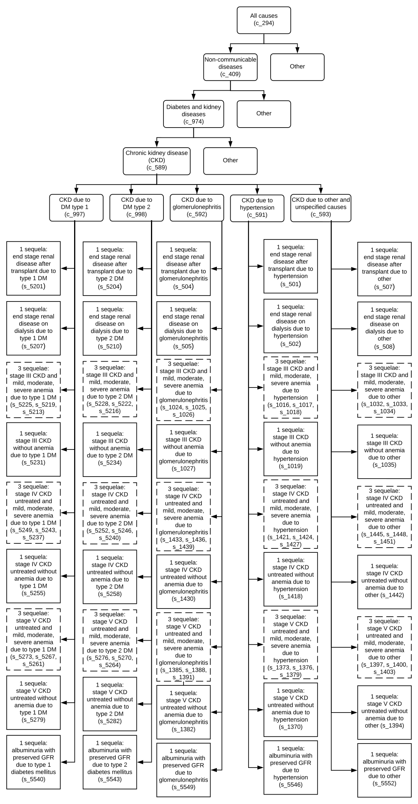
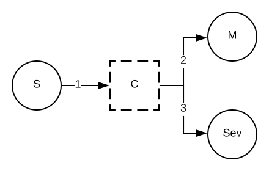

.. _2017_cause_ckd:

============================
Chronic Kidney Disease (CKD)
============================

According to GBD 2017, chronic kidney disease (CKD) is defined as a permanent loss of renal function as indicated by estimated glomerular filtration rate (eGFR) and urinary albumin to creatinine ratio (ACR). The GBD study considers six stages of CKD as defined by degree of loss of renal function or receipt of renal replacement therapy: Albuminuria (eGFR > 60ml/min/1.73m2 and ACR > 30 mg/g), CKD Stage III (eGFR 30-60ml/min/1.73m2), CKD Stage IV (eGFR 15-30ml/min/1.73m2), CKD Stage V (eGFR <15ml/min/1.73m2, not on renal replacement therapy), maintenance dialysis, and renal transplantation.

.. todo:: Add a general clinical overview of the cause. Useful external data sources, note to flesh out how this cause kills or causes disability among with condition. Features of the cause. Links to prominent mathematical models of the cause if they exist. 

GBD 2017 Modeling Strategy
--------------------------

Cause Hierarchy
+++++++++++++++

Restrictions
++++++++++++

The following table describes any restrictions in GBD 2017 on the effects of
this cause (such as being only fatal or only nonfatal), as well as restrictions
on the ages and sexes to which the cause applies.

.. todo:: Check in with SE / RT team if Restrictions should be stratified by CKD sub_causes (six stages of CKD).

.. list-table:: GBD 2017 Cause Restrictions
   :widths: 15 15 20
   :header-rows: 1

   * - Restriction Type
     - Value
     - Notes
   * - Male only
     - False
     -
   * - Female only
     - False
     -
   * - YLL only
     - False
     -
   * - YLD only
     - False
     -
   * - YLL age group start
     - Post Neonatal
     - (28, 364 days], age_group_id = 4
   * - YLL age group end
     - 95 plus
     - (95, 125], age_group_id = 235
   * - YLD age group start
     - Post Neonatal
     - (28, 364 days], age_group_id = 4
   * - YLD age group end
     - 95 Plus
     - (95, 125], age_group_id = 235

Vivarium Modeling Strategy
--------------------------

Scope
+++++
.. todo::

  Describe which aspects of the disease this cause model is designed to
  simulate, and which aspects it is **not** designed to simulate.

Assumptions and Limitations
+++++++++++++++++++++++++++

.. todo::

  Describe the clinical and mathematical assumptions made for this cause model,
  and the limitations these assumptions impose on the applicability of the
  model.

Cause Model Diagram
-------------------

Data Description
----------------

State and Transition Data Tables
++++++++++++++++++++++++++++++++

.. list-table:: State Definitions
   :widths: 1, 10, 10
   :header-rows: 1

   * - State
     - State Name
     - Definition
   * - C
     - With **C**\ ondition of chronic kidney disease
     - Simulant is has a permanent loss of renal function as indicated in the cause model description above

.. list-table:: State Data
   :widths: 5 10 10 20
   :header-rows: 1

   * - State
     - Measure
     - Value
     - Notes
   * - C
     - prevalence
     - prevalence_c589
     -
   * - C
     - excess mortality rate
     - :math:`\frac{\text{deaths_c589}}{\text{population} \,\times\, \text{prevalence_c589}}`
     -
   * - C
     - disability weight
     - :math:`\displaystyle{\sum_{s\in \text{sequelae_c589}}} \scriptstyle{\text{disability_weight}_s \,\times\, \text{prevalence}_s}`
     -
   * - All
     - cause-specific mortality rate
     - :math:`\frac{\text{deaths_c589}}{\text{population}}`
     -

.. list-table:: Transition Data
   :widths: 10 10 10 10 10
   :header-rows: 1

   * - Transition
     - Source State
     - Sink State
     - Value
     - Notes
   * - 1
     - susceptible
     - With **C**\ ondition of chronic kidney disease
     - incidence_c589
     -
   * - 2
     - With **C**\ ondition of type 2 diabetes mellitus
     - susceptible
     - TBD
     - This needs to be clarified further with the RT/SE teams

.. list-table:: Data Sources and Definitions
   :widths: 10 10 20 20
   :header-rows: 1

   * - Variable
     - Source
     - Description
     - Notes
   * - prevalence_c589
     - como
     - prevalence of chronic kidney disease
     -
   * - deaths_c589
     - codcorrect
     - Count of deaths due to chronic kidney disease
     - 
   * - population
     - demography
     - Mid-year population for given sex/age/year/location
     - 
   * - prevalence_s{sid}
     - como
     - Prevalence of sequela with id {id}
     - 
   * - disability_weight_s{sid}
     - YLD appendix
     - Disability weight of sequela with id {id}
     - 

Validation Criteria
-------------------

References
----------