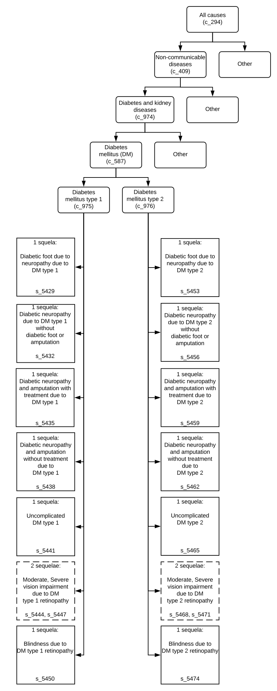

.. _2017_cause_diabetes_mellitus:

======================
Diabetes Mellitus (DM)
======================

.. todo:: Add a general clinical overview of the cause. Useful external data sources, note to flesh out how this cause kills or causes disability among with condition. Features of the cause. Links to prominent mathematical models of the cause if they exist. 

GBD 2017 Modeling Strategy
--------------------------

Cause Hierarchy
+++++++++++++++

Restrictions
++++++++++++

The following table describes any restrictions in GBD 2017 on the effects of
this cause (such as being only fatal or only nonfatal), as well as restrictions
on the ages and sexes to which the cause applies.

.. todo:: Check in with SE / RT team if Restrictions should be stratified by DM Type 1/Type 2. Restrictions vary, whether DM Type 1 or Type 2.

.. list-table:: GBD 2017 Cause Restrictions
   :widths: 15 15 20
   :header-rows: 1

   * - Restriction Type
     - Value
     - Notes
   * - Male only
     - False
     -
   * - Female only
     - False
     -
   * - YLL only
     - False
     -
   * - YLD only
     - False
     -
   * - YLL age group start
     - Early Neonatal
     - (0, 6 days], age_group_id = 2
   * - YLL age group end
     - 95 plus
     - (95, 125], age_group_id = 235
   * - YLD age group start
     - Early Neonatal
     - (0, 6 days], age_group_id = 2
   * - YLD age group end
     - 95 Plus
     - (95, 125], age_group_id = 235

Vivarium Modeling Strategy
--------------------------

Scope
+++++
.. todo::

  Describe which aspects of the disease this cause model is designed to
  simulate, and which aspects it is **not** designed to simulate.

Assumptions and Limitations
+++++++++++++++++++++++++++

.. todo::

  Describe the clinical and mathematical assumptions made for this cause model,
  and the limitations these assumptions impose on the applicability of the
  model.

Cause Model Diagram
-------------------

According to GBD 2017, the case definitions and diagnostic criteria for overall diabetes mellitus, type 1 diabetes mellitus, and type 2 diabetes mellitus are presented differently. The overall diabetes mellitus model is defined as fasting plasma glucose (FPG) > 126 mg/dL (7 mmol/L) or being on treatment for diabetes. The overall type 1 diabetes mellitus model is defined as cases of DM that are on insulin or diagnosed with a biomarker (eg, c-peptide levels) that is not fasting plasma glucose. Type 2 diabetes mellitus cases are those that are not reported as type 1 diabetes mellitus.

.. image:: cause_model_dm.svg

Data Description
----------------

.. todo::

  Confirm with the RT/SE that simulants cannot transition from C1 to C2 ot C2 to C1 and that C3 should/should not be included in the Data Description tables.

State and Transition Data Tables
++++++++++++++++++++++++++++++++

.. list-table:: State Definitions
   :widths: 1, 10, 10
   :header-rows: 1

   * - State
     - State Name
     - Definition
   * - C1
     - With **C**\ ondition of type 1 diabetes mellitus
     - Simulant is on insulin or diagnosed with a biomarker (eg, c-peptide levels) that is not fasting plasma glucose
   * - C2
     - With **C**\ ondition of type 2 diabetes mellitus
     - Simulant is a diabetes mellitus case but is not reported as type 1 diabetes mellitus

.. list-table:: State Data
   :widths: 5 10 10 20
   :header-rows: 1

   * - State
     - Measure
     - Value
     - Notes
   * - C1
     - prevalence
     - prevalence_c975
     -
   * - C1
     - excess mortality rate
     - :math:`\frac{\text{deaths_c975}}{\text{population} \,\times\, \text{prevalence_c975}}`
     -
   * - C1
     - disability weight
     - :math:`\displaystyle{\sum_{s\in \text{sequelae_c975}}} \scriptstyle{\text{disability_weight}_s \,\times\, \text{prevalence}_s}`
     -
   * - C2
     - prevalence
     - prevalence_c976
     -
   * - C2
     - excess mortality rate
     - :math:`\frac{\text{deaths_c976}}{\text{population} \,\times\, \text{prevalence_c976}}`
     -
   * - C2
     - disability weight
     - :math:`\displaystyle{\sum_{s\in \text{sequelae_c976}}} \scriptstyle{\text{disability_weight}_s \,\times\, \text{prevalence}_s}`
     -
   * - All C1
     - cause-specific mortality rate
     - :math:`\frac{\text{deaths_c975}}{\text{population}}`
     -
   * - All C2
     - cause-specific mortality rate
     - :math:`\frac{\text{deaths_c976}}{\text{population}}`
     -

.. list-table:: Transition Data
   :widths: 10 10 10 10 10
   :header-rows: 1

   * - Transition
     - Source State
     - Sink State
     - Value
     - Notes
   * - 1
     - susceptible
     - With **C**\ ondition of type 1 diabetes mellitus
     - incidence_c975
     -
   * - 2
     - susceptible
     - With **C**\ ondition of type 2 diabetes mellitus
     - incidence_c976
     -
   * - 3
     - With **C**\ ondition of type 2 diabetes mellitus
     - susceptible
     - :math:`\frac{\text{prevalence_c975}}{\text{prevalence_c587}}{\text{remission_c976}}`
     - This needs to be clarified further with the RT/SE teams

.. list-table:: Data Sources and Definitions
   :widths: 10 10 20 20
   :header-rows: 1

   * - Variable
     - Source
     - Description
     - Notes
   * - prevalence_c975
     - como
     - prevalence of type 1 diabetes mellitus
     -
   * - prevalence_c976
     - como
     - Prevalence of type 2 diabetes mellitus
     - 
   * - deaths_c975
     - codcorrect
     - Count of deaths due to type 1 diabetes mellitus
     - 
   * - deaths_c976
     - codcorrect
     - Count of deaths due to type 2 diabetes mellitus
     - 
   * - population
     - demography
     - Mid-year population for given sex/age/year/location
     - 
   * - prevalence_s{sid}
     - como
     - Prevalence of sequela with id {id}
     - 
   * - disability_weight_s{sid}
     - YLD appendix
     - Disability weight of sequela with id {id}
     - 

Validation Criteria
-------------------

References
----------