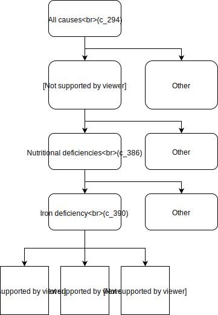

.. _2017_cause_iron_deficiency:

================================================
Dietary Iron Deficiency (Iron Deficiency Anemia)
================================================

Disease Description
-------------------

Generally, **anemia** is a condition defined by a deficiency of red blood cells 
or a deficiency of hemoglobin in the blood. Anemia is typically classified by 
hemoglobin concentrations below a defined threshold that varies by age and sex. 
Severity of anemia is similarly classified according to ranges of hemoglobin 
concentrations. Anemia is associated with increased morbidity and mortality and 
symptoms of anemia often include weakness, fatigue, and difficulty 
concentrating.

 Notably, anemia may be caused by many diverse factors. Examples of factors 
 that may cause anemia include genetic mutations in hemoglobin genes, acute or 
 chronic blood loss, altered red blood cell morphology, inadequate nutritional 
 intake, and others.

**Iron deficiency anemia** is a type of anemia that is due to insufficient 
iron levels, which lead to a deficiency of hemoglobin in the blood. Notably, 
iron deficiency anemia can occur when dietary intake of iron is insufficient, 
although it may occur in other situations as well, such as when iron is lost 
through bleeding (ex: menstrual disorders, hookworm disease, etc.). Iron 
deficiency anemia is the most common cause of anemia globally in most 
populations.

**Dietary iron deficiency anemia** is a specific type of iron deficiency anemia 
that is due to inadequate dietary intake of iron, leading to inadequate iron 
levels in the body and a subsequent deficiency of hemoglobin in the blood.

Modeling Iron Deficiency in GBD 2017
------------------------------------

In GBD 2017, the cause dietary iron deficiency is a population attributable 
fraction (PAF) of 1 cause with the iron deficiency risk factor. This means 
that 100% of the dietary iron deficiency cases are attributable to the iron 
deficiency risk factor. Notably, there are additional causes other than 
dietary iron deficiency that are attributable to the iron deficiency risk 
factors (ex: maternal disorders).

Additionally, there is an anemia *impairment* modeled in GBD 2017 that 
represents **all** forms of anemia that are attributable to several causes, 
including causes such as hemoglobinopathies and hemolytic anemias that are not 
causally attributable to iron deficiency. 

Anemia Impairment
+++++++++++++++++

The anemia impairment in GBD 2017 represents the total prevalence of anemia due 
to all causes modeled in GBD (ex: dietary iron deficiency anemia, anemia due to 
maternal hemorrhage, sickle cell anemia, etc.). Estimating the total prevalence 
of the anemia impairment for a given population is the first step in modeling 
anemia in GBD 2017. This is done by fitting a distribution of hemoglobin levels 
for that population from primary input data. For GBD 2017, an ensemble 
distribution was used, which was 40% gamma and 60% mirror gumbel. Source code 
for this process is available `here <https://stash.ihme.washington.edu/projects/MNCH/repos/anemia/browse/model/envelope>`_.

Once a the distribution is fit to hemoglobin levels for a particular age-, 
sex-, and location-specific demographic group, age- and sex-specific hemoglobin 
thresholds, as defined by the WHO and described in the table below, are used to 
determine the prevalence of anemia by severity for that population.

.. list-table:: Hemoglobin Thresholds (g/L)
	:widths: 15, 15, 15, 15
	:header-rows: 1

	* - Group
	  - Mild Anemia
	  - Moderate Anemia
	  - Severe Anemia
	* - Males and Females <1 month
	  - 130-149
	  - 90-129
	  - <90
	* - Males and Females 1 month - 5 years
	  - 100-109
	  - 70-99
	  - <70
	* - Males and Females 5-14 years
	  - 110-114
	  - 80-109
	  - <80
	* - Males 15+ years
	  - 110-129
	  - 80-109
	  - <80
	* - Females 15+ years, non-pregnant 
	  - 110-119
	  - 80-109
	  - <80
	* - Females 15+ years, pregnant
	  - 100-109
	  - 70-00
	  - <70

The prevalence of anemia as calculated in the process described above serves as 
the overall anemia envelope for a age-, sex-, and location-specific demographic 
groups, and prevalent cases of anemia in the anemia envelope are then causally 
attributed to various causes in GBD 2017 that have anemia as seqeulae. This is 
done through a process described in the GBD 2017 non-fatal methods appendix.

Notably, early neonatal and late neonatal age groups (age group IDs 2 and 3) 
are excluded from this process; instead, these age groups are assigned the 
anemia prevalence from the postneonatal age group (age group ID 4).

Additionally, a pregnancy correction is performed for women of reproductive 
age. Therefore, additional considerations beyond the scope of the current 
documentation will need to be made if planning to model hemoglobin among women 
of reproductive age.

Dietary Iron Deficiency Cause
+++++++++++++++++++++++++++++

The dietary iron deficiency cause in GBD 2017 that is 100% attributable to the 
iron deficiency risk factor. The dietary iron deficiency cause in GBD is a 
YLD-only cause, meaning that it contributes to morbidity, but not mortality.

Modeling Strategy for the Dietary Iron Deficiency Cause
^^^^^^^^^^^^^^^^^^^^^^^^^^^^^^^^^^^^^^^^^^^^^^^^^^^^^^^

The dietary iron deficiency cause in GBD 2017 is not modeled directly. Rather, 
the dietary iron deficiency cause is estimated as the remaining cases of 
anemia after all of the other anemic cases in the overall anemia envelope were 
causally attributed to their respective attributable causes (ex: 
hemoglobinopathies and hemolytic anemias).

Cause Hierarchy
^^^^^^^^^^^^^^^

Health States and Sequela
^^^^^^^^^^^^^^^^^^^^^^^^^

The sequela associated with the dietary iron deficiency cause in GBD 2017 
include mild iron deficiency anemia, moderate iron deficiency anemia, and 
severe iron deficiency anemia. The severity of iron deficiency anemia is 
determined by the WHO age- and sex- specific hemoglobin concentrations, as 
described in the table above.

Iron Deficiency Risk Factor
+++++++++++++++++++++++++++

The iron deficiency risk factor in GBD 2017 is a **continuous measure** modeled 
as a distribution of hemoglobin concentrations among the population with 
conditions that cause iron deficiency anemia. Below is a list of such causes: 

- Chronic kidney disease
- Digestive disorders (Gastritis & Duodenitis, Peptic Ulcer Disease, Crohn's Disease, Ulcerative Colitis)
- Cirrhosis
- Endocrine disorders
- Gynecological disorders (Uterine fibroids, Menstrual disorders)
- Neglected Tropical Diseases (Hookwork, Schistosomiasis, Other neglected tropical diseases)
- Other infectious diseases
- Maternal hemorrhage
- Nutritional deficiencies (Vitamin A Deficiency, Dietary iron deficiency) 

The distribution of hemoglobin concentrations represented by the iron 
deficiency risk factor is assumed to have the same shape as the distribution of 
hemoglobin concentrations in the entire population (anemia envelope).

Risk Factor Hierarchy
^^^^^^^^^^^^^^^^^^^^^

.. image:: iron_risk_hierarchy.svg

Cause Model Diagram
-------------------

Data Description
----------------

State and Transition Data Tables
++++++++++++++++++++++++++++++++

Model Assumptions and Limitations
---------------------------------

Validation Criteria
-------------------

References
----------

Kassebaum NJ, GBD 2013 Anemia Collaborators. The Global Burden of Anemia. 
Hematol Oncol Clin North Am. 2016 Apr;30(2):247-308. doi: 
10.1016/j.hoc.2015.11.002
