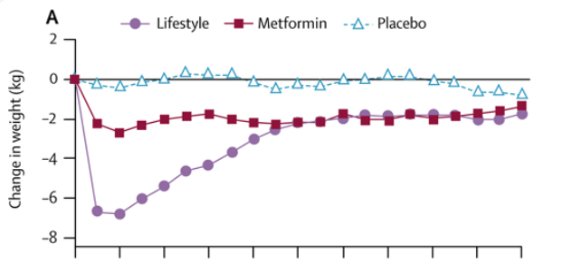
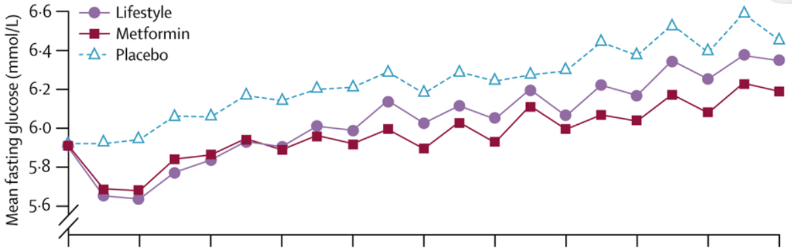
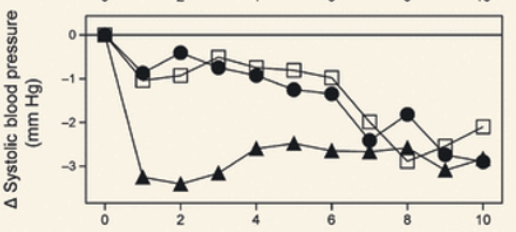

.. _intervention_crm_mgmt_lifestyle:

======================
Lifestyle Intervention
======================

.. contents::
   :local:
   :depth: 1

.. list-table:: Abbreviations
  :widths: 15 15 15
  :header-rows: 1

  * - Abbreviation
    - Definition
    - Note
  * - FPG
    - Fasting Plasma Glucose
    - 
  * - DPP
    - Diabetes Prevention Program 
    - 
  * - SBP
    - Systolic Blood Pressure
    - 
  * - LDL-C
    - Low-Density Lipoprotein Cholesterol
    - 
  * - CVD
    - Cardiovascular Disease 
    - 

Intervention Overview
---------------------

Modeled on the `DPP <https://www.cdc.gov/diabetes/prevention/index.html>`_, 
this intervention is a structured program composed of education sessions 
and individualized coaching with the goal of reducing body weight and 
increasing physical activity for simulants. 

While the program exists today and is available for patients, enrollment and 
utilization are very low. The scenarios here would represent an increased 
effort from HCPs and the community to encourage enrollment and support patients. 

Once a simulant is enrolled, their FPG, BMI, and SBP are all affected outcomes. 
The reduction in these risk factors will likely produce decreases in CVD. 

Baseline Coverage and Scenarios
+++++++++++++++++++++++++++++++

**Baseline:**
Unlike the other interventions in this model, we will have some enrollment at 
baseline for simulants. The full description for enrollment through the healthcare 
system is described below. Of those who are eligible for enrollment, 8.55% will be 
enrolled and start on the lifestyle intervention in the baseline scenario. [Holliday_2019]_ [Mehta_2017]_ 

**Coverage 50%:**
Enrollment will increase from 8.55% to 50%. Scales linearly over 1 year such that 
there is 8.55% coverage at baseline (Jan 1, 2023) and 50% at year 1 (Jan 1, 2024). 
Remain at 50% coverage for the remainder of the simulation.

**Coverage 100%:**
Enrollment will increase from 8.55% to 100%. Scales linearly over 1 year such that 
there is 8.55% coverage at baseline (Jan 1, 2023) and 100% at year 1 (Jan 1, 2024). 
Remain at 100% coverage for the remainder of the simulation.

Vivarium Modeling Strategy
--------------------------

Eligibility and Initiation
++++++++++++++++++++++++++

- BMI >=25 AND FPG >=100 and <=126 mg/dL [CDC_DPP]_ 
- Enrollment in the intervention only happens during interactions with healthcare, as shown :ref:`here <us_cvd_concept_model>`

Affected Outcomes
+++++++++++++++++

This intervention has relatively high dropout rates. To model this, 36.9% of 
simulants will not receive any benefit from the intervention. For those that do 
receive a benefit, the affected outcomes are outlined below. [Cannon_2020]_

BMI, FPG and SBP are affected. All of these risk factors 
follow the same general pattern, with different values. To allow for 
the modeling of the underlying risk factors to remain the same, we are 
applying a "drop" in the risk factor. This essentially means that if a 
simulant's BMI was 30, and a drop of 2 is applied, the new BMI is 28. If 
that simulant then ages up and their base BMI changes to 32, their drop 
remains the same and so their final BMI is 30. 

The pattern for all affected outcomes is: 

#. There will be an initial drop in the risk factor. While this would actually take place over some short period of time, we will model it as an instantaneous drop. 
#. There is a 1-year maintanence period where the drop value remains the same. 
#. The drop value decreases linearly over a 3 year period to a final, static drop value 
#. A final drop value is maintained for the remainder of the simulation 

To make this more clear, an example is below for BMI: 

#. A simulant has an initial BMI of 30 when they are enrolled in the intervention. The inital drop value is 2.49, so they will instantaneously change to a BMI of 27.51. 
#. They will retain this drop value of 2.49 for 12 time steps (approximately 1 year). If they age up during this time, their BMI might change, but the drop value will not. 
#. The drop value decreases linearly over a 36 time steps (approximately 3 years) period to 0.71. 
#. The simulant retains a 0.71 drop in BMI throughout the sim, regardless of underlying changes in BMI 

.. list-table:: Abbreviations
  :widths: 15 15 15 15 
  :header-rows: 1

  * - Risk Factor 
    - Intial Drop 
    - Final Drop 
    - Source 
  * - BMI
    - 2.49
    - 0.71 
    - [DPP_2009]_
  * - FPG
    - 0.3 mmol/L
    - 0.17 mmol/L 
    - [DPP_2009]_
  * - SBP
    - 3 mmHg 
    - 0 mmHg
    - [Orchard_2013]_

Assumptions and Limitations
~~~~~~~~~~~~~~~~~~~~~~~~~~~~

- Simulants who are enrolled in the DPP but dropout still likely receive some benefit from the intervention. We are not including that here and assume no benefit, likely underestimating the overall effect. 
- The retention rate is the same for all simulants. We might make this race/ethnicity specific once that information is added to the model. 
- We are assuming that 100% enrollment of eligible simulants is possible. As this intervention includes a significant amount of time and energy, this is unrealistic in real life. 

Validation and Verification Criteria
~~~~~~~~~~~~~~~~~~~~~~~~~~~~~~~~~~~~~~

- Intervention coverage among the eligible population should verify to the scenario-specific level
- Intervention coverage should be zero among the non-eligible populations
- BMI, FPG, and SBP effects stratified by intervention coverage should reflect the intervention effect size

References
------------

.. [Cannon_2020] Cannon, Michael J., Boon Peng Ng, Kayla Lloyd, John Reynolds, and Elizabeth K. Ely. 2022. “Delivering the National Diabetes Prevention Program: Assessment of Enrollment in In-Person and Virtual Organizations.” Journal of Diabetes Research 2022 (February): e2942918. 
 https://doi.org/10.1155/2022/2942918. 

.. [CDC_DPP] “National Diabetes Prevention Program | Diabetes | CDC.” 2022. December 27, 2022. 
 https://www.cdc.gov/diabetes/prevention/index.html. 

.. [DPP_2009] Diabetes Prevention Program Research Group. 2009. “10-Year Follow-up of Diabetes Incidence and Weight Loss in the Diabetes Prevention Program Outcomes Study.” The Lancet 374 (9702): 1677–86. 
 https://doi.org/10.1016/S0140-6736(09)61457-4. 

.. [Holliday_2019] Holliday, Christopher S., Janet Williams, Vanessa Salcedo, and Namratha R. Kandula. 2019. “Clinical Identification and Referral of Adults With Prediabetes to a Diabetes Prevention Program.” Preventing Chronic Disease 16 (June): E82. 
 https://doi.org/10.5888/pcd16.180540. 

.. [Mehta_2017] Mehta, Sandhya, Michelle Mocarski, Tami Wisniewski, Karin Gillespie, K M Venkat Narayan, and Kathleen Lang. 2017. “Primary Care Physicians’ Utilization of Type 2 Diabetes Screening Guidelines and Referrals to Behavioral Interventions: A Survey-Linked Retrospective Study.” BMJ Open Diabetes Research & Care 5 (1): e000406. 
 https://doi.org/10.1136/bmjdrc-2017-000406.

.. [Orchard_2013] Orchard, T. J., M. Temprosa, E. Barrett-Connor, S. Fowler, R. Goldberg, K. Mather, S. Marcovina, et al. 2013. “Long-Term Effects of the Diabetes Prevention Program Interventions on Cardiovascular Risk Factors: A Report from the DPP Outcomes Study.” Diabetic Medicine : A Journal of the British Diabetic Association 30 (1): 46–55. 
 https://doi.org/10.1111/j.1464-5491.2012.03750.x.