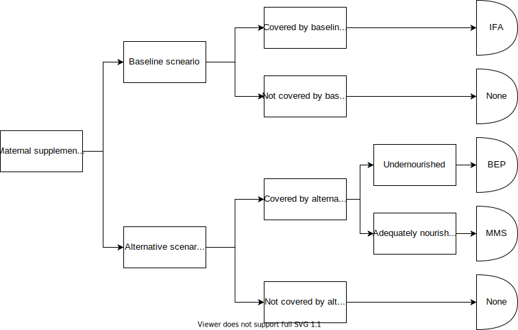

.. _oral_iron_antenatal:

====================================
Oral Iron in Pregnancy (IFA and MMS)
====================================

.. contents::
   :local:
   :depth: 2

.. list-table:: Abbreviations
  :widths: 15 15 15
  :header-rows: 1

  * - Abbreviation
    - Definition
    - Note
  * - MMS
    - Multiple Micronutrient Supplement
    - 
  * - IFA
    - Iron-folic acid
    - 
  * - BMI
    - Body Mass Index
    - 
  * - ANC
    - Antenatal coverage
    - 

Intervention Overview
-----------------------
 

Maternal supplementataion during the prenatal period is a critical intervention to support the increased nutritional demands due to the mother's changing physiology and fetal growth. 
Maternal supplementation in low and middle income country settings are often accessed through antenatal care (ANC) services and early initiation of supplementation has been associated with improved outcomes. 
There are various maternal supplementation regimens that provide varying combinations of micro- and macro-nutrients and therefore have varying impacts on both maternal and child health. 
The two major classes of maternal supplementation regimens that we will be modeling are outlined in the table below.

- **Iron and Folic Acid (IFA):** IFA affects outcomes including maternal anemia (which is a risk factor for maternal mortality) and infant birthweight (a risk factor for infant mortality). Additionally, folic acid deficiency is associated with haematological consequences and congenital malformations, however the effect on congenital malformations is sensitive to timing of administration relative to conception. The latest cochrane review of IFA trials was performed by [Pena-Rosas-et-al-2015]_; notably, as IFA is considered the current standard of care, there are few studies that compare IFA to placebo or no treatment.

- **Multiple Micronutrient Supplementation (MMS):** MMS is a combination of micronutrients that includes iron and folic acid as well as other nutrients such as vitamin A and zinc. The latest cochrane review on MMS (containing IFA) relative to IFA alone was performed by [Keats-et-al-2019-maternal-supplementation]_.

In August of 2020, the :download:`World Health Organization updated their recommendation <who_guidance_positive_pregnancy_mms_2020.pdf>` on nutritional interventions during pregnancy to include MMS that includes iron and folic acid as part of routine antenatal care. 
Prior to this update, they recommended only IFA. Additionally, the :download:`WHO recommends BEP supplementation during pregnancy in undernourished populations <who_guidance_positive_pregnancy_2016.pdf>`.

.. note:: 

  According to the :download:`2016 WHO recommendations <who_guidance_positive_pregnancy_2016.pdf>`: Undernourishment is usually defined by a low BMI (i.e. being underweight). 
  For adults, a 20–39% prevalence of underweight women is considered a high prevalence of underweight and 40% or higher is considered a very high prevalence (46). 
  Mid-upper arm circumference (MUAC) may also be useful to identify protein–energy malnutrition in individual pregnant women and to determine its prevalence in this population (31). 
  However, the optimal cut-off points may need to be determined for individual countries based on context-specific cost–benefit analyses (31).

IFA is widely used as a prenatal supplement in most areas of the world and is recommended by the WHO as part of routine antenatal care, although coverage and adherence levels vary. 
Given the relatively recent recommendation regarding MMS, the coverage of MMS at a wide scale is believed to be substantially lower.

.. todo::

  Fill out the following table with a additional known outcomes affected by the intervention.

.. list-table:: Affected Outcomes
  :header-rows: 1

  * - Outcome
    - Regimen(s)
    - Effect
    - Modeled?
    - Note
  * - Infant birthweight
    - IFA, MMS
    - Increases population mean
    - Yes
    - Differential effect by regimen. Effect modification by counterfactual birthweight (or proxy such as maternal nourishment)
  * - Maternal anemia
    - IFA, MMS
    - Increases population mean hemoglobin
    - Yes
    - Non-linear dose response likely. Differential effect by regimen. Effect modification by baseline hemoglobin likely.

Baseline Coverage Data
++++++++++++++++++++++++

Given the low utilization of MMS relative to IFA, we assume that baseline coverage of MMS is zero. 
Baseline coverage of IFA varies by location, and we will be using estimates processed by the Health Systems team to inform this. 
The country-specific estimates are available at ``/snfs1/Project/simulation_science/mnch_grant/MNCNH portfolio/anc_iron_prop_st-gpr_results_aggregates_scaled2025-05-30.csv``.

.. warning::

  Maternal supplementation interventions are typically delivered through antenatal care (ANC) visits. Therefore, maximum alternative scenario coverage should be considered to be equal to the proportion of pregnant women who attend ANC visits in the absence of an intervention to increase ANC attendance or an alternative maternal supplementation delivery program. 

Vivarium Modeling Strategy
--------------------------

The maternal supplementation intervention is administered to mothers and impacts both the mother and infant. To model the impact of the intervention on either child or maternal outcomes, simulant attributes for maternal nourishment exposure (BMI/x-factor) and maternal ANC attendance exposure are required. Additionally, to model the impact on child growth, child growth exposures are required. 
To model the impact on maternal mortality, a maternal hemoglobin exposure value is required. This intervention model requires the additional simulant attribute of maternal supplement regimen.

Coverage algorithms
+++++++++++++++++++

Individual product coverage algorithms
~~~~~~~~~~~~~~~~~~~~~~~~~~~~~~~~~~~~~~

For use in the :ref:`nutrition optimization simulation <2021_concept_model_vivarium_nutrition_optimization>`.

For our purposes, each individual antenatal supplementation product (IFA and MMS) are mutually exclusive; in other words, a given simulant can only be covered by one of these two products for any given pregnancy. We do not consider changing antenatal supplementation products during a single pregnancy. Supplementation product coverage may depend on other simulant characteristics, such as antenatal care visit attendance.

.. note::

  Although the supplementation products are mutually exclusive, it is important to remember that iron and folic acid (the nutrients present in IFA) are also present in MMS products. 
  However, MMS contains micronutrients that are not provided with IFA.

  Therefore, the intervention impacts of each intervention product "stack" upon one another such that the effect of MMS includes the effect of IFA relative to no supplementation. 
  Specific instructions and details are provided in the following sections. 

Targeted intervention package coverage algorithm
~~~~~~~~~~~~~~~~~~~~~~~~~~~~~~~~~~~~~~~~~~~~~~~~

For use in the :ref:`MNCNH Portfolio simulation <2024_concept_model_vivarium_mncnh_portfolio>`.

For the implementation of the intervention in alterative scenarios, we will model MMS supplementation among adequately nourished mothers rather than IFA supplementation alone, as demonstrated in the following decision tree. 

.. list-table:: Modeled Outcomes
  :widths: 15 15 15 15 15 15 15
  :header-rows: 1

  * - Outcome
    - Outcome type
    - Outcome ID
    - Affected measure
    - Effect size measure
    - Effect size
    - Note 
  * - Hemoglobin
    - Modelable entity
    - 10487
    - Population mean hemoglobin concentration (as continuous measure)
    - Mean difference
    - Varies by supplement regimen
    - Related effect on anemia reduction
  * - Birthweight
    - Risk exposure
    - 339
    - Population mean birthweight (as continuous measure)
    - Mean difference
    - Varies by supplement regimen
    - Assume no difference in gestational age

Maternal Hemoglobin
+++++++++++++++++++++

Both regimens in the maternal supplementation interventions affect the hemoglobin concentration of pregnant and lactating women who are covered by them. 
Notably, the intervention will not affect the hemoglobin level of women of reproductive age who are not pregnant or lactating because they will not be covered by this specific intervention. 
:ref:`The hemoglobin module document can be found here <2024_vivarium_mncnh_portfolio_hemoglobin_module>`.

.. list-table:: Restrictions for intervention effect on hemoglobin
  :header-rows: 1

  * - Restriction
    - Value
    - Note
  * - Male only
    - False
    - 
  * - Female only
    - True
    - 
  * - Age group start
    - 10 to 14
    - Age group ID 7
  * - Age group end
    - 50 to 54
    - Age group ID 15
  * - Other
    - Pregnant and lactating women only
    - (see the :ref:`pregnancy module document <2024_vivarium_mncnh_portfolio_pregnancy_module>`)

.. list-table:: Supplementation effect on hemoglobin
  :header-rows: 1

  * - Population
    - Effect size (95% CI)
    - Note
    - Source
  * - IFA
    - +7.8 g/L (4.08, 11.52)
    - Relative to no supplementation 
    - [Oh-et-al-2020]_
  * - MMS
    - +0 g/L
    - Relative to IFA
    - 

**How to sample and apply effect sizes:**

The intervention hemoglobin shifts should be applied at **eight weeks gestation** (assume pregnancy identification occurs at six weeks, intervention coverage begins at the time of pregnancy identification, and intervention effect on hemoglobin occurs two weeks after initiation of the intervention). 
The intervention hemoglobin shift should persist until six weeks postpartum, at which point the simulant's hemoglobin level should return to the pre-pregnancy value.

Additionally, the code block below walks through how to implement the following considerations:

- Assume a normal distribution of uncertainty when sampling from the effect size parameter confidence intervals
- Hemoglobin exposure values among PLW need to be calibrated to baseline IFA coverage in the baseline scenario
- Effect sizes in the table above are NOT relative to no supplementation and are assumed to be *additive* to one another. It is important that they are implemented in the method described below due to their overlapping confidence intervals to ensure that the effect of BEP>MMS/IFA in all draws.
- The effect of MMS in the alternative scenario depends on IFA coverage status in the baseline scenario

.. code-block:: python

  from scipy.stats import norm

  def sample_from_normal_distribution(mean, lower, upper):
      """Instructions on how to sample from a normal distribution given a mean value and
      95% confidence interval for a parameter"""
      std = (upper - lower) / 2 / 1.96
      dist = norm(mean, std)
      return dist.rvs()

  """A hemoglobin shift for each supplement regimen should be sampled independently
  for each simulation draw assuming a normal distribution of uncertainty"""
  for draw in draws:    
      for supplement in ['ifa','mmn']:
          {supplement}_shift_draw = sample_from_normal_distribution({supplement}_mean, 
                                                                    {supplement}_lower, 
                                                                    {supplement}_upper)
      
      for i in simulants:

      """In the baseline scenario, we need to calibrate baseline coverage of IFA
      so that the difference between IFA supplemented and unsupplemented babies, on 
      average, equals to the ifa_shift AND that the population mean hemoglobin value
      among PLW from GBD is approximately unchanged.

      * hgb_{i} represents the assigned continuous hemoglobin exposure value for a 
      simulant sampled from GBD, after the application of the pregnancy adjustment factor
      and BEFORE consideration of the impact of maternal supplementation.

      * baseline_ifa_coverage represents the coverage proportion of IFA for a location and
      specific simulation draw"""
          if baseline_maternal_supplement_{i} == 'none':
              baseline_supplemented_hgb_{i} = hgb_{i} - baseline_ifa_coverage_draw * ifa_shift_draw
          elif baseline_maternal_supplement_i == 'ifa':
              baseline_supplemented_hgb_{i} = hgb_{i} + (1 - baseline_ifa_coverage_draw) * ifa_shift_draw

      """In the alternative scenario, the amount to shift a simulant's hemoglobin (if they are
      covered by MMS in the alternative scenario) depends on if they were already covered 
      by IFA in the baseline scenario"""
          alternative_supplemented_hgb_{i} = baseline_supplemented_hgb_{i}
          if alternative_maternal_supplement_{i} is in ['ifa', 'mmn'] and baseline_maternal_supplement_{i} == 'none':
              alternative_supplemented_hgb_{i} =+ ifa_shift_draw
          if alternative_maternal_supplement_{i} is in ['mmn']:
              alternative_supplemented_hgb_{i} =+ mmn_shift_draw

Assumptions and Limitations
~~~~~~~~~~~~~~~~~~~~~~~~~~~~

- We assume that pregnant women begin taking the supplementation intervention six weeks into their pregnancy. In reality, the average person may begin taking oral iron supplementation closer to the start of the second trimester. However, we have chosen six weeks in order to be conservative as the comparison intervention for the assessment of the impact of the intravenous iron intervention.
- We assume that the effect of the intervention persists for six weeks postpartum at which point hemoglobin returns to its pre-pregnancy value
- We assume no effect modification by baseline hemoglobin level. In reality, the individual hemoglobin shifts are likely greater among those who are anemic at baseline.

Verification and validation criteria
~~~~~~~~~~~~~~~~~~~~~~~~~~~~~~~~~~~~~

In the baseline scenario, the exposure distribution of hemoglobin and anemia among PLW and WRA as well as the maternal disorders cause model should match that of GBD. 

Hemoglobin exposures stratified by supplementation regimen should match supplementation effect sizes.

The relative risk of anemia by supplmentation regimen should validate to external sources.

.. todo::

  Cite external sources for these validations.

Birthweight
+++++++++++++++++++++

The maternal supplementation intervention (both regimens) affect child birthweight exposures, :ref:`which are documented here <2019_risk_exposure_lbwsg>`. 
The intervention should result in an **additive change to a simulant's continuous birthweight exposure value at birth (or upon initialization into the early or late neonatal age groups).** 
We assume changes in simulant birthweight are independent from changes in their gestational age exposure value at birth.

.. list-table:: Restrictions for intervention effect on birthweight
  :header-rows: 1

  * - Restriction
    - Value
    - Note
  * - Male only
    - False
    - 
  * - Female only
    - False
    - 
  * - Age group start
    - Birth
    - 
  * - Age group end
    - Late neonatal
    - 
  * - Other
    - 
    - 

.. list-table:: Supplementation effect on birthweight
  :header-rows: 1

  * - Population
    - Effect size (95% CI)
    - Note
    - Source
  * - Unsupplemented mothers
    - 0
    - 
    - N/A
  * - IFA supplemented mothers (overall)
    - +57.73 g (7.66 to 107.79)
    - Relative to no supplementation 
    - [Pena-Rosas-et-al-2015]_
  * - MMN supplemented mothers (overall)
    - +45.16 (32.31 to 58.02) 
    - Relative to IFA
    - Meta-analysis of 13 trials from [Keats-et-al-2019-maternal-supplementation]_, linked as a memo in :ref:`BEP concept model document <2017_concept_model_vivarium_gates_bep>`

**How to sample and apply effect sizes:**

The code block below walks through how to implement the following considerations:

- Assume a normal distribution of uncertainty when sampling from the effect size parameter confidence intervals
- Birthweight exposure values need to be calibrated to baseline IFA coverage in the baseline scenario
- Effect sizes in the table above are NOT relative to no supplementation and are assumed to be *additive* to one another. It is important that they are implemented in the method described below due to their overlapping confidence intervals to ensure that the effect of BEP>MMN>IFA in all draws.
- The effect of MMN in the alternative scenario depends on IFA coverage status in the baseline scenario

.. code-block:: python

  from scipy.stats import norm

  def sample_from_normal_distribution(mean, lower, upper):
      """Instructions on how to sample from a normal distribution given a mean value and
      95% confidence interval for a parameter"""
      std = (upper - lower) / 2 / 1.96
      dist = norm(mean, std)
      return dist.rvs()

  """A birthweight shift for each supplement regimen should be sampled independently
  for each simulation draw assuming a normal distribution of uncertainty"""
  for draw in draws:    
      for supplement in ['ifa','mmn','bep']:
          {supplement}_shift_draw = sample_from_normal_distribution({supplement}_mean, 
                                                                    {supplement}_lower, 
                                                                    {supplement}_upper)
      
      for i in simulants:

      """In the baseline scenario, we need to calibrate baseline coverage of IFA
      so that the difference between IFA supplemented and unsupplemented babies, on 
      average, equals to the ifa_shift AND that the population mean birthweight value
      from GBD is approximately unchanged.

      * bw_{i} represents the assigned continuous birthweight exposure value for a 
      simulant sampled from GBD, which may or may not have already been affected by other 
      factors such as maternal BMI, etc. BEFORE consideration of the impact of 
      maternal supplementation.

      * baseline_ifa_coverage represents the coverage proportion of IFA for a location and
      specific simulation draw"""
          if baseline_maternal_supplement_{i} == 'none':
              baseline_supplemented_bw_{i} = bw_{i} - baseline_ifa_coverage_draw * ifa_shift_draw
          elif baseline_maternal_supplement_i == 'ifa':
              baseline_supplemented_bw_{i} = bw_{i} + (1 - baseline_ifa_coverage_draw) * ifa_shift_draw

      """In the alternative scenario, the amount to shift a simulant's birthweight (if they are
      covered by MMS in the alternative scenario) depends on if they were already covered 
      by IFA in the baseline scenario"""
          alternative_supplemented_bw_{i} = baseline_supplemented_bw_{i}
          if alternative_maternal_supplement_{i} is in ['ifa', 'mmn'] and baseline_maternal_supplement_{i} == 'none':
              alternative_supplemented_bw_{i} =+ ifa_shift_draw
          if alternative_maternal_supplement_{i} is in ['mmn']:
              alternative_supplemented_bw_{i} =+ mmn_shift_draw

Assumptions and Limitations
~~~~~~~~~~~~~~~~~~~~~~~~~~~~

- We assume that the birthweight shifts of maternal supplementation interventions are equal across the counterfactual unsupplemented birthweight exposure distribution. In reality the impact may be greater among the lower end of the birthweight distribution. Because the same shift in the birthweight among the lower end of the distribution is associated with a greater magnitude of mortality risk reduction than among the higher end of the distribution, we may underestimate the effect of the intervention. 

- We do not consider effect modification by maternal anemia status.

- For the :ref:`MNCNH portfolio simulation <2024_concept_model_vivarium_mncnh_portfolio>` that uses the baseline coverage value of women that took any antenatal iron: We assume that taking any iron supplement is equally as effective as taking daily a iron supplement in the baseline scenario. If it is in fact less effective, we will overestimate the impact of the baseline IFA coverage and therefore underestimate the impact of the MMS interventions.

Validation and Verification Criteria
~~~~~~~~~~~~~~~~~~~~~~~~~~~~~~~~~~~~~~

In the baseline scenario, the exposure distribution of birthweight (mean birthweight, if available) as well as the mortality rates among the neonatal age groups should match that of GBD. 

If birthweight exposures are stratified by supplementation regimen and maternal nourishment strata, then birthweight differences between regimens should match the effect sizes within a given maternal nourishment exposure strata.

Gestational age
+++++++++++++++++++

.. note::

  This outcome was added in June of 2023, and was first incorporated into the :ref:`nutrition optimization <2021_concept_model_vivarium_nutrition_optimization>` model.
  We have already incorporated it into the :ref:`MNCNH portfolio <2024_concept_model_vivarium_mncnh_portfolio>` simulation.

Research background
~~~~~~~~~~~~~~~~~~~

The antenatal supplementation products affect child gestational age at birth exposures, :ref:`which are documented here <2019_risk_exposure_lbwsg>`. While we measure LBWSG exposures at the continuous level (including a joint birth weight and gestational age at birth value), the literature tends to report the effect of antenatal supplementation products on gestational age at birth in terms of a relative risk of preterm birth (less than 37 weeks gestational age at birth) or very preterm birth (less than 32 weeks gestational age at birth), which are summarized in the table below.

.. list-table:: Dichotomous effect of antenatal supplementation on preterm birth
  :header-rows: 1

  * - Product
    - Relative to 
    - Outcome
    - Value
    - Source
  * - IFA
    - No IFA
    - Preterm birth, <37 weeks
    - OR = 0.9 (95% CI: 0.86, 0.95)
    - [Li-et-al-2019-antenatal-supplementation]_
  * - MMS
    - IFA
    - Preterm birth, <37 weeks
    - RR = 0.91 (95% CI: 0.84, 0.99)
    - [Gomes-et-al-2023-antenatal-supplementation]_, effect with *prospective* last menstrual period and/or ultrasound-based pregnancy dating (rather than *retrospective* last menstrual period dating). Note that this value was updated between wave I and wave II of the N.O. project from 0.95 (0.90, 1.01) from [Keats-et-al-2019-maternal-supplementation]_, which did not conduct the outcome assessment quality sensitivity analysis.
  * - MMS
    - IFA
    - Very preterm birth, <32 weeks
    - RR = 0.81 (95% CI: 0.71, 0.93)
    - [Keats-et-al-2019-maternal-supplementation]_

In order to make these effects compatible with our continuous exposure modeling strategy for LBWSG, we have converted these relative risks of dichotomous outcomes to continuous gestational age "shifts" that result in preterm (and very preterm, if applicable) birth prevalence that replicates the appropriate dichotomous measure of effect. 

The methodology for this conversion was inspired in part by the methodology of the air pollution GBD team in calculating the impact of the risk on LWBSG exposures. As with GBD, we assume that these shifts are independent of any shifts in birth weight. However, rather than implement the conversion using the LBWSG exposure distribution specific to the individual study included in a meta-analysis of the overall effect to find a global shift as GBD did, we used the meta-analyzed global relative risks and applied the conversion for each of our modeled locations, resulting in location-specific continuous shifts that replicate the global dichotomous effect.
In the case of birth weight shifts, it may be more accurate to assume that the relative risks are generalizable across locations.

Additionally, our methods differ from GBD's in that we estimated two separate GA shifts, conditional on baseline GA exposure, for the effect of MMS relative to IFA rather than a single shift applied equally to the entire distribution. This approach allowed us to replicate the literature-reported relative risks of MMS on both preterm birth (<37 weeks) as well as very preterm birth (<32 weeks). This "dual shift" approach follows these steps:

1. Find and apply a shift to the entire distribution that results in the replication of the very preterm birth dichotomous effect

2. Find and apply a second shift that replicates the preterm birth dichotomous effect when applied only to the portion of the distribution with baseline gestational age exposures that are *greater* than 32 (the very preterm birth threshold) *minus* this second shift. Note that the second shift will be negative in direction.

`The estimation of the antenatal supplementation gestational age shifts as described was performed in this notebook <https://github.com/ihmeuw/vivarium_research_nutrition_optimization/blob/data_prep/data_prep/antenatal_interventions/Gestational%20age%20shifts.ipynb>`_

Assumptions and limitations
~~~~~~~~~~~~~~~~~~~~~~~~~~~

- In the case of IFA, we assume that the entire distribution experiences the same constant shift in gestational age. It is more likely that the lower end of the distribution experiences a greater shift and that the upper end experiences little to no shift (as supported from the MMS evidence). This limitation will result in an underestimation of the impact of the lower end of the distribution (which has a high magnitude of risk, but a low overall exposure) and an overestimation of the impact on the upper end of the distribution (which has lower risk magnitude, but higher overall exposure). However, we have limited data on how to better apply such a shift.

- In the case of MMS, although we have improved the assumption of a single shift applied to the entire distribution through our "dual shift" strategy, it is still limited in that the true shift is likely more of a continuous function with baseline gestational age rather than two conditional values. In particular, a limitation of this approach is the illogical implication that the effect of treatment on a birth that would have been 31.9 weeks without treatment leads to a longer gestation than the effect of the same treatment on a birth that would have been 32.1 weeks without treatment.

  We have some ideas for how we might improve this limitation, including:

    1) Create a function of the dichotomous effect of MMS relative to IFA as a function of baseline gestational age exposure by assuming a linear relationship between the points (32, log(very preterm birth RR)) and (37, log(preterm birth RR)), potentially with some additional constraints (such as constant dichotomous effects above or below some thresholds).

    2) Find gestational age shifts as a function of baseline gestational age that replicates the relative risk values along the line developed in step 1.

  However, we will remain limited by the lack of reported information on the true shape of the association between these "gestational age shifts" and baseline gestational age exposure.

Modeling strategy
~~~~~~~~~~~~~~~~~

The supplementation intervention (all regimens) affects infant gestational age at birth exposures, :ref:`which are documented here <2019_risk_exposure_lbwsg>`. 

Antenatal supplementation intervention should result in an **additive change to a simulant's continuous gestational age exposure value at birth (or upon initialization into the early or late neonatal age groups).** :ref:`The LBWSG risk exposure document can be found here <2019_risk_exposure_lbwsg>`. We assume changes in simulant gestational age exposure values are independent from changes in their birth weight exposure values.

.. list-table:: Restrictions for intervention effect on birthweight
  :header-rows: 1

  * - Restriction
    - Value
    - Note
  * - Male only
    - False
    - 
  * - Female only
    - False
    - 
  * - Age group start
    - Birth
    - 
  * - Age group end
    - Late neonatal
    - 
  * - Other
    - 
    - 

.. list-table:: Supplementation effect on gestational age
  :header-rows: 1

  * - Product
    - Relative to
    - Subpopulation
    - Shift
    - Note
  * - IFA
    - No supplementation
    - Overall
    - IFA_SHIFT
    - 
  * - MMS
    - IFA
    - IFA-shifted GA < (32 - MMS_SHIFT_2)
    - MMS_SHIFT_1
    - 
  * - MMS
    - IFA
    - IFA-shifted GA >= (32 - MMS_SHIFT_2)
    - MMS_SHIFT_1 + MMS_SHIFT_2
    - 

Where,

.. list-table:: Gestational age shift values
  :header-rows: 1

  * - Parameter
    - Value
  * - IFA_SHIFT
    - `Location-specific .csv files of IFA_SHIFT values can be found here <https://github.com/ihmeuw/vivarium_research_nutrition_optimization/tree/data_prep/data_prep/antenatal_interventions/ifa_gestational_age_shifts>`_
  * - MMS_SHIFT_1
    - `Location-specific .csv files of MMS_SHIFT_1 values can be found here <https://github.com/ihmeuw/vivarium_research_nutrition_optimization/blob/data_prep/data_prep/antenatal_interventions/updated_mms_shifts.csv>`_
  * - MMS_SHIFT_2
    - `Location-specific .csv files of MMS_SHIFT_2 values can be found here <https://github.com/ihmeuw/vivarium_research_nutrition_optimization/blob/data_prep/data_prep/antenatal_interventions/updated_mms_shifts.csv>`_

.. todo::

  These notebooks are outdated from the Nutrition Optimization project, so we need to update the above notebook links once we update to new GBD rounds
  and to the locations of interest for the :ref:`MNCNH Portfolio <2024_concept_model_vivarium_mncnh_portfolio>` simulation. 
  Here is the relevant `JIRA ticket <https://jira.ihme.washington.edu/browse/SSCI-2209>`_.

Verification and validation criteria
~~~~~~~~~~~~~~~~~~~~~~~~~~~~~~~~~~~~

In the baseline scenario, the LBWSG exposure distribution as well as the mortality rates among the neonatal age groups should match that of GBD. 

When birthweight exposures are stratified by supplementation regimen and maternal nourishment strata, then birthweight differences between regimens should match the effect sizes within a given maternal nourishment exposure strata.

The dichotomous measures of effects should also replicate the intended values.

Birth outcomes
++++++++++++++++++

Antenatal supplementation interventions will affect the risk of stillbirth for full term pregnancies (NOTE: not necessary to apply to partial term pregnancies), as described in the :ref:`pregnancy model document <other_models_pregnancy>`. 
Notably, it is assumed that increased risk of stillbirth will result in decreased risk of live birth and vise versa, with no impact on the risk of abortion/miscarriage or ectopic pregnancy.

The observed effect of each antenatal supplementation product on the risk of stillbirth is summarized below:

.. list-table:: Stillbirth effects
  :header-rows: 1

  * - Supplementation product
    - Stillbirth RR
    - Source
  * - IFA
    - 1
    - Lack of evidence
  * - MMS
    - 0.91 (95% CI: 0.71, 0.93), lognormal distribution of uncertainty
    - Relative to no supplementation/IFA [Oh-et-al-2020]_

Because there is no effect of IFA on stillbirths and we assume there is no baseline coverage of MMS, there is no differentiation in stillbirth rate due to baseline coverage of antenatal supplementation products in our modeled populations. 
Therefore, we can simply apply the relative risk of stillbirth directly to the baseline stillbirth rate without accounting for calibration of baseline coverage (in other words, the PAF of antenatal supplementation on stillbirths is equal to 0).

The relative risk for this risk factor will apply to the probability of experiencing still birth such that:

.. math::

  \text{stillbirth probability}_\text{no supplementation} = \text{stillbirth probability}_{overall} 

  \text{stillbirth probability}_\text{supplement} = \text{stillbirth probability}_{overall} * RR_\text{supplement}

And the probabilities of experiencing the remaining birth outcomes are as follows:

.. math:: 

  \text{other probability}_\text{no supplementation} = \text{other probability}_{overall}

  \text{other probability}_\text{supplement} = \text{other probability}_{overall} 

  \text{live birth probability}_\text{no supplementation} =  \text{live birth probability}_{overall}

  \text{live birth probability}_\text{supplement} = 1 - \text{stillbirth probability}_\text{supplement} - \text{other probability}_{overall}

Where, :math:`\text{stillbirth probability}_{overall}`, :math:`\text{live birth probability}_{overall}`, and :math:`\text{other probability}_{overall}` are defined on the :ref:`pregnancy module document <2024_vivarium_mncnh_portfolio_pregnancy_module>` and :math:`RR_\text{supplement}` is the supplementation product-specific relative risk of stillbirth, as defined in the table above.

Validation and verification criteria
~~~~~~~~~~~~~~~~~~~~~~~~~~~~~~~~~~~~

- The rate of each birth outcome should continue to validate to input data in the baseline scenario
- Birth outcome rates stratified by the intervention coverage should verify to the magnitude of the risk effect

Assumptions and limitations
~~~~~~~~~~~~~~~~~~~~~~~~~~~~

- There is an observed association between severe anemia during pregnancy and stillbirth, as shown in [Young-et-al-2019]_. Therefore, there should hypothetically be some effect of IFA on stillbirth given that it improves hemoglobin concentration during pregnancy; however, we do not consider this effect due to lack of evidence that shows a direct effect of IFA on stillbirth outcomes.

References
------------

.. note::
   The following citations are defined in `maternal_supplementation/index.rst` and should be referenced from there:
   [Gomes-et-al-2023-antenatal-supplementation], [Keats-et-al-2019-maternal-supplementation], [Lassi-et-al-2020-antenatal-supplementation], [Li-et-al-2019-antenatal-supplementation], [McGovern-et-al-2019-maternal-supplementation], [Nisar-et-al-2020], [Oh-et-al-2020], [Ota-et-al-2015], [Pena-Rosas-et-al-2015]
