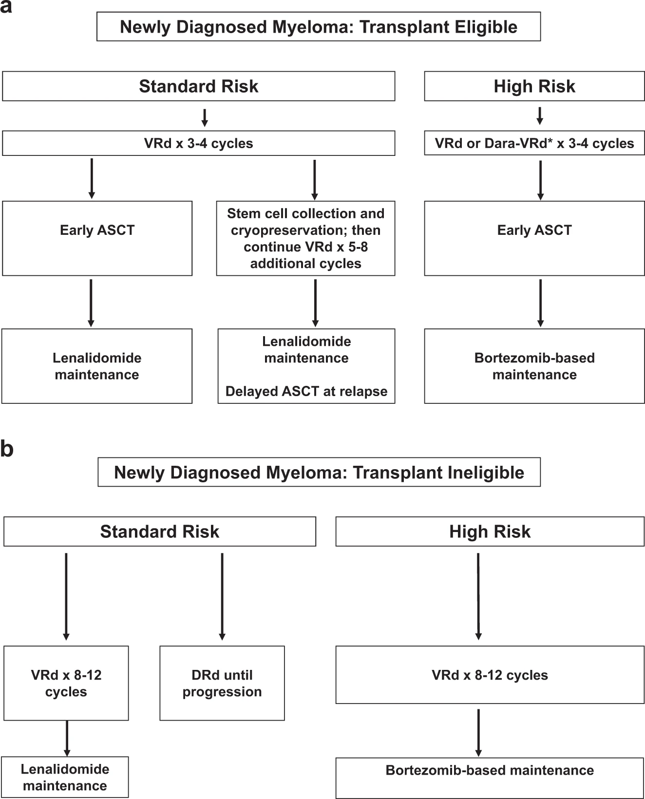
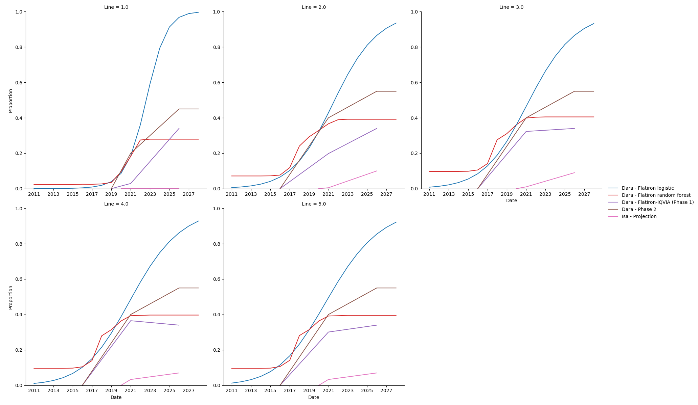
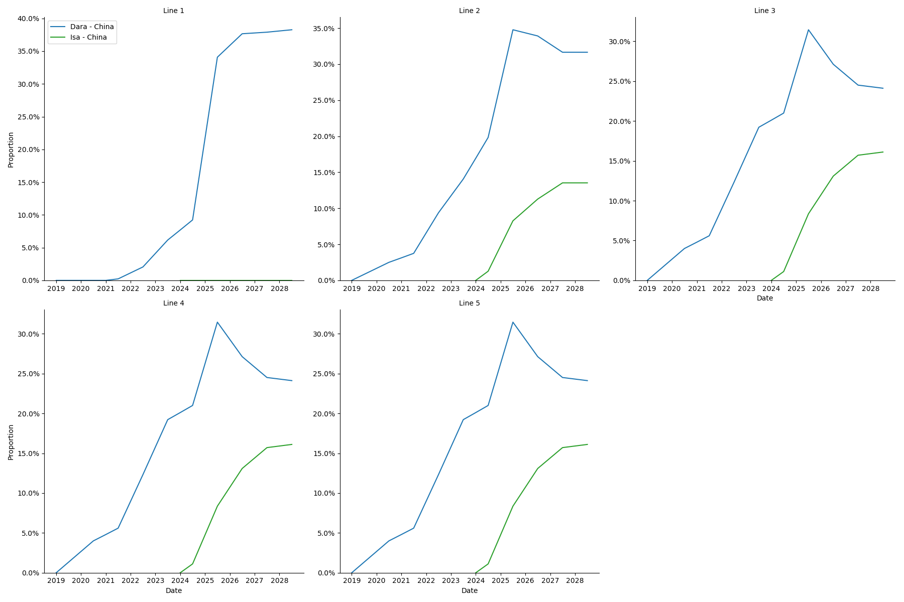
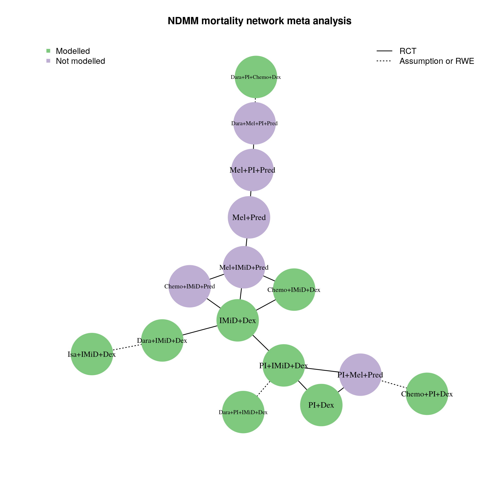
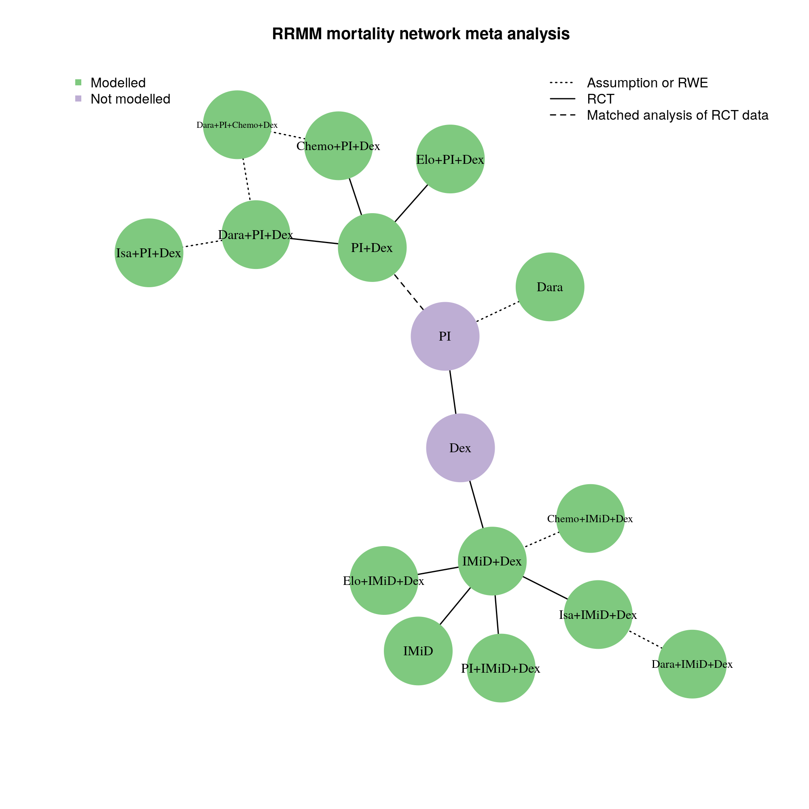

.. _multiple_myeloma_treatment:

..
  Section title decorators for this document:

  ==============
  Document Title
  ==============

  Section Level 1
  ---------------

  Section Level 2
  +++++++++++++++

  Section Level 3
  ~~~~~~~~~~~~~~~

  Section Level 4
  ^^^^^^^^^^^^^^^

  Section Level 5
  '''''''''''''''

  The depth of each section level is determined by the order in which each
  decorator is encountered below. If you need an even deeper section level, just
  choose a new decorator symbol from the list here:
  https://docutils.sourceforge.io/docs/ref/rst/restructuredtext.html#sections
  And then add it to the list of decorators above.

==============================
Multiple Myeloma Treatment
==============================

The multiple myeloma treatment model for :ref:`Phase 2 of the project
<2019_concept_model_vivarium_csu_multiple_myeloma_phase_2>` will incorporate
much of the information and strategy from the :ref:`Multiple Myeloma Phase 1
Treatment Model <mm5.3.3>`. The main differences are that we are expanding the
set of mutually exclusive treatment regimen categories, and we will be supplementing
data from literature and expert opinion with patient-level data from Flatiron to
inform our treatment algorithm.

.. contents::
   :local:

.. list-table:: Abbreviations
  :widths: 5 5 10
  :header-rows: 1

  * - Abbreviation
    - Definition
    - Note
  * - ASCT
    - autologous stem cell transplantation
    - A preferred treatment for multiple myeloma in which a patient has stem cells extracted,
      is given high-dose chemotherapy, and then receives an infusion of their own stem cells.
      Not every patient with multiple myeloma is eligible for ASCT, and treatment strategy varies significantly
      between eligible and ineligible patients.
  * - IMiD
    - immunomodulatory imide drug
    -
  * - PI
    - proteasome inhibitor
    -
  * - MoAB
    - monoclonal antibody
    -
  * - Isa
    - isatuximab
    -
  * - Dara
    - daratumumab
    -
  * - Dex
    - dexamethasone
    -

Links to Related Models
-----------------------

* :ref:`Multiple Myeloma Cause Model <2019_cancer_model_multiple_myeloma>`
* :ref:`Multiple Myeloma Phase 1 Concept Model <2019_concept_model_vivarium_csu_multiple_myeloma>`
* :ref:`Multiple Myeloma Phase 2 Concept Model <2019_concept_model_vivarium_csu_multiple_myeloma_phase_2>`

Intervention Overview
-----------------------

Treatment guidelines for multiple myeloma are complex and varied.
[Rajkumar-and-Kumar-2020]_ and [Nijhof-et-al-2017]_ published recent reviews on
multiple myeloma treatment options and guidelines.

Classes of Drugs for Treating Multiple Myeloma
++++++++++++++++++++++++++++++++++++++++++++++

Important classes of
anti-myeloma drugs are summarized (non-exhaustively) below, according to
[Nijhof-et-al-2017]_:

.. list-table:: Select anti-myeloma drug classes
   :header-rows: 1

   * - Class
     - Abbreviation
     - Drugs
   * - Immunomodulatory imide drugs
     - IMiDs
     - thalidomide, lenalidomide, pomalidomide
   * - Proteasome inhibitors
     - PIs
     - bortezomib, carfilzomib, ixazomib, marizomib, oprozomib
   * - Monoclonal antibodies
     - MoABs
     - isatuximab (anti-CD38), daratumumab (anti-CD38), MOR202 (anti-CD38), elotuzamab (anti-CS1/anti-SLAM7), denosumab (anti-RANKL), siltuximab (anti-IL6), IPH2101 (anti-KIR2DL1/2/3)
   * - Corticosteroids
     - steroids
     - dexamethasone, prednisone

Autologous Stem Cell Transplantation (ASCT)
+++++++++++++++++++++++++++++++++++++++++++

The standard of care for fit multiple myeloma patients is to receive high-dose
chemotherapy (HDT) with autologous stem cell rescue — otherwise known as
autologous stem cell transplant (ASCT) — after completion of induction therapy.
Autologous stem cell transplant can provide significant remission that is both
long and deep, extending survival.

**Autologous vs. Allogeneic:** "Autologous" refers to the blood-making stem
cells that are harvested from the patient to be a source of new blood cells
after high-dose chemotherapy with melphalan. "Allogeneic" transplant, in which
donor stem cells are used instead of the patient's own cells, is not performed
in myeloma outside the context of a clinical trial.
[https://www.myeloma.org/autologous-stem-cell-transplant]

.. todo::

  Look into some questions about ASCT. For example:

  * What factors determine whether a patient is eligible for ASCT?

    - According to [Rajkumar-and-Kumar-2020]_, "In general, eligibility for ASCT
      is affected by age, `performance status`_, and comorbidities."
    - According to https://www.myeloma.org/autologous-stem-cell-transplant,
      transplant eligibility also depends on disease-related factors including
      "the type and the stage of the disease, its aggressiveness and
      responsiveness to treatment, the levels of serum albumin and beta-2
      microglobulin, and the presence or absence of certain chromosomal
      abnormalities in the patient’s myeloma cells."

  * When in the treatment cycle does ASCT usually occur? (According to the
    treatment algorithm in [Rajkumar-and-Kumar-2020]_, ASCT is usually done in
    the first line, but sometimes after the first relapse. How often is ASCT
    done more than once?)
  * How does eligibility for ASCT affect choice of treatment regimens?
  * How does ASCT affect survival rates and progression rates in the first line
    and in later lines? (E.g., if ASCT is done in the first line, (a) does it
    delay the onset of the first relapse, and (b) does it have a detectable
    effect on survival or progression after the first relapse?)

  The answers to these questions may affect how we implement the MM treatment
  algorithm in Vivarium, and they may also affect how we implement the survival
  regression of Flatiron data to get transition rates for the MM cause model.

.. _performance status: https://ecog-acrin.org/resources/ecog-performance-status/

Maintenance Therapy and Continuous Therapy
++++++++++++++++++++++++++++++++++++++++++

**Maintenance therapy** refers to treatment given to patients after high-dose
chemotherapy with autologous stem cell transplant (ASCT), while **continuous
therapy** refers to treatment given to patients who do not go on to transplant
after frontline therapy.

While maintenance and continuous therapy with Revlimid® (lenalidomide) is the
standard of care for treatment of multiple myeloma, there is currently no set
time period for the optimal duration of maintenance.
[https://www.myeloma.org/maintenance-therapy]

Myeloma Treatment Algorithm Flowcharts
++++++++++++++++++++++++++++++++++++++

The following flowcharts illustrate the current treatment algorithms for
multiple myeloma recommended in [Rajkumar-and-Kumar-2020]_. For more details,
see the original reference and the description from the :ref:`Multiple Myeloma
Phase 1 Treatment Model <mm5.3.3>`. The images are shared under the `Creative
Commons license <creative_commons_license_>`_.

Note that capital letters in the abbreviations for treatment regimens in the
figures below refer to the brand names of the drugs, not the generic names. For
example, VRd stands for Velcade® (bortezomib), Revlimid® (lenalidomide),
dexamethasone.

.. _creative_commons_license: https://creativecommons.org/licenses/by/4.0/

Treatment of Newly Diagnosed Myeloma
~~~~~~~~~~~~~~~~~~~~~~~~~~~~~~~~~~~~

According to [Rajkumar-and-Kumar-2020]_, the two main factors driving the
authors' approach to treating newly diagnosed MM are (1) eligibility for
autologous stem cell transplantation (ASCT) and (2) risk stratification. *Risk
stratification* refers to the presence (high risk) or absence (standard risk) of
certain cytogenetic abnormalities, which are screened for upon diagnosis of MM.
The current recommended algorithm for the treatment of symptomatic newly
diagnosed MM based on transplant eligibility and cytogenetic risk is shown in
:ref:`Fig. 1
<mm_treatment_fig_1_treatment_of_newly_diagnosed_multiple_myeloma>`.

See also:

* https://www.myeloma.org/frontline-treatment-options
* https://www.seattlecca.org/diseases/multiple-myeloma/treatment

.. _mm_treatment_fig_1_treatment_of_newly_diagnosed_multiple_myeloma:

  Fig. 1: Approach to the treatment of newly diagnosed myeloma in
  transplant-eligible **(a)** and transplant-ineligible **(b)** patients. VRd,
  Bortezomib, lenalidomide, dexamethasone; DRd, daratumumab, lenalidomide,
  dexamethasone; Dara-VRd, daratumumab, bortezomib, lenalidomide, dexamethasone;
  ASCT, autologous stem cell transplantation.

Treatment of Relapsed Myeloma
~~~~~~~~~~~~~~~~~~~~~~~~~~~~~

According to [Rajkumar-and-Kumar-2020]_, with modern therapy, the first relapse
of MM occurs after ~3–4 years following initial diagnosis. Each subsequent
remission is of shorter duration. Many patients with MM receive five or more
lines of therapy in a sequential manner over several years. The remission
duration in relapsed MM decreases with each regimen.

The choice of treatment at each relapse is affected by many factors, including
the timing of the relapse, response to prior therapy, aggressiveness of the
relapse, and `performance status`_. In general, a triplet regimen is preferred.
At each relapse, a regimen that contains at least two new drugs that the patient
is not refractory to should be considered. The recommended algorithm for the
treatment of relapsed MM is given in :ref:`Fig. 2
<mm_treatment_fig_2_treatment_of_relapsed_multiple_myeloma>`.

See also:

* https://www.myeloma.org/relapsed-multiple-myeloma
* https://www.myeloma.org/treatments-subsequent-relapse

.. _mm_treatment_fig_2_treatment_of_relapsed_multiple_myeloma:

.. figure:: Rajkumar_2020_Fig2_line_2plus_treatment.webp

  Fig. 2: Approach to the treatment of relapsed multiple myeloma in first
  relapse **(a)** and second or higher relapse **(b)**. DRd daratumumab,
  lenalidomide, dexamethasone; KRd carfilozomib, lenalidomide, dexamethasone;
  IRd ixazomib, lenalidomide, dexamethasone; ERd elotuzumab, lenalidomide,
  dexamethasone; DVd daratumumab, bortezomib, dexamethasone; DPd daratumumab,
  pomalidomide, dexamethasone; KPd carfilzomib, pomalidomide, dexamethasone; VCd
  bortezomib, cyclophosphamide; DKd daratumumab, carfilzomib, dexamethasone; IPd
  ixazomib, pomalidomide, dexamethasone.

Affected Outcomes
+++++++++++++++++

.. list-table:: Affected Outcomes
  :widths: 15 15 15 15
  :header-rows: 1

  * - Outcome
    - Effect
    - Modeled?
    - Note
  * - Mortality
    - Various
    - Yes
    -
  * - Relapse
    - Various
    - Yes
    -
  * - Response to future therapy
    - Decreases efficacy of similar therapy
    - No
    -
  * - Quality of life/disability weight
    - Various
    - No
    -

Vivarium Modeling Strategy
--------------------------

The Phase 1 simulation only considered three categories of treatment regimen:
isatuximab-containing, daratumumab-containing, and other. Transitions between
these were determined only by coverage proportions, unaffected by prior treatment
for the simulant or covariates.

In Phase 2, we are expanding the treatment regimen categories considerably, to a
total of 24, and making transitions dependent on prior treatment and covariates.

Treatment Regimen Category Components
+++++++++++++++++++++++++++++++++++++

These are the components that make up our modelled treatment regimen categories.
They are drug classes, individual drugs, and ASCT. Not every combination of these
components is a valid treatment regimen category; those are enumerated in the next section.

.. list-table:: Modeled Treatment Regimen Category Components
  :widths: 1 1 5 10
  :header-rows: 1

  * - Component
    - Abbreviation
    - Drugs
    - Notes
  * - Proteasome inhibitors
    - PI
    - bortezomib, carfilzomib, ixazomib
    -
  * - Immunomodulatory drugs
    - IMID
    - lenalidomide, pomalidomide, thalidomide
    -
  * - Chemotherapy drugs
    - Chemo
    - bendamustine, cyclophosphamide, doxorubicin
    -
  * - Daratumumab
    - Dara
    - daratumumab
    -
  * - Isatuximab
    - Isa
    - isatuximab
    -
  * - Dexamethasone
    - Dex
    - dexamethasone
    -
  * - Autologous stem cell transplant
    - ASCT
    - N/A
    - While ASCT is a subsequent step after induction therapy, we consider it
      part of the same line and it is included in the treatment regimen category as if it
      were at the time of induction. We restrict it to only appear in NDMM; while
      later transplants do occur in real life, they are relatively uncommon, and
      we do not model them.

.. note::

  The drug class components represent *exactly one* drug from
  that class. If there is more than one, the treatment regimen will always fall
  into one of the Other treatment regimen categories described in the next section.

Treatment Regimen Categories
++++++++++++++++++++++++++++

Based on conversations
with the client and with our clinical expert, we are expanding the
modeled treatment regimen categories to the following set of 24 mutually exclusive and exhaustive
categories:

.. list-table:: Modeled Treatment Regimen Categories
  :widths: 5 10
  :header-rows: 1

  * - Treatment regimen category
    - Notes
  * - PI+Dex
    -
  * - IMID+Dex
    -
  * - PI+IMID+Dex
    -
  * - Chemo+PI+Dex
    -
  * - Chemo+IMID+Dex
    -
  * - Dara+PI+Dex
    -
  * - Dara+IMID+Dex
    -
  * - Isa+PI+Dex
    -
  * - Isa+IMID+Dex
    -
  * - Dara+PI+Chemo+Dex
    -
  * - Dara+PI+IMID+Dex
    -
  * - Other
    - Covers all other combinations of *non-ASCT components* in the absence of ASCT.
  * - PI+Dex+ASCT
    - NDMM only
  * - IMID+Dex+ASCT
    - NDMM only
  * - PI+IMID+Dex+ASCT
    - NDMM only
  * - Chemo+PI+Dex+ASCT
    - NDMM only
  * - Chemo+IMID+Dex+ASCT
    - NDMM only
  * - Dara+PI+Dex+ASCT
    - NDMM only
  * - Dara+IMID+Dex+ASCT
    - NDMM only
  * - Isa+PI+Dex+ASCT
    - NDMM only
  * - Isa+IMID+Dex+ASCT
    - NDMM only
  * - Dara+PI+Chemo+Dex+ASCT
    - NDMM only
  * - Dara+PI+IMID+Dex+ASCT
    - NDMM only
  * - Other+ASCT
    - Covers all other combinations of *non-ASCT components* in the presence of ASCT.

Baseline Coverage Data
++++++++++++++++++++++++

If any simulants are initialized into the NDMM state in the multiple myeloma cause model
(this is TBD according to what is easier to implement), they will all be initialized
to PI+IMID+Dex. The 10-year burn-in period of running the treatment assignment scheme
described below will make this initialization almost entirely inconsequential.

Treatment Assignment
++++++++++++++++++++

The Phase 1 simulation had fixed coverage percentages for each treatment regimen category
in each line, which varied between scenarios. In Phase 2, we will assign treatment regimen categories
according to these three schemes:

#. In the baseline scenario, we use "sophisticated" models, which take into account covariates and prior
   treatment in a patient's history, and some postprocessing "business rules" that modify their predicted
   probabilities.
#. In the naive-model scenario (Model 1; Model 3's alternative scenario 1), we use naive models that always predict the same probabilities
   regardless of covariates, with the same postprocessing rules as the baseline scenario.
   This will be even simpler than Phase 1 because it has no time trend.
#. In the other alternative scenarios, we use sophisticated models (same as the baseline scenario) with modified
   postprocessing rules.

Both the naive and sophisticated models are informed by Flatiron data.

To be precise, in each scheme there will be two models: one that assigns the
first line of treatment (the treatment a simulant receives at the time of incidence of MM)
and another that assigns later lines (at time of 1st, 2nd, 3rd, etc relapse). All models output probabilities;
the simulation will apply the postprocessing rules and then randomly assign a treatment regimen category according to the final probabilities.

Naive Models
~~~~~~~~~~~~

The naive models can be summarized very easily. They are provided as CSV
files where the first row contains treatment regimen categories and the second contains corresponding
(invariant) probabilities of assignment.

.. warning::
  These naive probabilities `have missing categories for RRMM due to a data processing error <https://ihme.slack.com/archives/C016L1Y7G6R/p1661120837399389>`_.
  They also were not run with the most updated version of the line of therapy coding algorithm.

  These are not critical issues since the naive scenario is not a key output of our simulation.

.. list-table:: Naive probabilities CSV paths
  :widths: 1 10
  :header-rows: 1

  * - Name
    - Path
  * - NDMM
    - J:\\Project\\simulation_science\\multiple_myeloma\\data\\treatment_model_input\\2022_07_16\\ndmm_model_naive_proba.csv
  * - RRMM
    - J:\\Project\\simulation_science\\multiple_myeloma\\data\\treatment_model_input\\2022_07_16\\rrmm_model_naive_proba.csv

Sophisticated Models
~~~~~~~~~~~~~~~~~~~~

The sophisticated models are random forests.
To avoid over-fitting, the maximum number of leaf nodes permitted in each tree was selected by 5-fold stratified cross-validation,
optimizing for log-loss of probabilistic predictions.
Though tree-based approaches inherently involve selecting features, some feature selection had to be done manually because of missing data;
we used a complete-case analysis, dropping records that were missing data in any necessary field.
Therefore, there was a trade-off between using information available to us and losing statistical power and representativeness.
Renal impairment was included as a predictor in NDMM because it showed strong feature importance in that model.
Cytogenetic risk was not included in either model because it did not improve predictions and lead to smaller sample size.
We tested alternative codings of previous-treatment covariates, but none improved predictions.

The sophisticated models require a more complex simulation implementation approach. Because they need to be trained within Foundry, they have to be passed from
Foundry to Vivarium in a serialized format. While a human-readable and interoperable
format would be ideal, due to Foundry constraints we will use :code:`joblib.dump` to output :code:`.pkl` files. The pickled
form of the models may depend on the version of Python, :code:`sklearn`,
and possibly sklearn subdependencies they were trained with. We will need to align
these between the Vivarium environment and the Foundry environment and verify
that outputs are what we expect. For this last task, see the verification script below.

.. list-table:: Python and package versions at model training time
  :header-rows: 1

  * - Package
    - Version
  * - Python
    - 3.8.13
  * - scikit-learn
    - 1.1.1
  * - pandas
    - 0.25.3
  * - numpy
    - 1.19.5

.. note::

  As of now, there is a bug in Foundry that does not allow us to download the pickle
  file. So, as a workaround, we are printing the file as hex bytes and using this script
  to generate the binary file:

  .. literalinclude:: hex_to_binary.py
    :language: python
    :linenos:

Each pickled object is an sklearn Classifier, implemented by an sklearn Pipeline.
This object has a :code:`predict_proba` method which takes a pandas DataFrame
of covariates and returns a 2d numpy array of probabilities. That returned array
can be transformed into a DataFrame with meaningful column names like so:

.. code-block:: python

  ndmm_assignment_probs = pd.DataFrame(ndmm_model.predict_proba(ndmm_X_to_predict), columns=ndmm_model.classes_)

.. note::

  The :code:`.classes_` array may not contain all the treatment regimen categories in the model.
  Any treatment regimen categories missing should have probability 0 of being selected.

.. list-table:: Pickle file paths
  :widths: 1 10
  :header-rows: 1

  * - Name
    - Path
  * - NDMM
    - J:\\Project\\simulation_science\\multiple_myeloma\\data\\treatment_model_input\\2022_07_16\\ndmm_model.pkl
  * - RRMM
    - J:\\Project\\simulation_science\\multiple_myeloma\\data\\treatment_model_input\\2022_07_16\\rrmm_model.pkl
  * - NDMM naive model
    - J:\\Project\\simulation_science\\multiple_myeloma\\data\\treatment_model_input\\2022_07_16\\ndmm_model_naive.pkl
  * - RRMM naive model
    - J:\\Project\\simulation_science\\multiple_myeloma\\data\\treatment_model_input\\2022_07_16\\rrmm_model_naive.pkl

Model Covariates
~~~~~~~~~~~~~~~~

.. list-table:: Covariates for NDMM treatment assignment
  :header-rows: 1

  * - Column name
    - Description
    - Allowed values
  * - FirstTreatmentAge
    - Age at time of first treatment/incidence of MM (for NDMM, this equals current age) in un-rounded years.
    -
  * - Sex
    - The simulant's sex. Binary because our source data does not distinguish between intersex and not recorded.
    - 'M' or 'F'
  * - RenalImpairment
    - Whether or not the simulant has renal impairment.
    - 0 or 1
  * - Year
    - Current (unrounded) year minus 2000. e.g. 22.5 for halfway through 2022.
    -

.. list-table:: Covariates for RRMM treatment assignment
  :header-rows: 1

  * - Column name
    - Description
    - Allowed values
  * - FirstTreatmentAge
    - Age at time of first treatment/incidence of MM in un-rounded years.
    -
  * - Sex
    - The simulant's sex. Binary because our source data does not distinguish between intersex and not recorded.
    - 'M' or 'F'
  * - Year
    - Current (unrounded) year minus 2000. e.g. 22.5 for halfway through 2022.
    -
  * - Duration_previous
    - Time since the **previous** relapse in days. In other words, the number of days the simulant spent in the cause model state they are transitioning out of.
    -
  * - {component}_flag_previous
    - For each component part of a valid treatment regimen category (e.g. 'PI', 'IMID', 'ASCT')
      a binary flag indicating whether it was present in the previous line of treatment.
      The Isa_flag_previous and Dara_flag_previous flags are ignored by the treatment model, but used in the business rules.
    - 0 or 1
  * - IsaOrDara_flag_previous
    - A binary flag indicating whether Dara **or** Isa was present in the previous line of treatment. They are assumed to affect future treatment identically.
    - 0 or 1
  * - NumberOfComponents_previous
    - **Number** of component parts of a valid treatment regimen category (e.g. 'PI', 'IMID', 'ASCT')
      present in the previous line of treatment. Equivalently, the sum of {component}_flag_previous across
      all components.
    -
  * - LineNumber
    - Line of treatment. Equal to the number of relapses + 1.
    - Less than or equal to 5.
  * - TimeSinceFirstTreatment
    - Time elapsed since first treatment (a.k.a. incidence of MM) in unrounded years.
    -

Model Transfer Verification
~~~~~~~~~~~~~~~~~~~~~~~~~~~

The following script verifies that assignment probabilities for a certain set of covariates
match those generated within Foundry. It requires access to all the files in J:\\Project\\simulation_science\\multiple_myeloma\\data\\treatment_model_input\\2022_07_16.

.. literalinclude:: verify_model_probabilities.py
  :language: python
  :linenos:

Postprocessing rules
~~~~~~~~~~~~~~~~~~~~

Postprocessing rules flowchart
^^^^^^^^^^^^^^^^^^^^^^^^^^^^^^

.. image:: postprocessing_flowchart.svg
  :width: 500
  :alt: Flowchart of postprocessing rules

Estimated population-level probabilities
^^^^^^^^^^^^^^^^^^^^^^^^^^^^^^^^^^^^^^^^

In the postprocessing rules, there are several places where we'd like to rescale probabilities of a regimen category or a set of regimen categories to match some target probability.
However, we only want to match the target value **at the population level**, without eliminating the individual variation in that probability.
In other words, we want to rescale so that if there were a large enough population of simulants, they would transition to the category or categories with the target probability,
but we also want the ratios of each probability *between* simulants to be unchanged by this rescaling.
In the actual simulation, this "large population" is hypothetical, because for any specific line number on a specific timestep, the population will be
small, and covariate distributions will be unstable from timestep to timestep. This means that we cannot directly observe the population-level probabilities.

For naive treatment assignment models, this is not a problem in practice, because there is no individual variation. Therefore, the naive probabilities already represent probabilities in
an arbitrarily large population. However, when using sophisticated treatment assignment models, we need a population large enough to have a representative distribution of covariates.

We approximate the population by starting from all Flatiron patients receiving a new line of treatment in that setting (NDMM or RRMM) and assigning them the relevant line number
and calendar year without changing any other attributes.
This will differ from the true population in the simulation, but should be similar enough to make rescaling fairly accurate.
We then estimate the population-level probabilities by aggregating treatment assignment model predictions for this dataset.

The key is that, at each postprocessing step, we not only apply the step to the actual simulant-level probabilities for the timestep, but also to the estimated population-level probabilities.
This means that they are kept in sync: at each point in the postprocessing algorithm, the estimated population-level probabilities are our best estimate of what a large population's mean probabilities
would be **just before that step**.

The estimated probabilities before any postprocessing steps are applied, calculated for each line number at the start of each calendar year, can be found at
J:\\Project\\simulation_science\\multiple_myeloma\\data\\treatment_model_input\\2022_08_10\\population_level_probabilities.csv.
At each timestep, the probabilities used are a linear interpolation between the adjacent years according to the date at that timestep.

China adjustments
^^^^^^^^^^^^^^^^^

Goals
'''''

Our China adjustment postprocessing rules are designed so that:

* We approximately match our population-level NDMM induction coverage targets for each cytogenetic risk grouping. The target values are interpreted as proportions **among treatments except for Other and Other+ASCT** for lower-granularity groups of regimen categories: Dara quadruplets, Dara triplets, other triplets, doublets, and regimen categories not seen in China (always set to 0). Note that these induction targets are not stratified by ASCT.
    * Dara quadruplets: Dara+PI+IMID+Dex and Dara+PI+Chemo+Dex, with and without ASCT
    * Dara triplets: Dara+PI+Dex and Dara+IMID+Dex, with and without ASCT
    * Other triplets: PI+IMID+Dex and Chemo+PI+Dex, with and without ASCT
    * Doublets: PI+Dex and IMID+Dex, with and without ASCT
    * Not seen in China (probabilities set to 0): Chemo+IMID+Dex, with and without ASCT 
* We approximately match our population-level RRMM induction coverage targets, which are for the same groups of regimen categories, but not separated by cytogenetic risk.
* We approximately match our population-level NDMM targets for the probability of treatment containing ASCT or not.
* As much as possible, we do not change the probability ratios between simulants for each regimen category. In other words, if Simulant 1 was twice as likely as Simulant 2 to receive PI+IMID+Dex before these rules, that should still be the case after these steps. However, we are forced to compromise on this requirement when we normalize each simulant's probabilities to sum to 1.
* The probability ratios between regimen categories indistinguishable to these targets are unchanged. For example, PI+IMID+Dex and Chemo+PI+Dex are both Dara triplets, and they are both non-ASCT. Both at the population level and at the individual simulant level, the ratio between the probability of PI+IMID+Dex and the probability of Chemo+PI+Dex is the same after the China adjustments as it was before.

The word "approximately" in the population-level constraints above refers to two limitations that prevent us from exactly meeting these targets:

* Our sample size on any one timestep for treatment assignment is small, so we calibrate our rescaling factors to match the targets in a larger synthetic population. However, this population is derived from the Flatiron joint distribution of covariates, which can differ from the true simulation joint distribution.
* The NDMM values have both induction and ASCT constraints, and both NDMM and RRMM probabilities must satisfy the constraint that they sum to 1 at the simulant level. In practice, there is no way to exactly satisfy all these constraints at the same time. We could use a technique like IPF to iteratively converge on the solution, but for now we do something even simpler: rescale to the marginals in a particular order (essentially one iteration of IPF). That means that the last marginal "wins" and is exactly matched. The order (currently) is: induction constraints, simulant probabilities sum to 1, ASCT/non-ASCT constraints (if present), simulant probabilities sum to 1.

Detailed description
''''''''''''''''''''

Perform the following steps:

#. If in NDMM, do this step separately for each cytogenetic risk group (high risk and standard risk); if in RRMM, do this step for the population overall:
     #. **Note:** The input data for population-level probabilities are not stratified by cytogenetic risk. However, in the NDMM setting, there is no correlation between treatment and cytogenetic risk. Therefore, the correct population-level probabilities can be created by replicating the existing probabilities and assigning cytogenetic risk at random according to the exposure proportion.
     #. For each coverage target (Dara quadruplets, Dara triplets, Other triplets, Doublets), scale the regimen categories within it to match the target coverage at the population level. Specifically, multiply the probabilities of the regimen categories within it by :math:`\frac{\text{coverage_target}}{\text{population_target_regimen_categories}}`, where coverage_target is the target coverage from the "China coverage targets" data file, and population_target_regimen_categories is the sum of probabilities of the regimen categories included in this coverage target at the population level **after filtering to the cytogenetic risk group** (see "Estimated population-level probabilities" section).
#. Set the probabilities of all regimen categories in the "Not seen in China" list to 0.
#. Re-normalize the probabilities to 1 without modifying the Other and Other+ASCT probabilities. Specifically, multiply the probabilities of the categories **besides Other and Other+ASCT** by :math:`\frac{1 - \text{other_simulant}}{\text{non_other_simulant}}`, where other_simulant is the sum of the probabilities of Other and Other+ASCT for that particular simulant, and non_other_simulant is the sum of the probabilities of the categories besides Other and Other+ASCT for that particular simulant.
#. If in NDMM, for each ASCT coverage target (ASCT and non-ASCT), scale the regimen categories within it to match the target coverage at the population level. Specifically, multiply the probabilities of the regimen categories within it by :math:`\frac{\text{coverage_target}}{\text{population_target_regimen_categories}}`, where coverage_target is the target coverage from the "China coverage targets" data file, and population_target_regimen_categories is the sum of probabilities of the regimen categories included in this coverage target at the population level (see "Estimated population-level probabilities" section).
#. Re-normalize the probabilities to 1. Specifically, multiply the probabilities by :math:`\frac{1}{\text{total_simulant}}`, where total_simulant is the sum of all probabilities for that particular simulant.

Coverage targets
''''''''''''''''

.. note::

  The coverage for Dara triplets in NDMM with high risk has been set to 0.01% instead of 0. This is because triplets are the only Dara regimen categories in the simulation that directly correspond to Isa regimen categories; there are no Isa quadruplets in the simulation. We can only use the Dara triplets' individual variation to scale up Isa in NDMM if they are non-zero at the point in the algorithm where we scale to our Isa targets. Setting the target coverage for Dara triplets to 0.01% is a workaround to make this possible without restructuring our Isa rules.

:download:`China coverage targets <china_coverage_targets.csv>`

Isa and Dara projection and scenarios
^^^^^^^^^^^^^^^^^^^^^^^^^^^^^^^^^^^^^

Goals
'''''

Our Isa and Dara projection/scenario postprocessing rules are designed so that:

* We do not assign Isa or Dara regimen categories before those treatments were approved/in use.
* We approximately match the Isa coverage (sum of all Isa-containing regimen categories) from our location-, line-, and year-specific projections.
* We approximately match the Dara coverage (sum of all Dara-containing regimen categories) from our location-, line-, and year-specific projections. Though we do have the sample size to inform US values from Flatiron, we needed to extrapolate them in a custom, expert-opinion-informed way (see US projections section below).
* The split between the Dara-containing regimen categories is unchanged.
* The split between the Isa-containing regimen categories matches the split between the analogous Dara-containing categories, conditional on covariates.
* The associations between all non-Isa categories and simulant-level covariates are unchanged.
* Isa is associated with covariates -- besides line and year -- in the same way as Dara (they have the same patient profile), except that when it follows Dara in our Isa-after-Dara scenario, it is constant across these covariates.
* The probability of interest for each of our alternative scenarios (probability of Isa after Dara, probability of Isa in the first line) approximates our specified probability in that scenario, and is zero in all other scenarios. When Isa scales up in these scenarios, it selectively replaces Dara.
* Time trends of all regimen categories **that do not contain Isa or Dara** are unchanged. Because the sophisticated models are random forests, they use a flat (every future year is like the present) extrapolation.
* The split between ASCT and non-ASCT treatment is unchanged **for each simulant**.

Detailed description
''''''''''''''''''''

Perform the following steps:

#. Before applying any Isa/Dara rules, record the probability of ASCT and the probability of non-ASCT treatment. These should sum to 1 and will be used in the final re-normalization.
#. Multiply the probability of each Dara-containing regimen category by :math:`\text{dara_target_coverage} / \text{population_dara}`, where dara_target_coverage is a linear interpolation or extrapolation by year of the scenario- and line-specific value in the "Target Dara coverage" data file, and population_dara is the sum of the estimated population-level probabilities of Dara-containing regimen categories (see "Estimated population-level probabilities" section).
#. For each of the regimen category pairs that only differ by substituting Isa with Dara, perform this step:
    * Set the probability of the Isa-containing category to :math:`p_\text{dara} * \frac{\text{isa_target_coverage}}{\text{population_dara_isa_corresponding}}`, where :math:`p_\text{dara}` is the probability of the corresponding Dara regimen category (after application of previous steps), isa_target_coverage is a linear interpolation or extrapolation by year of the scenario- and line-specific value in the "Target Isa coverage" data file, and population_dara_isa_corresponding is the sum of the estimated population-level probabilities of Dara regimen categories that only differ from an Isa regimen category by substituting Dara with Isa (see "Estimated population-level probabilities" section).
#. If this is an RRMM assignment and the previous line contained a Dara component (in other words, if the Dara_flag_previous in the model covariates table above is 1):
    #. **Note:** These operations cannot be performed on the population-level probabilities because they are not stratified by whether the previous line contained a Dara component. The population-level probabilities are not used in the remaining steps and can be discarded at this point.
    #. If the scenario is alternative scenario 2 (Isa-after-Dara) and the patient is in second line treatment (first relapse state), multiply the probabilities of all Dara-containing categories by ((the sum of the probabilities of all the Isa- **or** Dara-containing categories - target Isa retreatment coverage) / the sum of all the Dara-containing categories), then multiply the probabilities of all Isa-containing categories by (target Isa retreatment coverage / the sum of the probabilities of all the Isa-containing categories), where "target Isa retreatment coverage" is 0.05 or the sum of all Isa- **or** Dara-containing categories, whichever is less.
    #. Otherwise, multiply the probabilities of all Dara-containing categories by (the sum of all the Isa- **or** Dara-containing categories / the sum of all the Dara-containing categories), then set the probabilities of all Isa-containing categories to 0.
#. Split the probabilities into two sets: those that contain ASCT and those that do not. Within each set:
    #. Determine the amount the non-Isa, non-Dara categories should be scaled to match. This is the original probability of this ASCT category from Step 1 minus the sum of the probabilities that **do contain Isa or Dara**, except in the rare case that this value would be negative, in which case it should be zero.
    #. Multiply the probabilities of the categories that **do not contain Isa or Dara** by the quantity from the previous step divided by the sum of the probabilities that **do not contain Isa or Dara**.
    #. In the rare case where the sum of the probabilities of the categories that **do contain Isa or Dara** is greater than the original probability of this ASCT category from Step 1, multiply these probabilities by that original ASCT category probability divided by the sum of the probabilities of the categories that **do contain Isa or Dara**.
#. The probabilities of each ASCT category (ASCT or non-ASCT) should now match the corresponding probability in Step 1.
#. The probabilities should now sum to 1, and the probabilities of Isa- and Dara-containing categories should not have changed in the last two steps.
#. Sample the assigned treatment.

US projections
''''''''''''''

The upward trend in Dara use observed in Flatiron is steep; a linear extrapolation (in logistic space) out to 2028 puts it at nearly 100%. A tree-based model such as a random forest creates a flat extrapolation, in which all future years are the same as the present.

Notably, our models indicate higher Dara uptake than the projections we used in Phase 1, and in many cases already surpass those 2025 projections. As a middle ground, in consultation with our clinical expert,
we made "best guess" projections of Dara, incorporating evidence on what we see so far, and knowledge that there is a "ceiling" on how many patients Dara will reach. We have set this ceiling at 45% in the NDMM
setting and 55% in the RRMM setting. Our projections do not vary by line within RRMM.

Data files:

:download:`Target Isa coverage in the US <target_isa_coverage.csv>`

:download:`Target Dara coverage in the US <target_dara_coverage.csv>`

China projections
'''''''''''''''''

Data files:

:download:`Target Isa coverage in China <target_isa_coverage_china.csv>`

:download:`Target Dara coverage in China <target_dara_coverage_china.csv>`

Details on the calculation of these values can be found at J:\\Project\\simulation_science\\multiple_myeloma\\data\\treatment_model_input\\China Projections.xlsx

.. warning::
  These values were calculated in the Excel spreadsheet listed above, which is not very easy to understand;
  if we return to this work we should replace this with code.

Modeled Affected Outcomes
+++++++++++++++++++++++++

.. list-table:: Modeled Outcomes
  :header-rows: 1

  * - Outcome
    - Affected measure
    - Effect size measure
    - Effect size
    - Note
  * - Mortality
    - Hazard rate of death
    - Hazard ratio
    - Various
    - HRs relative to mix of treatment observed in Flatiron survival data
  * - Relapse
    - Hazard rate of relapse
    - Hazard ratio
    - Various
    - HRs relative to mix of treatment observed in Flatiron survival data

Mortality and Relapse Effects
+++++++++++++++++++++++++++++

.. note::

  For more about how we model relapse, see :ref:`the Multiple Myeloma
  cause model <2019_cancer_model_multiple_myeloma>`.

For each multiple myeloma setting (NDMM, RRMM) in which it can be used,
each regimen category has a hazard ratio (HR) for mortality and an HR for relapse.
These hazard ratios are relative to the regimen category mix in the base survival curve.
Therefore, the hazard at time :math:`t` after incidence/relapse for a simulant
with covariates :math:`x` being treated with regimen category :math:`r` is:

.. math::

  h(t|x,r) = h(t|x) * HR_r

Mortality and relapse hazard ratios for each regimen category, plus the major subcategories of the 'Other' category, in each setting were estimated using a
network meta-analysis of published findings with study random effects. The majority of categories could
be connected by a network of randomized controlled trials (RCTs).

Some categories were connected using non-randomized evidence:

* Two matched analyses between different RCTs.
* Two matched analyses comparing RCT evidence with claims data.

A few categories had to be connected with assumptions:

* Assuming similarity (with some uncertainty) between substantially similar
  categories, including those that differed only by substitution of Isa with Dara, and those that differed only
  by substitution of melphalan with cyclophosphamide and prednisone/prednisolone with dexamethasone.
* Assuming that the *HRs* were similar between analogous comparisons, for example the HR of adding Chemo to a regimen or the HR of adding Dara to a regimen.

We also assumed that adding drugs could not make a regimen *less* effective.

After estimating HRs for each subcategory, the HR
of the 'Other' category was calculated by weighting these subcategories according to the observed proportions
of use in Flatiron data.
This was used for the 'Other' category in both the US and China locations, in absence of
evidence about 'Other' treatments used in China.

Below are the networks used to calculate mortality HRs in the NDMM and RRMM setting respectively. The networks for relapse HRs
were nearly identical to these, the only difference being a few added links (RCTs that reported relapse outcomes but did not have mature mortality data).

The effect of ASCT was estimated separately with a small meta-analysis of two RCTs: [DETERMINATION]_ and [IFM_2009]_.
ASCT and induction regimen were assumed not to modify each others' effects.

After estimating HRs relative to a common reference category by combination of induction regimen
and ASCT effects, a HR relative to the common reference category was calculated for the population-level
mix of treatments observed in Flatiron data, which informs the base hazard described above. All HRs were
then modified to be relative to this population-level mix. For the China simulation, the "China adjustment"
postprocessing rules were performed before calculating the population-level mix.

A log-normal distribution of uncertainty within the uncertainty intervals reported
above should be assumed. The mortality and relapse hazard ratios for the same
regimen category should be sampled with the same random percentile from their respective distributions,
so that mortality and relapse effects are correlated.

US Hazard Ratios
~~~~~~~~~~~~~~~~

.. csv-table:: Mortality hazard ratios for the US
  :file: mortality_hrs.csv
  :header-rows: 1

:download:`mortality_hrs.csv`

.. csv-table:: Relapse hazard ratios for the US
  :file: relapse_hrs.csv
  :header-rows: 1

:download:`relapse_hrs.csv`

China Hazard Ratios
~~~~~~~~~~~~~~~~~~~

.. csv-table:: Mortality hazard ratios for China
  :file: mortality_hrs_china.csv
  :header-rows: 1

:download:`mortality_hrs_china.csv`

.. csv-table:: Relapse hazard ratios for China
  :file: relapse_hrs_china.csv
  :header-rows: 1

:download:`relapse_hrs_china.csv`

Assumptions and Limitations
~~~~~~~~~~~~~~~~~~~~~~~~~~~~

#. We assume that treatment assignment depends only on the selected covariates and
   characteristics of the immediately preceding treatment, and that the remaining variation
   is truly random.
#. We assume that regimen categories not including Isa or Dara will not change
   in relative proportion between the end of our data (roughly 2022) and the end
   of our simulation (2028), except that they all scale up or down by the same proportion according
   to the time-varying projections of Isa and Dara.
#. We only model ASCT in NDMM.
#. We assume all conditioning regimens for ASCT have identical effects.
#. We assume all maintenance therapies, or the lack of maintenance therapy, have
   identical effects.
#. We assume that all regimens within a regimen category have identical effects.
#. We assume that treatment regimen categories have proportional hazards; that is,
   their hazard ratios do not change depending on time since incidence/relapse.
#. We assume that treatment regimen categories do not have interaction effects
   with any covariates.

Validation and Verification Criteria
~~~~~~~~~~~~~~~~~~~~~~~~~~~~~~~~~~~~~~

Treatment Assignment
^^^^^^^^^^^^^^^^^^^^

In each year, line, and age group, we will calculate the proportions of initiated treatments that were in each treatment
regimen category using the output of the treatment observer.

When the simulation is using a naive treatment assignment scheme, these should approximately equal the proportions of the relevant (NDMM or RRMM) naive scheme, in every year and line. In practice, we will bin later lines to have sufficient
sample size to verify this.

When the simulation is using a sophisticated treatment assignment scheme, NDMM treatment proportions should be similar to the naive proportions, except that:

 #. Treatments with a positive time trend according to our model outputs in Foundry have higher proportions in the
    first year. They should have even higher proportions in later simulation years. Both of these effects will be
    reversed for treatments with negative time trends.
 #. Treatments with a positive age trend according to our model outputs in Foundry have higher proportions in older
    age groups, and vice versa.

.. todo::

  How do we verify RRMM treatment assignment once we are using a sophisticated treatment assignment scheme?

Treatment Effects
^^^^^^^^^^^^^^^^^

In each timestep, we will calculate the death risk and relapse risk in each treatment regimen category.
The death risk is :code:`died_by_end` divided by :code:`alive_at_start`, while the relapse risk is :code:`progressed_by_end` divided by :code:`alive_at_start`.
All of these values are recorded by the survival observer.

When the simulation is using a naive treatment assignment scheme, the relative risk of death or relapse between treatment :math:`t1` and treatment :math:`t2` in a timestep, :math:`risk_{t1} / risk_{t2}`,
should approximately equal the ratio of the corresponding HRs, :math:`HR_{t1} / HR_{t2}`. In practice,
we will bin groups of adjacent timesteps in order to have sufficient sample size to verify this.

.. todo::

  How do we verify treatment effects once we are using a sophisticated treatment assignment scheme?

References
~~~~~~~~~~

.. [DETERMINATION] Triplet Therapy, Transplantation, and Maintenance until Progression in Myeloma
   https://www.nejm.org/doi/full/10.1056/NEJMoa2204925
   (accessed July 9, 2022)

.. [IFM_2009] Early Versus Late Autologous Stem Cell Transplant in Newly Diagnosed Multiple Myeloma: Long-Term Follow-up Analysis of the IFM 2009 Trial
   https://ash.confex.com/ash/2020/webprogram/Paper134538.html
   (accessed July 9, 2022)
