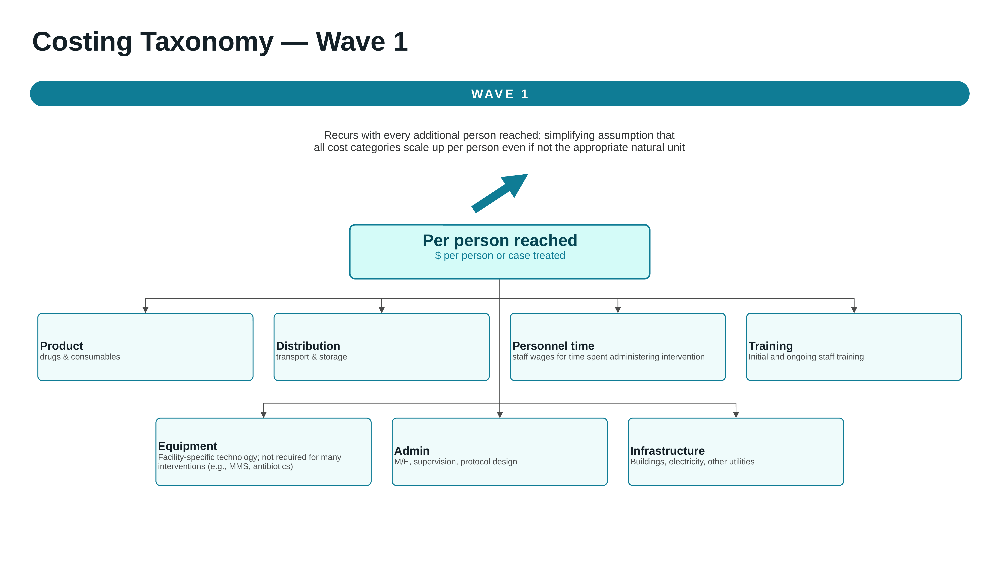
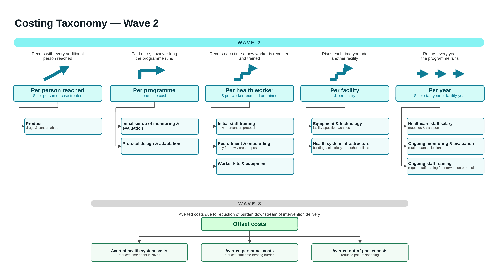

.. _costing_lit_review_vivarium_mncnh_portfolio:

..
  Section title decorators for this document:

  ==============
  Document Title
  ==============

  Section Level 1 (#.0)
  ---------------------

  Section Level 2 (#.#)
  +++++++++++++++++++++

  Section Level 3 (#.#.#)
  ~~~~~~~~~~~~~~~~~~~~~~~

  Section Level 4
  ^^^^^^^^^^^^^^^

  Section Level 5
  '''''''''''''''

  The depth of each section level is determined by the order in which each
  decorator is encountered below. If you need an even deeper section level, just
  choose a new decorator symbol from the list here:
  https://docutils.sourceforge.io/docs/ref/rst/restructuredtext.html#sections
  And then add it to the list of decorators above.

MNCNH Portfolio Costing Analysis
================================

.. contents::
  :local:
  :depth: 2

1.0 Background
--------------

In tandem with our simulation of the MNCNH portfolio (:ref:`concept model <2024_concept_model_vivarium_mncnh_portfolio>`), 
we are conducting a systematic literature review to estimate the costs of delivering several different maternal and newborn health interventions in low- and middle-income countries. 
Cost estimates derived from this literature review (extracted in the form of reported components such as personnel, consumables, and distribution, 
then meta-regressed to understand variability across locations and delivery contexts) will be paired with the effectiveness estimates from the microsimulation to determine cost-effectiveness of these interventions, 
helping funders and other decision-makers compare interventions and allocate resources to ensure greatest reduction in maternal and newborn burden of disease.
In past iterations of this work, we have also conducted cost-effectiveness analyses (see Appendix 6 of this manuscript for more details `<https://uwnetid.sharepoint.com/:w:/r/sites/ihme_simulation_science_team/Shared%20Documents/Research/BMGF_MNCH/Nutrition%20Optimization/NO%20Paper%20%231%20Model%20Overview.docx?d=w54bc12085d904be3a5356efcb7b0239c&csf=1&web=1&e=xqNgPO&nav=eyJoIjoiNzE1NDkzNTYzIn0>`_). 
however, the methods by which we are conducting our current economic analysis differ from previous projects in 3 key ways:

1. Systematic literature review of all available published data on each intervention and associated costs;
2. Use of regression tool (MR-BRT) as opposed to a simple calculation of average; and
3. Finer granularity in cost categories.

We have also scoped a Wave 2 and Wave 3 of this costing analysis which will complicate the way by which the different cost components associated with intervention delivery are scaled, 
such that rather than estimating the cost of delivering each additional unit of an intervention (i.e., cost per person treated), 
we will consider the natural unit of scale for each cost category modeled in order to more realistically capture the true costs of scaling up the delivery of an intervention (e.g., cost per facility-year, cost per new health worker-year). 
We also hope to include what are known as offset costs in later iterations of our costing model, such as cost savings from averted healthcare utilization due to improved maternal and newborn health outcomes.
The details of these later waves are still being determined, and you can read more in later sections of this document. 

*Resources to learn more about our literature review process*: 
- How to conduct a systematic review
  - `Ten Steps to Conduct a Systematic Literature Review <https://pmc.ncbi.nlm.nih.gov/articles/PMC10828625/>`_
  - `PRISMA 2020 Checklist <https://static1.squarespace.com/static/65b880e13b6ca75573dfe217/t/67ad313f1c80aa5235fce0d0/1739403584136/PRISMA_2020_checklist.pdf>`_
  - `Reading Articles Strategically <https://uwnetid.sharepoint.com/sites/ihme_simulation_science_team/Shared%20Documents/Forms/AllItems.aspx?id=%2Fsites%2Fihme%5Fsimulation%5Fscience%5Fteam%2FShared%20Documents%2FResearch%2FBMGF%5FMNCH%2FMNCNH%20portfolio%20products%2F04%5Fcosting%2FSystematic%20Review%20Training%20%26%20Materials%2FStrategically%20Reading%20Articles%2Epdf&parent=%2Fsites%2Fihme%5Fsimulation%5Fscience%5Fteam%2FShared%20Documents%2FResearch%2FBMGF%5FMNCH%2FMNCNH%20portfolio%20products%2F04%5Fcosting%2FSystematic%20Review%20Training%20%26%20Materials>`_
- How to use Distiller-SR (our chosen systematic review software for this project)
  - `Distiller-SR Guide for IHMErs <https://uwnetid.sharepoint.com/sites/ihme_simulation_science_team/Shared%20Documents/Forms/AllItems.aspx?id=%2Fsites%2Fihme%5Fsimulation%5Fscience%5Fteam%2FShared%20Documents%2FResearch%2FBMGF%5FMNCH%2FMNCNH%20portfolio%20products%2F04%5Fcosting%2FSystematic%20Review%20Training%20%26%20Materials%2FDistiller%5FSR%20Guidelines%20for%20NFRQ%5F8bc816bee446450faa11b903e6589298%2D180226%2D1736%2D8%2Epdf&parent=%2Fsites%2Fihme%5Fsimulation%5Fscience%5Fteam%2FShared%20Documents%2FResearch%2FBMGF%5FMNCH%2FMNCNH%20portfolio%20products%2F04%5Fcosting%2FSystematic%20Review%20Training%20%26%20Materials>`_
  - `Distiller-SR Tutorials <https://evidencepartners.wistia.com/medias/028x70nmp9>`_

*Resources to learn more about healthcare costing*:
- `Cost-Effectiveness Meta-Regression <https://uwnetid.sharepoint.com/:p:/r/sites/ihme_simulation_science_team/_layouts/15/Doc.aspx?sourcedoc=%7BD50FB7F8-3ACB-4CB2-AA63-7FC4DBEA50BA%7D&file=2_Cost-Effectiveness%20Meta-Regression_presentation%20version.pptx&action=edit&mobileredirect=true>`_
- `Estimating health care costs at scale in low- and middle-income countries: Mathematical notations and frameworks for the application of cost functions <https://onlinelibrary.wiley.com/doi/10.1002/hec.4722>`_
- `Costs of scaling up health interventions: a systematic review <https://pubmed.ncbi.nlm.nih.gov/15689425/>`_
- Other economic analyses by fellow IHME researchers: 
  - `Evaluating US county health-care system performance and key associated factors (2014-2019): a Triple Aim framework analysis <https://linkinghub.elsevier.com/retrieve/pii/S2468-2667(25)00173-2>`_
  - `Cost-effectiveness of interventions for HIV/AIDS, malaria, syphilis, and tuberculosis in 128 countries: a meta-regression analysis <https://www.thelancet.com/journals/langlo/article/PIIS2214-109X(24)00181-5/fulltext>`_
  - `Historic and future spending estimates of maternal health and family planning in 139 low- and middle-income countries, 2000–2030: a modelling study <https://bmjpublichealth.bmj.com/content/4/2/e004211>`_

1.1 Scope
+++++++++

The below table lists the MNCNH portfolio interventions that we are planning to produce cost estimates for, 
along with their corresponding model documentation and the status of cost estimation.

.. list-table:: Interventions in scope for costing
  :header-rows: 1
  :widths: 18 40 42

  * - Simulation stage
    - Intervention
    - Model documentation
    - Status of costing
  * - Antenatal
    - Iron and folic acid supplementation (IFA)
    - :ref:`Oral iron in pregnancy <oral_iron_antenatal>`
    - Cost estimates have been extracted from literature but not yet processed
  * - Antenatal
    - Multiple micronutrient supplementation (MMS)
    - :ref:`Oral iron in pregnancy <oral_iron_antenatal>`
    - Cost estimates have been extracted from literature but not yet processed
  * - Antenatal
    - Intravenous iron for anemia in pregnancy
    - :ref:`IV iron intervention <intervention_iv_iron_antenatal_mncnh>`
    - Cost estimates have been extracted from literature but not yet processed
  * - Antenatal
    - Anemia screening (ANC hemoglobin testing)
    - :ref:`Anemia screening <anemia_screening>`
    - Cost estimates have been extracted from literature but not yet processed; 
      second wave of literature search is needed due to minimal evidence found in the first wave
  * - Antenatal
    - Standard, point-of-care, and AI-assisted ultrasound
    - :ref:`AI ultrasound module <2024_vivarium_mncnh_portfolio_ai_ultrasound_module>`
    - Cost estimates have been extracted from literature and partially processed [[todo: double-check the types of ultrasound we want to process costs for]]
  * - Antenatal
    - Pre-eclampsia testing and treatment
    - Not yet documented
    - Cost estimates have not yet been extracted from literature
  * - Intrapartum
    - Intrapartum azithromycin for maternal sepsis prevention
    - :ref:`Azithromycin intervention <azithromycin_intervention>`
    - Cost estimates have been extracted from literature and partially processed
  * - Intrapartum
    - Misoprostol for prevention of postpartum hemorrhage
    - :ref:`Misoprostol intervention <misoprostol_intervention>`
    - Cost estimates have been extracted from literature but not yet processed
  * - Intrapartum
    - Antenatal corticosteroids (ACS)
    - :ref:`ACS intervention <acs_intervention>`
    - Cost estimates have not yet been extracted from literature
  * - Intrapartum
    - E-MOTIVE bundle for postpartum hemorrhage treatment
    - :ref:`E-MOTIVE intervention <emotive_intervention>`
    - Cost estimates have not yet been extracted from literature
  * - Intrapartum
    - Caesarean section (elective and emergent [[todo: double-check types of c-section]])
    - :ref:`Intrapartum interventions module <2024_vivarium_mncnh_portfolio_intrapartum_interventions_module>`
    - Cost estimates have not yet been extracted from literature 
  * - Intrapartum
    - Intrapartum sensors
    - Not yet documented
    - Cost estimates have not yet been extracted from literature
  * - Neonatal
    - Inpatient antibiotic management of PSBI
    - :ref:`Neonatal antibiotics <intervention_neonatal_antibiotics>`
    - Cost estimates have been extracted from literature and partially processed
  * - Neonatal
    - Outpatient antibiotic management of PSBI
    - :ref:`Neonatal antibiotics <intervention_neonatal_antibiotics>`
    - Cost estimates have been extracted from literature and partially processed
  * - Neonatal
    - CPAP for respiratory distress syndrome
    - :ref:`CPAP intervention <intervention_neonatal_cpap>`
    - Cost estimates have been partially extracted from literature ([[todo: double-check: literature review still in screening phase?]])
  * - Neonatal
    - Probiotics for infection prevention in preterm neonates
    - :ref:`Neonatal probiotics <intervention_neonatal_probiotics>`
    - Cost estimates have been extracted from literature and partially processed

.. note::

  This table summarizes the status of the costs estimated for scoped interventions and was 
  last updated on 2025-09-28.

.. _costing_lit_review_taxonomy:

2.0 Cost taxonomy
-----------------

2.1 Three kinds of extracted estimate
+++++++++++++++++++++++++++++++++++++

In this literature review, we are extracting cost estimates that fall into one of 3 buckets (listed below), 
not all of which will be used directly as inputs to our costing meta-regression. 

1. **Unit costs** — the cost of delivering one unit of intervention to one person.
These are the focus of the costing model and the input to the meta-regression.
As noted previously, in a future iteration of this analysis, we hope to more realistically reflect the costs of intervention scale-up beyond the per-person unit cost, 
by considering how various cost components might scale by a factor other than the number of persons reached.

2. **Cost-effectiveness estimates** — published ICERs and similar estimates. These are *not*
inputs to our analysis; they are retained as validity checks against the
cost-effectiveness estimates we eventually produce from our own unit costs and
simulation output.

3. **Offset costs** — averted costs due to reduction of burden downstream of intervention delivery
(e.g., averted health system costs due to decreased time spent in NICU or hospital, averted personnel costs due to decreased staff time treating burden, and averted patient spending).

2.2 Unit cost taxonomy (wave 1)
-------------------------------

In our wave 1 analysis, we are calculating unit cost by considering the following components which make up the total cost required to treat one person with a given intervention.
The cost taxonomy diagram below illustrates how we break down each unit cost. 

2.3 Unit cost taxonomy (wave 2 & 3)
-----------------------------------

.. todo:: 
  describe how each cost category has a different natural unit and even though for wave 1 costs we are assuming all cost categories scale up by person, 
  we know it's more complicated than this in reality for most of the cost categories except for personnel costs.

3.1 Intervention Profile Sheet
++++++++++++++++++++++++++++++

Unit definitions, protocols, and delivery assumptions are maintained in the
`Intervention Profile Sheet <https://uwnetid.sharepoint.com/:x:/r/sites/ihme_simulation_science_team/Shared%20Documents/Research/BMGF_MNCH/MNCNH%20portfolio%20products/04_costing/Intervention%20Profiles%20for%20Costing.xlsx?d=wc7b6dad8525741a981889a3624225e77&csf=1&web=1&e=K0z7cp>`_, 
which serves three purposes: it attempts to standardize what each intervention is assumed to consist of, 
it records which cost categories are relevant to each intervention, 
and it summarizes the delivery protocols for each intervention across the literature we use for the costing analysis, 
the effectiveness literature, and what protocols our stakeholders are interested in.

For each intervention, the sheet records:

- The unit being costed, and the dosage or quantity constituting a full treatment.
- The relevant WHO guideline, the protocol used in costing literuature, and the narrowed-down protocol we assume.
- The standard-of-care comparator, if any.
- Personnel type and time required to deliver, and the delivery facility type. See
  the
  :ref:`delivery facility choice model <2024_facility_model_vivarium_mncnh_portfolio>`
  for the facility types represented in the simulation.
- Which cost categories from the taxonomy are relevant.
- The literature used for effects and the literature used for costs, kept in
  separate columns because they are frequently different bodies of work.

.. todo::

  Finish filling in the Intervention Profile Sheet for all interventions and determine how to best document information there
  (i.e., move to a table here rather than Sharepoint Excel spreadsheet?)

4.0 Literature review methods
-----------------------------

We follow PRISMA 2020 guidelines and the GBD systematic review protocol so that each search is systematic and replicable. 
Each intervention has its own search strategy and set of inclusion criteria, aside from IFA and MMS which we bundled together, 
as well as IV iron and oral iron treatment for anemia. 
Searches are conducted and tracked in **DistillerSR**, 
which retains PubMed search history, 
allows inclusion criteria to be edited retroactively without restarting screening, 
and maintains the PRISMA 2020 flow diagram automatically. 

4.2 Our review process
++++++++++++++++++++++

1. Develop inclusion criteria and the search string, with assistance from a UW
   Health Sciences librarian. (Note: after consulting with a UW Health Sciences 
   librarian for our first few interventions, we shifted to developing our own search strategies independently.)
2. Run the search in PubMed within Distiller; import EMBASE references separately; de-duplicate.
3. Create screening forms in DistillerSR for both title/abstract and full-text screening 
  (Note: can copyforms from other interventions and adapt as needed.)
4. **Screening level 1 (title/abstract).** One reviewer screens 100% of references;
   a second reviewer screens a random 10% as a quality check. Conflicts are
   resolved by group discussion.
5. **Screening level 2 (full text).** Same dual-screening protocol.
6. Iterate on search strategy and inclusion criteria depending on the number of
   references returned.
7. Extract cost estimates and relevant study information into the extraction sheet.
8. Process data for meta-regression — see the
   :ref:`meta-regression document <costing_metaregression_vivarium_mncnh_portfolio>`.

..note:: 
  
  Reviews and meta-analyses are excluded from extraction (except where cost-effectiveness
  estimates are reported, which we will use to validate our own estimates once calculated), 
  but are flagged during screening so that their reference lists can be used to augment the search.
  Every stage of the review process should be fully documented with notes of any decisions, assumptions,
  or other observations made during the process.

4.2 Inclusion and exclusion criteria
++++++++++++++++++++++++++++++++++++

Criteria are defined per intervention using the **PICOS** framework — Population,
Intervention, Comparison, Outcome, Study design. In DistillerSR, exclusion reasons
are selected from a form so that exclusions are auditable.

Across all interventions the study design criterion is the same: **RCT or costing
study collecting primary data or using modeled costs in which sources of input cost
data are clearly reported**.

.. list-table:: PICOS criteria by intervention
  :header-rows: 1
  :widths: 16 28 20 18 18

  * - Intervention
    - Population
    - Intervention
    - Comparison
    - Outcome
  * - Intrapartum azithromycin
    - General population; may narrow to antenatal care depending on screening yield
    - Azithromycin or similar oral antibiotic
    - Any
    - Sepsis prevention and associated costs
  * - Neonatal probiotics
    - Newborn infants; not limited to preterm, though most literature concerns low
      birthweight or preterm infants
    - Probiotics
    - Any
    - Neonatal sepsis or NEC prevention and associated costs
  * - Standard ultrasound
    - Obstetric or pregnant patients in any LMIC healthcare setting
    - Standard ultrasound scan
    - Any
    - Costs associated with intervention
  * - Intravenous iron
    - Pregnant patients
    - Any IV iron
    - Oral iron
    - Anemia
  * - Oral iron (IFA and MMS)
    - Pregnant patients
    - IFA / MMS
    - Any
    - Anemia
  * - Anemia screening
    - Pregnant patients
    - Anemia screening
    - Any
    - Anemia
  * - Neonatal antibiotics
    - Infants
    - Neonatal antibiotics for prevention and management of PSBI
    - Any
    - Costs associated with intervention
  * - CPAP
    - Infants and neonates
    - CPAP availability, including lower-cost CPAP variants such as VAYU
    - Standard CPAP or invasive mechanical ventilation
    - Respiratory distress syndrome and associated costs

.. todo:: 
  Define criteria for the remaining portfolio interventions (antenatal corticosteroids,
  E-MOTIVE, generalized hospitalization and patient admission, and caesarean section).

4.3 Search strategy
+++++++++++++++++++

[[todo: add link to sharepoint excel with search strategies for each intervention and note that
searches are also tracked in distiller]]

.. _costing_lit_review_extraction:

5.0 Data extraction
-------------------

5.1 Extraction conventions
++++++++++++++++++++++++++

A few conventions exist specifically to keep downstream processing tractable.

**One value per row.** Cells containing multiple numbers, or numbers mixed with
explanatory text, cannot be processed programmatically. Where a study reports
several values for what is conceptually the same cost, they are split into separate
rows.

**Record conversion factors explicitly.** Most reported costs are not in the unit we
need, and the number required to convert them is often buried in the methods
section — a mean 23.6 days of treatment, 82 participants in a trial arm, a 2 g single
dose delivered as four 500 mg tablets, three minutes of pharmacy technician time.
These go in ``conversion_factor``, with their meaning in
``conversion_factor_description``.

**Record how uncertainty was obtained, not just its value.** A 95% CI from a trial
and a min–max range across price catalogue entries are different kinds of
uncertainty and are usable in different ways.

**Record currency type (e.g., USD, EUR, GBP) and currency base year** for direct use by the currency
conversion script.

**Take notes of any assumptions or decisions made** during the extraction process.
There is a lot of heterogeneity in the data and the extraction sheet is not always sufficient to capture all the nuances, 
so detailed notes are very important and useful for processing and analysis later on.

5.2 Summary of Data sources 
+++++++++++++++++++++++++++

Cost estimates in the included literature come from a wide range of underlying
sources, and the source materially affects how the estimate should be treated:

- Primary micro-costing at study sites
- Programme and facility financial or expenditure records
- Price catalogues, reference prices, and national tariff databases
- Facility and pharmacy surveys or records
- Expert opinion surveys
- Household or patient surveys
- Manufacturer, supplier, or implementer quotes
