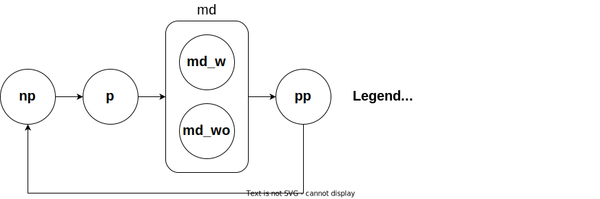

.. _other_models_pregnancy_closed_cohort:

..
  Section title decorators for this document:

  ==============
  Document Title
  ==============

  Section Level 1 (#.0)
  ---------------------

  Section Level 2 (#.#)
  +++++++++++++++++++++

  Section Level 3 (#.#.#)
  ~~~~~~~~~~~~~~~~~~~~~~~

  Section Level 4
  ^^^^^^^^^^^^^^^

  Section Level 5
  '''''''''''''''

  The depth of each section level is determined by the order in which each
  decorator is encountered below. If you need an even deeper section level, just
  choose a new decorator symbol from the list here:
  https://docutils.sourceforge.io/docs/ref/rst/restructuredtext.html#sections
  And then add it to the list of decorators above.

==================================
Pregnancy: GBD 2021, Closed Cohort
==================================

.. contents::
   :local:
   :depth: 1

.. list-table:: Abbreviations
  :widths: 15 15 15
  :header-rows: 1

  * - Abbreviation
    - Definition
    - Note
  * - ASFR
    - Age-specific fertility rate
    - 
  * - SBR
    - Stillbirth to live birth ratio
    - 
  * - LBWSG
    - Low birthweight and short gestation
    - 

Overview
-------------

This model document is an adaptation of the :ref:`pregnancy model document found here <other_models_pregnancy>`, which was developed for the :ref:`IV iron simulation <2019_concept_model_vivarium_iv_iron>`. This version differs in that it is designed for a closed rather than open cohort for the :ref:`nutrition optimization simulation <2021_concept_model_vivarium_nutrition_optimization>` and therefore models pregnancies only rather than all women of reproductive age. 

GBD Modeling Strategy
----------------------

Pregnancy and births are not explicit outcomes in the GBD study. However, there are location- and year-specfic GBD covariates related to fertility and births, including:

.. list-table:: Covariates
  :widths: 15 15 15
  :header-rows: 1

  * - Covariate name
    - Covariate ID
    - Note
  * - Live births (thousands)
    - 60
    - 
  * - Live births by sex
    - 1106
    - 
  * - Live births by sex and maternal age
    - 2298
    - 
  * - Stillbirth to live birth ratio
    - 2267
    - Not specific to maternal age. Upper and lower bound estimates are equal to mean estimate (no uncertainty interval)
  * - Age-specific fertility rate
    - 13
    - 
  * - Total fertility rate
    - 2363
    - 

GBD has estimated the prevalence of pregnancy (as an intermediate variable for the estimation of various outcomes) as:

.. math::

   (ASFR + (SBR * ASFR)) * 46/52

Where :math:`ASFR` is the age-specific fertility rate, :math:`SBR` is the stillbirth to live birth ratio, and :math:`46/52` is the proportion of the year spent pregnant (40 weeks) and postpartum (6 weeks).

.. todo::

   Determine the threshold of gestational age at which a loss of pregnancy is classified as a stillbirth rather than miscarriage for the GBD covariate. Standard thresholds are 20 or 24 weeks.

Vivarium Modeling Strategy
----------------------------

We will model pregnancy as a characteristic of women of reproductive age in our simulations. We will inform the *incidence* of pregnancy using the age-specific fertility and stillbirth to live birth ratio covariates from GBD. We will inform the *duration* of pregnancy using the GBD 2019 exposure distribution of gestational age.

.. list-table:: State definitions
  :widths: 15 15 15
  :header-rows: 1

  * - State
    - Description
    - Note
  * - np
    - Not pregnant or postpartum
    - 
  * - p
    - Pregnant
    - 
  * - md
    - Maternal disorders 
    - Simulated state that lasts for single timestep in order to accrue maternal disorders YLDs - not representative of biological state. Can be with (md_w) or without (md_wo) maternal disorders while within this state according to the maternal disorders cause model document. Referred to as "prepostpartum" state in software implementation.
  * - pp
    - Postpartum
    - 

.. note::

  The duration of the maternal disorders state for the IV iron simulation was set to one week. This parameter is currently a barrier to extending the maternal IV iron simulation timestep from 1 to 2 weeks.

.. list-table:: State prevalence table for initialization
  :widths: 15 15 15
  :header-rows: 1

  * - State
    - Value
    - Note
  * - np
    - 0
    - 
  * - p
    - 1
    - 
  * - pp
    - 0
    -  
  * - md_w
    - 0
    - 
  * - md_wo
    - 0
    - 

.. list-table:: State transition data
  :header-rows: 1

  * - Source state
    - Sink state  
    - Transition name
    - Transition rate
    - Note
  * - np
    - p
    - incidence_p
    - 0
    - Assumed zero for convenience. Note that this is typically :math:`\frac{ASFR + ASFR * SBR + incidence_\text{c995} + incidence_\text{c374}}{prevalence_\text{np}}`
  * - p
    - md
    - duration_p
    - Duration informed by gestational age (see below section)
    - Duration-based transition
  * - md
    - pp
    - duration_md
    - 1 timestep
    - Duration-based transition
  * - pp
    - np
    - duration_pp
    - 6 weeks (42 days) - duration_md
    - Duration-based transition

.. list-table:: Data values
  :header-rows: 1

  * - Parameter
    - Data type  
    - Data ID
    - Source
    - Note
  * - ASFR
    - Covariate
    - 13
    - get_covariate_estimates: decomp_step='iterative' for GBD 2021
    - Assume lognormal distribution of uncertainty.
  * - SBR
    - Covariate
    - 2267
    - get_covariate_estimates: decomp_step='iterative' for GBD 2021
    - Parameter is not age specific and has no draw-level uncertainty. Use mean_value as location-specific point parameter.
  * - incidence_c995
    - Incidence rate of abortion and miscarriage cause
    - c995
    - como; decomp_step='iterative'
    -  Use the :ref:`total population incidence rate <total population incidence rate>` directly from GBD and do not rescale this parameter to susceptible-population incidence rate using condition prevalence. 
  * - incidence_c374
    - Incidence rate of ectopic pregnancy
    - c374
    - como; decomp_step='iterative'
    -  Use the :ref:`total population incidence rate <total population incidence rate>` directly from GBD and do not rescale this parameter to susceptible-population incidence rate using condition prevalence. 

.. note::

  NOTE: this was NOT implemented for IV iron (deprioritized as it was thought to have little influence on results). To be implemented for the nutrition optimization project average duration of pregnancy will need to be calculated as described below.

    **AGE SHIFTING:** The incidence rates in the table above are measured at the *end* of pregnancy. However, we will use them to inform the rates of the *beginning* of pregnancy. In order to avoid causing pregnancies to end at older ages than they should in our simulation, we will implement a custom "pregnancy age" in our vivarium simulation that is equal to a simulant's actual age *minus* the average duration of pregnancy. This "pregnancy age" should be used to index which pregnancy incidence rate (incidence_p) value the simulant is subject to at any given time.

    The average duration of pregnancy (pregnancy age shift) was calculated assuming that live and still births have a duration of 40 weeks and that ectopic pregnancies and miscarriages/abortions have an average duration of 15 weeks (the midpoint between 6 weeks (assumed minimum duration of an *identified* pregnancy) and 24 weeks (cutoff between miscarriage and stillbirth)) and according to the location-specific distribution of birth outcomes. `These values were calculated for the IV iron simulation in this notebook <https://github.com/ihmeuw/vivarium_research_iv_iron/blob/main/misc_investigations/Pregnancy%20age%20shift%20calculation.ipynb>`_.

.. list-table:: Restrictions
   :widths: 15 15 20
   :header-rows: 1

   * - Restriction Type
     - Value
     - Notes
   * - Male only
     - False
     -
   * - Female only
     - True
     -
   * - Age group start
     - 10 to 14 years
     - ID=7
   * - Age group end
     - 50 to 54 years
     - ID=15

.. note::

  **Pregnancy modeling steps:**

  *At initialization:*

  1. Assign pregnancy state according to state prevalence values
  2. Assign partial or full term duration according to table in `Pregnancy term lengths`_ section
  3. Assign sex of infant if pregnancy is full term (stillbirth or live birth)
  4. Assign duration of pregnancy depending on term length and, if applicable, sex of the infant
  5. Determine the amount of time remaining in pregnancy from the duration of pregnancy: for closed cohort, assume simulation starts at day 0 of all pregnancies
  6. Begin simulation

  *During simulation:*

    - Determine pregnancy model state according to state at initialization and state transition rates. 

    - Upon transition from the np to p state, follow steps 2-4 described above. (should not occur for closed cohort)

    - Upon birth (transition out of p state), assign pregnancy outcome

      - :code:`other` for partial duration pregnancies

      - :code:`live_birth` or :code:`stillbirth` for full duration pregnancies, according to table in `Pregnancy outcomes`_ section

  (Specific instructions for each of these steps described in the following sections.)

Pregnancy term lengths
~~~~~~~~~~~~~~~~~~~~~~~

At the beginning of pregnancy, it should be determined whether the pregnancy will be partial term or full term according to the probabilities in the table below.

.. list-table:: Pregnancy term lengths probabilities
  :header-rows: 1

  * - Term length
    - Probability
    - Note
  * - Partial term
    - (incidence_c995 + incidence_c374) / (ASFR + ASFR * SBR + incidence_c995 + incidence_c374)
    - 
  * - Full term
    - 1 - probability_partial_term
    - 

Sex of infant
~~~~~~~~~~~~~~~

.. note::

  The IV iron simulation assumed 50/50 probability

For pregnancies that result in live birth or stillbirth outcomes, infant sex should be determined and recorded acording to the probability of male sex shown in the table below (probability of female birth is equal to 1 minus the probability of male birth). This should be performed at the start of pregnancy (transition from np to p states) or upon initialization into the p state. These sex ratios were calculated using the live births by sex 2020 GBD covariate (ID 1106), `shown here <https://github.com/ihmeuw/vivarium_research_iv_iron/blob/main/sex_ratio_calculation.ipynb>`_. 

.. todo::

  Fill in table

.. _sex_ratio_table_21:

.. list-table:: Probability of male birth
    :header-rows: 1

    *   - Location
        - Location ID
        - Value
    *   - Pakistan 
        - XXX
        - 
    *   - Nigeria
        - 214
        -
    *   - Ethiopia
        - 179
        -

Duration of pregnancy
~~~~~~~~~~~~~~~~~~~~~~~~

A duration of pregnancy value will need to be assigned to all pregnancies regardless of the pregnancy outcome. This value will inform the duration that the simulant remains in the pregnancy state prior to transitioning to the postpartum state.

For partial term pregnancies (that result in abortion/miscarriage/ectopic pregnancy), assign a duration of pregnancy sampled from a uniform distribution beween 6 and 24 weeks (individual heterogeneity with no parameter uncertainty).

.. todo::

  Update link to correlation doc

For full term pregnancies (that result in live births or stillbirths), duration of pregnancy should be determined by gestational age exposure, which should be assigned according to the process for assigning LBWSG exposures described in the :ref:`risk correlation document between maternal BMI, maternal hemoglobin, and infant LBWSG exposure <2019_risk_correlation_maternal_bmi_hgb_birthweight>`. The LBWSG exposure distribution used to assign gestational age exposures should be specific to the sex of the infant for a given pregnancy (discussed in the above section). Note that the gestational age distribution is measured in weeks and will need to be converted to the equivalent simulation time measure.

.. todo::

  Describe how to handle intervention effects on gestational age here (remember, will make little difference for mothers... maybe ignore and only model impact on infants?)

Pregnancy outcomes
~~~~~~~~~~~~~~~~~~

At or before the time of birth, pregnancy outcome must be determined for each pregnancy as either a 1) live birth, 2) stillbirth, or 3) other (ectopic pregnancy, abortion/miscarriage). The probability of each pregnancy outcome dependent on the pregnancy term length and probabilities of each outcome conditional on pregnancy term are defined in the table below. 

.. list-table:: Pregnancy outcome probabilities conditional on pregnancy term length
  :header-rows: 1

  * - Pregnancy term length
    - Outcome
    - Conditional probability
    - Note
  * - Partial term
    - Live birth
    - 0
    - 
  * - Partial term
    - Stillbirth
    - 0
    - 
  * - Partial term
    - Other (abortion, miscarriage, ectopic pregnancy)
    - 1
    -     
  * - Full term
    - Live birth
    - ASFR / (ASFR + ASFR * SBR)
    - The :ref:`probability of a livebirth outcome is modified by antenatal supplementation intervention coverage <maternal_supplementation_intervention>`.
  * - Full term
    - Stillbirth
    - (ASFR * SBR) / (ASFR + ASFR * SBR)
    - The :ref:`probability of a stillbirth outcome is modified by antenatal supplementation intervention coverage <maternal_supplementation_intervention>`.
  * - Full term
    - Other (abortion, miscarriage, ectopic pregnancy)
    - 0
    - 

.. note::

  The current modeling strategy is dependent on our assumption that live births and stillbirths have the same duration. There is ongoing work at IHME to estimate gestational age at birth distributions among stillbirths. 

Assumptions and limitations
++++++++++++++++++++++++++++

- We assume that the gestational age distribution of stillbirths is equal to the gestational age distribution of live births. This is a limitation of our analysis given the lack of data on the distribution of gestational ages for which these outcomes occur. Given that the gestation for these outcomes is likely shorter than gestation for live births on average, we are likely overestimating the average duration of pregnancy for outcomes other than live births.
- We assume that all abortions, miscarriages and ectopic pregnancies occur uniformly between six and 24 weeks gestatation. Six weeks was chosen as a reasonable earliest possible time of pregnancy detection (prior to which miscarriages would be undiagnosed) and 24 weeks was chosen as the threshold between miscarriage and stillbirth. 
- We assume that abortions that occur after 24 weeks are not considered stillbirths for estimation of the stillbirth to livebirth ratio. We may overestimate the incidence rate of pregnancy due to this assumption.
- We are limited in the assumption that the stillbirth to livebirth ratio does not vary by maternal age and does not incorporate an uncertainty distribution.
- We do not model any morbidity (YLDs) associated directly with pregnancy.
- We do not distiguish between intended and unintended pregnancies.
- We do not consider the impact of birth interval timing or family size in our model of pregnancy.
- We do not consider the impact of singleton versus non-singleton pregnancies.
- We are limited in that we apply the age-specific fertility rate to the *beginning* of pregnancy when it is actually measured at the *end* of pregnancy (birth). Therefore, maternal age at birth in our simulation will be overestimated due to simulants becoming pregnant in one age group and giving birth in the next.

Verification and validation criteria
++++++++++++++++++++++++++++++++++++++

The following should validate:
- Average duration of pregnancy
- Duration of maternal disorders and postpartum states
- Rates of each birth outcomes

References
-----------

