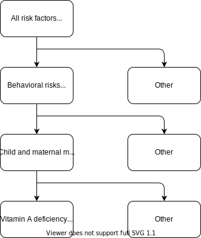

.. _2017_cause_vitamin_a_deficiency:

====================
Vitamin A Deficiency
====================

Disease Description
-------------------

Vitamin A deficiency (VAD) is a lack of vitamin A in blood and tissues. Vitamin
A deficiency is considered as one of the most serious public health concerns in
developing countries and can contribute directly or indirectly to disability.[1]

GBD 2017 Modeling Strategy
------------------------------------

In Global Burden of Disease (GBD) 2017, vitamin A deficiency is defined as
having a serum retinol concentration <0·7 μmol/L (<20 μg/dL). Population
exposure to vitamin A deficiency is measured by prevalence, i.e. the proportion
of the population with serum retinol below 0·7 μmol/L.

The VAD cause is a population attributable fraction (PAF) of 1 cause with the
VAD risk factor. That is, 100% of VAD morbidity is attributable to the VAD risk
factor. In this particular case, the PAF-of-1 relationship means that the VAD
risk and the VAD cause are identical. There is a single VAD model in GBD 2017
(modelable_entity_id=2510) for both the cause and the risk factor, and pulling
exposure estimates for the VAD risk factor yields the same data as pulling
prevalence outputs from the DisMod model for the VAD cause. [#]_
[GBD-2017-YLD-Appendix-VAD]_, [GBD-2017-Risk-Appendix-VAD]_

.. [#] Actually, there are numerical differences of up to about 30% between
  exposure and prevalence in a small fraction of the data points (~0.1% of
  draw-level values with a relative difference > 5%), but the VAD modeler
  assured us that these are probably just artifacts of the data processing and
  that the data sets are intended to be identical.

Vitamin A Deficiency Cause
+++++++++++++++++++++++++++++

The VAD cause in GBD 2017 is 100% attributable to the
VAD risk factor. The VAD cause in GBD is a
YLD-only cause, meaning that it contributes to morbidity, but not mortality.

Modeling Strategy for the Vitamin A Deficiency Cause
^^^^^^^^^^^^^^^^^^^^^^^^^^^^^^^^^^^^^^^^^^^^^^^^^^^^^^^
.. todo::

  Describe cause in detail

Cause Hierarchy
^^^^^^^^^^^^^^^

.. image:: vitA_cause_hierarchy.svg

Health States and Sequela
^^^^^^^^^^^^^^^^^^^^^^^^^

The sequela associated with the Vitamin A deficiency cause in GBD 2017 include
moderate vision impairment loss due to Vitamin A deficiency, severe vision
impairment loss due to Vitamin A deficiency, blindness due to Vitamin A
deficiency, asymptomatic Vitamin A deficiency, Vitamin A deficiency with mild
anemia, Vitamin A deficiency with moderate anemia, Vitamin A deficiency with
severe anemia.

Restrictions
^^^^^^^^^^^^

.. list-table:: GBD 2017 Cause Restrictions
   :widths: 15 15 20
   :header-rows: 1

   * - Restriction Type
     - Value
     - Notes
   * - Male only
     - False
     -
   * - Female only
     - False
     -
   * - YLL only
     - False
     -
   * - YLD only
     - True
     -
   * - YLD age group start
     - Early Neonatal
     - [0, 7 days), age_group_id = 2
   * - YLD age group end
     - 95 Plus
     - [95, 125 years), age_group_id = 235

Vitamin A Deficiency Risk Factor
++++++++++++++++++++++++++++++++

The Vitamin A deficiency risk factor in GBD 2017 is a **dichotomous variable** .
Below is a list of measures and corresponding IDs:

.. list-table:: Measures
  :widths: 20 45 40
  :header-rows: 1

  * - Measure
    - ID
    - Data source
  * - Remission
    - gbd_id = 2510, measure_id = 7
    - epi, use get_model_results function
  * - Incidence rate
    - gbd_id = cid(389)
    - como, use get_measure
  * - Risk factor exposure
    - gbd_id = reiid(96)
    - como, use get_measure

.. todo::

  Address James's comment about the above table in `PR 149 <https://github.com/ihmeuw/vivarium_research/pull/149>`_:

  1.  Incidence and remission are measures for the cause.
  2.  I thought we decided not to use them at all.

  Correct, we are not planning to use incidence or remission data, so we should
  make this clear. E.g. move the first two rows of this table into the `Vitamin
  A Deficiency Cause`_ section and clarify that we're not planning to use them
  for the Vivarium model, or just omit them entirely.

Risk Factor Hierarchy
^^^^^^^^^^^^^^^^^^^^^

Restrictions
^^^^^^^^^^^^

.. list-table:: GBD 2017 Risk Restrictions
   :widths: 15 15 20
   :header-rows: 1

   * - Restriction Type
     - Value
     - Notes
   * - Male only
     - False
     -
   * - Female only
     - False
     -
   * - YLL only
     - False
     -
   * - YLD only
     - False
     -
   * - YLL age group start
     - Post Neonatal
     - [28, 365 days), age_group_id = 4
   * - YLL age group end
     - 1-4 years
     - [1, 5 years), age_group_id = 5
   * - YLD age group start
     - Early Neonatal
     - [0, 7 days), age_group_id = 2
   * - YLD age group end
     - 95 Plus
     - [95, 125 years), age_group_id = 235

Relative Risks
^^^^^^^^^^^^^^

The causes affected by the Vitamin A Deficiency risk in GBD 2017 include
:ref:`lower respiratory infections <2017_cause_lower_respiratory_infections>`,
:ref:`diarrhoeal diseases <2017_cause_diarrhea>`, and :ref:`measles
<2017_cause_measles>`. The relative risks for these causes appear in :ref:`Table
4 <gbd_2017_vad_relative_risk_table>` on p. 112 of
[GBD-2017-Risk-Appendix-VAD]_, copied here for reference:

.. _gbd_2017_vad_relative_risk_table:

.. list-table:: Table 4.1: Relative risks for risk-outcome pairs in GBD 2017 [GBD-2017-Risk-Appendix-VAD]
  :widths: 15 13 15 15
  :header-rows: 1

  * - Cause
    - GBD 2016 RR
    - GBD 2017 RR
    - Include in GBD 2017
  * - Diarrhea
    - 1.6 (1.21 - 2.02)
    - **2.35 (2.17 - 2.54)**
    - Yes
  * - Measles
    - 2.4 (1.61 - 3.48)
    - **2.76 (2.01 - 3.78)**
    - Yes
  * - Lower Respiratory Infections (LRI)
    -
    - **1.23 (1.03 - 1.48)**
    - Yes
  * - Meningitis
    -
    - 3.2 (0.69 - 14.75)
    - No (not significant)
  * - Malaria
    -
    - 3.65 (2.23 - 5.97)
    - No (only one study)
	
.. list-table:: Table 4.2: Pulled relative risks of GBD 2017 
  :widths: 15 16 15 
  :header-rows: 1

  * - Cause
    - GBD 2017 RR
    - Note
  * - Diarrhea
    - 2.44 (2.27 - 2.63)
    - RR from relative_risk source pulled with rei_id 96 (age 1-5, 1000 draws)
  * - Measles
    - 3.51 (2.53 - 4.67)
    - RR from relative_risk source pulled with rei_id 96 (age 1-5, 1000 draws)
  * - Lower Respiratory Infections (LRI)
    - 1.33 (1.11 - 1.59)
    - RR from relative_risk source pulled with rei_id 96 (age 1-5, 1000 draws)

The above relative risks for GBD 2017 can be interpreted as rate ratios for the
incidence rates of diarrhea, measles, and LRI. They can also be interpreted as
rate ratios for cause-specific mortality rates. The GBD modelers found no
statistical difference between RR's for incidence and RR's for mortality, so
they pooled all data for effect sizes of VAD on incidence and cause-specific
mortality to arrive at the estimates in :ref:`Table 4
<gbd_2017_vad_relative_risk_table>`.

.. Note::

  In GBD 2019, the effect on lower respiratory infections (LRI) was **dropped**
  due to insufficient evidence of causation found by the network meta-analysis.
  Moreover, the relative risks for measles and diarrheal diseases were found to
  be smaller than those in the above table. This should be noted as a limitation
  in any simulation using the RR's from GBD 2017.

.. todo::

  Reformat :ref:`Table 4 <gbd_2017_vad_relative_risk_table>` (or perhaps make a
  separate table) to make it more useful for the software engineers, based on
  James's comments in `PR 149
  <https://github.com/ihmeuw/vivarium_research/pull/149>`_. Namely:

  1.  We can include the actual data means and uncertainties here if we want,
      but since we're planning to use the draw-level RR's from GBD, we should
      include the `rei_id` and `cause_id` associated with each risk-outcome pair
      we're using.

  2.  Including the interpretations of the RR's is good. I think you should
      have the interpretation as a column in the table though. A single risk
      factor may have different kinds of effects on different outcomes and
      should be specified pairwise. Also include the numerator and denominator
      or a link to what rate ratio means (I think we made a glossary in the
      documentation).

Vivarium Modeling Strategy
--------------------------

.. _percentile: https://en.wikipedia.org/wiki/Percentile
.. _quantile: https://en.wikipedia.org/wiki/Quantile
.. _percentile rank: https://en.wikipedia.org/wiki/Percentile_rank
.. _quantile rank: `percentile rank`_

We will use an **exposure model** (or **prevalence-only model** or **propensity
model**) for a vitamin A deficiency, in which each simulant is initialized with
a "propensity" for vitamin A deficiency, and the simulant's vitamin A status is
determined by comparing this propensity to the overall VAD exposure/prevalence
in the population. Such propensity/exposure models have been used in Vivarium
for other risk factors and risk-attributable causes, such as child stunting,
:ref:`child wasting/PEM <2020_risk_exposure_static_wasting>`, and :ref:`iron deficiency anemia
<2017_cause_iron_deficiency>`.

.. todo::

  Reword the above to make it clear that an exposure model is the standard
  strategy used for risk factors, and that it is *infrequently* used for cause
  models because we usually trust the dynamic disease parameters more or we care
  about counting cases. We should eventually have a description of what
  "exposure model" means in the general risk factor documentation.

  Standardize the terminology above and below to use "exposure model"
  throughout, since this applies to all risk factors.

  **Proposal:** What about using "exposure propensity model," because each
  simulant has a fixed propensity for exposure to the risk? This highlights the
  fact that we are not only using standard `inverse transform sampling
  <https://en.wikipedia.org/wiki/Inverse_transform_sampling>`_ to sample from
  the exposure distribution, but that we do this at each time step *without
  changing the simulants' percentile ranks*, which we conceptualize as fixed
  propensities for exposure. The same conceptual framework of "propensity" would
  still apply even if we come up with a way to dynamically change simulants'
  `percentile ranks <percentile rank_>`_ over the course of the simulation.

In more detail, the basic strategy is to initialize each simulant with a
propensity score distributed uniformly in [0,1], then compare this propensity
score with the (location/age/sex/year/intervention-status)-dependent prevalence
of vitamin A deficiency at each time step to determine whether the simulant has
VAD during that time step.  (More precisely, the propensity score is the
simulant's `quantile rank`_ in the VAD exposure distribution, and their vitamin
A status will be the corresponding `quantile`_.) Each simulant's propensity is
assigned only once, but the underlying prevalence of vitamin A deficiency (i.e.
the exposure distribution) can change throughout the course of the simulation,
which may result in a change in the simulant's vitamin A status. The precise
algorithm is described `below <Determining Vitamin A Status_>`_.

In particular, our modeling strategy will **not** explicitly use incidence or
remission data for vitamin A deficiency, but only *prevalence* (which is the
same as the exposure data for the VAD risk factor). The rationale for this
approach is twofold:

1.  We want to guarantee that the simulated baseline prevalence of vitamin A
    deficiency matches the prevalence data from GBD (1 - 5 age group), which is likely more
    trustworthy than incidence and remission data.

2.  Relative risks from the literature about the effects of vitamin A
    supplementation or fortification on vitamin A status are best interpreted as
    risk ratios for prevalence of vitamin A deficiency. The exposure model
    provides a way to directly model these effect sizes in a way that preserves
    this interpretation.

.. list-table:: Prevalence of Vitamin A deficiency in GBD 2017
  :widths: 15 16 14 
  :header-rows: 1

  * - Source
    - Exposure source using rei_id 96
    - Como 
  * - Nigeria
    - 0.232 (0.184 - 0.288)
    - 0.232 (0.184 - 0.288)
  * - India
    - 0.25 (0.205 - 0.303)
    - 0.25 (0.205 - 0.304)
  * - Ethiopia
    - 0.315 (0.252 - 0.379)
    - 0.315 (0.253 - 0.38)

.. todo::

  Be more clear about what we mean in point 1. above. E.g. it looks like using
  GBD's incidence and remission data will cause most of the population to get
  VAD over the course of a 5-year simulation, which may not be realistic. See
  `Assumptions and Limitations`_.

  In `PR 149 <https://github.com/ihmeuw/vivarium_research/pull/149>`_, James
  commented about the above rationale:

    We are only doing this because of option 2. We expect the cause version of
    the model to get incidence and remission correct in addition to getting
    prevalence correct.

    However, it is more important for us to use the intervention data correctly
    than it is to get the dynamic parameters of the disease correct. Details
    about the limitations and the expected impact to be found in .

Following is a more detailed description of how the exposure model for VAD
should work.

Determining Vitamin A Status
++++++++++++++++++++++++++++

At each time step, Vivarium needs to determine whether each simulant has vitamin
A deficiency. To do so, follow these steps:

1.  **Initialize:** When simulant :math:`i` enters the simulation (e.g. at the
    start of the simulation or at the time step when the simulant is born),
    assign the simulant a random number :math:`v_i \sim
    \operatorname{Uniform}([0,1])`, which we call the **VAD propensity score**
    for simulant :math:`i`.

2.  **Update:** On each time step :math:`t`:

    a)  If simulant :math:`i` survives, update any of simulant :math:`i`'s
        variables that determine which subpopulation the simulant belongs to.
        For example, they may move into the next age group, or they may begin
        receiving or stop receiving an intervention. Call this new subpopulation
        :math:`\text{subpop}(i,t)`.

    b)  Look up or compute the prevalence
        :math:`p_\text{VAD}(\text{subpop}(i,t))` of vitamin A deficiency for the
        simulant's updated subpopulation.

    c)  If :math:`v_i < p_\text{VAD}(\text{subpop}(i,t))`, the simulant has
        vitamin A deficiency on the next time step; otherwise, they don't.

In the above algorithm, note that each simulant's propensity score is assigned
only once, and that the simulant's vitamin A status can change only if the
simulant moves into a new subpopulation with a different VAD prevalence. Even
then, only simulants with propensity scores in the interval between the old
prevalence and the new prevalence will change status.

The different possible subpopulations a simulant can belong to will depend on
the particulars of the simulation, and hence so will the determination of the
prevalence :math:`p_\text{VAD}`. For the standard baseline model with no
interventions, the stratification into subpopulations should match GBD 2017:
Each location, age, sex, and year determines a subpopulation, and the
corresponding prevalence :math:`p_\text{VAD}` will be the prevalence of vitamin
A deficiency pulled from the VAD model in GBD 2017.

To address a point of potential confusion in the above algorithm, note that a
*lower* propensity score :math:`v_i` corresponds to a *higher* propensity for
vitamin A deficiency. This is why we called :math:`v_i` the "propensity score"
rather than just the "propensity." We could additionally define the
**propensity** for VAD to be :math:`1-v_i`, but we don't actually need this
number.

.. todo::

  Revise the above algorithm to take into account James' comments in `PR 149
  <https://github.com/ihmeuw/vivarium_research/pull/149>`_:

    I think we should standardize the notation for these things. I follow
    :code:`scipy` conventions in the code and I think they're reasonable:

    | x_i - the random variable (the exposure)
    | q_i - the percentile or propensity of the exposure x_i in the distribution
    | (called q because the inverse cdf is the quantile function, though also
    | called the percent point function).
    | Initialize should also describe how we actually get x_i.

  Actually, as noted above, the propensity score is not the percentile_ (or
  quantile_), but the `quantile rank`_. Perhaps it would be better to use p_i
  instead of q_i (I used v_i above)?

  In this case x_i would be a binary variable, "has VAD" / "does not have VAD".
  How would you initialize this before following the procedure in the "Update"
  step?

    The procedure is the same as in update, but it has to happen before a time
    step takes place. The value of other attributes the simulant is initialized
    with (e.g. whether or not they are receiving vitamin a fortification) may be
    dependent on their initial vitamin a deficiency status. This is a `fencepost
    error <https://en.wikipedia.org/wiki/Off-by-one_error#Fencepost_error>`_.
    All attributes of a simulant must be assigned an initial value before the
    first time step starts or you introduce extremely hairy issues into the
    order you must update simulant state each time step.

    Here's the procedure:

    1.  Initialization:

        - Sample propensity and store it for all time.
        - Use attributes initial distribution is conditional on (age, sex,
          year) to construct probability mass function
        - Use propensity to sample pmf and assign initial status.

    2.  Update:

        - Your procedure looks good here.

.. todo::

  In a separate document, write a description of how Vivarium's standard risk
  exposure model works using `inverse transform sampling
  <https://en.wikipedia.org/wiki/Inverse_transform_sampling>`_, and explain how
  the VAD model is a special case of this. The general procedure is described by
  James in `PR 149 <https://github.com/ihmeuw/vivarium_research/pull/149>`_:

    Just leaving notes. I think this section is great. I think we want to pull it out into the general risk model for the **standard way to sample from categorical distributions**. In order to do so, we have to generalize this section a bit. Technically what we do is start with a distribution

    p = [P_1, P_2, ..., P_N, 1 - (P_1 + ... +P_n)]

    where P_j is the probability that an individual is in category j.

    We then take the cumulative sum over the distribution

    p_cum = [P_1, P_1 + P_2, ..., P_1 + ...+ P_N, 1]

    to form the right bounds of a partition of the interval [0, 1] with each
    subinterval mapping to a risk exposure category with probability
    p_cum[right] - p_cum[left].

    We then select the exposure category k by arg_max_k (q_i < p_cum[k]) and
    assign that category as x_i.

    This means the interpretation of propensity is dependent on the sort order
    of the categories.

    The default sort order is worst to best.

    w/r/t risk effect. We have not had to deal with unordered categorical risks.

Tracking Years Lived with Disability due to Vitamin A Deficiency
++++++++++++++++++++++++++++++++++++++++++++++++++++++++++++++++

.. todo::

  Describe how to calculate YLDs from vitamin A deficiency, using the average
  disability weight over all 7 sequelae.

Risk Effects
++++++++++++

.. todo::

  Describe how to apply the relative risks in :ref:`Risk Appendix Table 4
  <gbd_2017_vad_relative_risk_table>` to affect the incidence rates of measles,
  diarrhea, and LRI. The relative risks should be available at the draw level
  from the VAD risk model in GBD. Presumably the GBD draws of each RR should
  follow a lognormal distribution whose geometric mean (=median) matches the
  central estimate and whose 2.5% and 97.5% percentiles match the upper and
  lower confidence bounds.

Scope
+++++

Assumptions and Limitations
+++++++++++++++++++++++++++

.. todo::

  Explain why the prevalence-only model is a reasonable strategy, citing
  incidence, remission, and prevalence data, as well as expert opinions about
  VAD. Note Abie's concern (partially explained below) that using GBD's
  incidence and remission data would result in most of the population getting
  VAD over the course of a 5-year simulation.

In addition to probably not getting incidence and remission of VAD right, this
model has a particular implication about who does not get VAD. GBD has estimated
that the prevalence of VAD is around 30% and the duration until remission is
around 1 year. GBD has not estimated what fraction of the population will have
ever had VAD over a time longer than a year, however. Will most kids have
experienced VAD by the time they are five? Or are the same 60% cycling in and
out of VAD to maintain the 30% prevalence and 1 year duration? Probably
something in between these extremes, but we have no data on this yet, and we
don't have guidance from GBD about how to do it. So it is hard to even know how
wrong our model is when we don't get remission right, let alone how much it
matters for quantifying the impact of vitamin A fortification or
supplementation.

In GBD 2019, the effect on lower respiratory infections (LRI) was dropped due to
insufficient evidence of causation found by the network meta-analysis. Moreover,
the relative risks for measles and diarrheal diseases were found to be smaller
than those in the above table. Clients should be made aware that the relative
risks from GBD 2017 do not reflect the most up-to-date data.

Cause Model Diagram
+++++++++++++++++++

State and Transition Data Tables
++++++++++++++++++++++++++++++++

.. todo::

  Create tables specifying exactly what data is needed for the model and where
  to get it.

Validation Criteria
+++++++++++++++++++

This model should get prevalence and YLDs right (meaning the prevalence and YLDs
in the sim should match that in GBD). It will not necessarily get incidence and
remission right (see `Assumptions and Limitations`_).

.. todo::

  Try to estimate how wrong we expect incidence and remission to be.

References
----------

1. Amy L. Rice, Keith P. West JR. and Robert E. Black. Comparative quantification of health risks. Chapter 4 Vitamin A deficiency.

.. [GBD-2017-YLD-Appendix-VAD]

   Pages 305-308 in `Supplementary appendix 1 to the GBD 2017 YLD Capstone <YLD
   appendix on ScienceDirect_>`_:

     **(GBD 2017 YLD Capstone)** GBD 2017 Disease and Injury Incidence and
     Prevalence Collaborators. Global, regional, and national incidence,
     prevalence, and years lived with disability for 354 diseases and injuries
     for 195 countries and territories, 1990–2017: a systematic analysis for the
     Global Burden of Disease Study 2017. :title:`Lancet` 2018; 392: 1789–858. DOI:
     https://doi.org/10.1016/S0140-6736(18)32279-7

.. _YLD appendix on ScienceDirect: https://ars.els-cdn.com/content/image/1-s2.0-S0140673618322797-mmc1.pdf

.. [GBD-2017-Risk-Appendix-VAD]

	Pages 109-114 in `Supplementary appendix 1 to the GBD 2017 Risk Capstone <Risk
	appendix on ScienceDirect_>`_:

		**(GBD 2017 Risk Capstone)** GBD 2017 Risk Factor Collaborators. Global,
		regional, and national comparative risk assessment of 84 behavioural,
		environmental and occupational, and metabolic risks or clusters of risks for
		195 countries and territories, 1990–2017: a systematic analysis for the
		Global Burden of Disease Study 2017. :title:`The Lancet`. 8 Nov 2018; 392:
		1923-94. doi: http://dx.doi.org/10.1016/S0140-6736(18)32225-6.

.. _Risk appendix on ScienceDirect: https://ars.els-cdn.com/content/image/1-s2.0-S0140673618322256-mmc1.pdf
