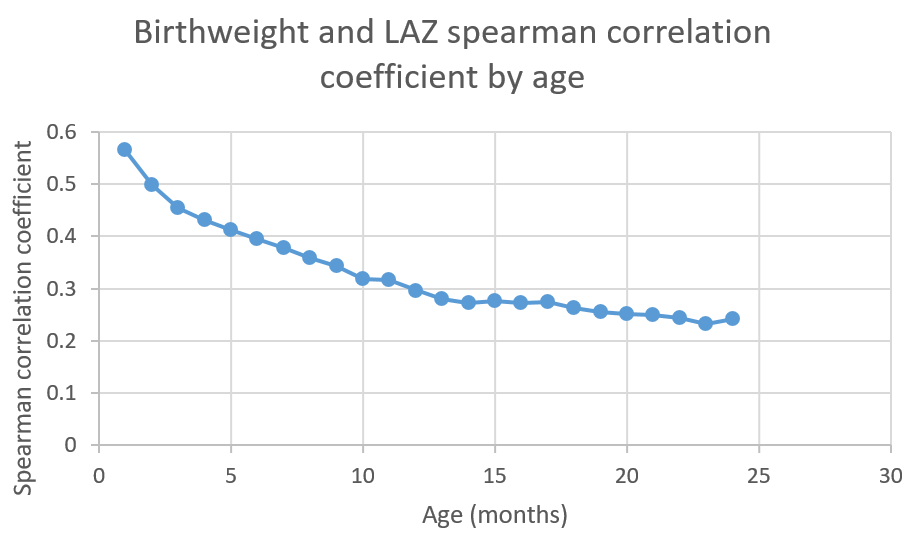

.. _2019_risk_correlation_birthweight_stunting:

..
  Section title decorators for this document:

  ==============
  Document Title
  ==============

  Section Level 1
  ---------------

  Section Level 2
  +++++++++++++++

  Section Level 3
  ^^^^^^^^^^^^^^^

  Section Level 4
  ~~~~~~~~~~~~~~~

  Section Level 5
  '''''''''''''''

  The depth of each section level is determined by the order in which each
  decorator is encountered below. If you need an even deeper section level, just
  choose a new decorator symbol from the list here:
  https://docutils.sourceforge.io/docs/ref/rst/restructuredtext.html#sections
  And then add it to the list of decorators above.

=================================================
Birthweight and Child Stunting
=================================================

Risk Exposures Overview
------------------------

Child anthropometry is measured through several different correlated metrics, generally related to length/height, weight, and age. Relevant metrics to this document include:

.. list-table:: Child Anthropometry Metrics
   :header-rows: 1

   * - Metric
     - Typical threshold value
   * - Birthweight
     - Low birthweight: <2500 grams
   * - Length/height for age (LAZ/HAZ)
     - Stunted: 2+ standard deviations below mean

Child anthropometry metrics tend to be highly correlated, with the magnitude of correlation varying with age. The metrics are related both through common causes as well as through suspected direct causal influences in some cases. It is critical to distinguish between the correlation between these metrics attributable to shared common causes between them from correlation between these metrics attributable to direct causal relationships. However, the influence of confounding factors in the estimation of the causal relationship between these factors must be carefully considered due to the high correlation between them and the observational nature of child anthropometry studies. Additionally, child age should be considered as an important effect modifier in the associations between each of these metrics, as discussed by [Alderman-and-Headey-2018-stunting-bw]_. For more discussion, see the :ref:`birthweight and wasting risk-risk correlation document <2019_risk_correlation_birthweight_stunting>`.

Correlation
++++++++++++

Spearman correlation coefficients between birthweight and LAZ/HAZ among the first two years of age were estimated from the MAL-ED study [MAL-ED-investigators-2014-stunting-bw]_, available in :download:`this spreadsheet <child_growth_birthweight_correlations.xlsx>` and presented in the figure below.

.. note::

   These correlation coefficients were estimated by Chris Troeger for previous work on risk correlation for the :ref:`Balanced Energy Protein simulation <2017_concept_model_vivarium_gates_bep>`.

Causation
+++++++++++

[McGovern-et-al-2019-stunting-bw]_ reports that **the marginal effect of a 200g increase in birthweight (at 2500g) is associated with a 2.0 (SD: 0.6) to 2.3 (SD: 0.5) percentage point decrease in the probability of stunting,** depending on if imputation was included in the model. [McGovern-et-al-2019-stunting-bw]_ was selected as a desireable data source as it is an analysis of twins and sibling pairs, a study design that is particularly advantageous for the control for confounding due to familial influence, and also provides continous estimates of the association between birthweight and stunting status. While this analysis was not confounded by gestational age due to the study design of evaluating twins, effect modification by gestational age was not considered. Additionally, the effect of birthweight on stunting was measured among a population of children five years of age and younger, although [McGovern-et-al-2019-stunting-bw]_ reports that the association was strongest among younger children. Due to the heterogenety of effects by age as well as the mortality selection bias, the effect of birthweight on wasting obtained from [McGovern-et-al-2019-stunting-bw]_ may be an underestimate, particularly as it applies to the youngest age groups. Further, [McGovern-et-al-2019-stunting-bw]_ modeled a quadratic term for birthweight and reported the marginal effect at 2500g.

There are several additional studies that report the association bewteen low birthweight and wasting status with attempted control for confounding factors such as maternal characteristics, socioeconomic status, etc. Examples of such analyses include a study by [Christian-et-al-2013-stunting-bw]_ that found low birthweight to be associated with 2.92 the odds of childhood stunting. [Christian-et-al-2013-stunting-bw]_ also assessed additional exposures including small for gestational age (SGA), preterm, and four categories including 1) adequate for gestational age (AGA) and term (reference category), 2) AGA and preterm, 3) SGA and term, 4) SGA and preterm. Notably, this data source was used in the [Optima-Nutrition-Model-stunting-bw]_ a model that includes of dynamic child wasting that is an adaptation of the Lives Saved Tool (LiST). Additionally, [Christian-et-al-2013]_ is an observational study that did not adjust for confounding beyond by child age, but reported that adjusting for child’s sex, twins, infection, child and maternal interventions, parity, socioeconomic status, maternal education and maternal infection did not change the risk estimates. [Christian-et-al-2013]_ reported that this analysis "revealed no evidence of strong confounding and showed a dose-response relationship, indicating possible causal associations" (p. 1351).

Risk Exposures in GBD
-----------------------

GBD models the correlated joint distribution of gestational age and birthweight as a single low birth weight and short gestation (LBWSG) risk factor. However, GBD does not consider the joint distribution of other risk exposures related to child anthropometry. Therefore, we will model risk-risk correlation of GBD risk exposures between LBWSG with wasting (and others) separately from the GBD in Vivarium.

Notably, in GBD, there are LBWSG risk exposures at birth and among the early and late neonatal age groups only. For the child growth failure risks (wasting, stunting, and underweight), there are risk exposures for all age groups under five years, although risk effects for these risks apply to the post-neonatal and 1-4 age groups only.

Links to documentation for relevant risk exposure pages include:

- :ref:`GBD 2019 Low birthweight short gestation risk exposure <2019_risk_exposure_lbwsg>`

- :ref:`GBD 2020 Child stunting risk exposure <2020_risk_exposure_child_stunting>`

Vivarium Modeling Strategy
----------------------------

The strategy for modeling risk-risk correlations related to child anthropometry in this document was developed for the needs of the :ref:`acute malnutrition treatment and prevention simulation <2019_concept_model_vivarium_ciff_sam>`. Different strategies may be more appropriate for different project needs and should be reevaluated when necessary.

In GBD, the birthweight exposure distribution is tracked through the late neonatal age group (28 days after birth) and affects the risk of mortality during this period. 

Correlation
+++++++++++++

When simulants are initialized into the early or late neonatal age groups or born into the simulation, they will be assigned a birthweight exposure value associated with their LBWSG risk exposure. Additionally, when simulants are initialized into the early or late neonatal age group and when they are born into the simulation, they will be initialized into a particular stunting exposure category (e.g. TMREL, mild stunting, moderate stunting, or severe stunting) *based on their birthweight exposure value* according to the steps below. NOTE: simulants who are initialized into age groups older than the late neonatal age group will not be assigned a birthweight exposure, so they should be assigned a stunting exposure value that is independent of birthweight.

1. Assign the simulant a birthweight exposure value specific to their age group and additional attributes that affect birthweight (i.e. intervention coverage, maternal BMI risk exposure, etc.)

2. Assess the percentile of a simulant's birthweight exposure value (after application of all birthweight-affecting variables in the baseline scenario but before the application of *new* intervention coverage in the alternative scenario) within the overall sex, location, and year-specific birthweight exposure distribution *at birth*.

3. Assign the simulant a stunting propensity that is correlated to their birthweight percentile according to the spearman correlation coefficient of birthweight and wasting at one month of age (0.56461806). This should be done according to the methodology described in the :ref:`risk-risk correlation page <risk_correlation>`.

4. Assign the simulant a stunting exposure based on their stunting propensity and their sex/location/year-specific stunting exposure distribution such that the propensity is equal to the percentile within the exposure distribution.

Causation
++++++++++++

For interventions that impact birthweight, there should be a corresponding change in a child's stunting risk exposure attributable *if the impact of the intervention on stunting is not modeled directly*. This change in stunting risk exposure should persist among all age groups five years and under.

For each gram increase in a simulant's birthweight due to a simulation intervention, the category 1 (severe stunting) and category 2 (moderate stunting) exposures used to determine the probability of initialization into those states should be reduced proportionately such that the total reduction in moderate and severe stunting exposure prevalence is equal to :math:`Y` (defined in the table below). The exposure prevalence of category 3 (mild stunting) should be increased by :math:`Y`. The figure below demonstrates how to implement this change visually. This change in the stunting expousure distribution thresholds attributable to a change in birthweight should be implemented **at birth**, after the calculation of the simulant's stunting initialization propensity correlated with their birthweight percentile, as described above.

.. list-table:: Child Anthropometry Metrics
   :header-rows: 1

   * - Parameter
     - Value
     - Note
     - Source
   * - :math:`Y`
     - 0.0001 (SD: 0.00003)
     - Assume a normal distribution of uncertainty.
     - [McGovern-et-al-2019-stunting-bw]_; 200g increase in birthweight associated with a 2.0 (SD: 0.6) percentage decrease in stunting exposure, scaled to a a single gram increase in birthweight. 2.0 was selected instead of 2.3 in order to be conservative.

.. image:: stunting_exposure_dist.svg

.. note::

   We will only consider the causal impact of birthweight on stunting exposure as it relates to *new* intervention coverage in the alternative scenario in our models. We will assume that the birthweight/stunting correlation captures this causal relation otherwise. 

Assumptions and Limitations
+++++++++++++++++++++++++++++

We are limited in that we will use the correlation between birthweight and stunting to initialize simulant stunting exposures at birth through the first month of life. However, as shown in the [MAL-ED-investigators-2014-stunting-bw]_ study, the correlation between these factors decreases with age. Since we do not model birthweight exposure values after one month of life, we cannot consider this evolving correlation. Additionally, we assume that the correlation coefficient between birthweight and stunting does not significantly vary within the first month of life.

The application of the size from [McGovern-et-al-2019-stunting-bw]_ makes the following assumptions:

- The effect size is entirely causal and not subject to confounding

- The effect of BW on stunting applies proportionately to moderate and severe stunting

- We apply the average effect of birthweight on stunting exposure for all ages under 5 years and do not consider effect modification by age, although [McGovern-et-al-2019-stunting-bw]_ suggests that the effect is likely larger among younger ages.

Validation Criteria
+++++++++++++++++++++

- The LBWSG and stunting risk exposures should continue to validate to the GBD risk exposures in the baseline scenario after the induction of correlation betwen the risk exposures. This is an especially critical validation criteria given our expected bias this modeling strategy will introduce as described in the "important" note above.

- For interventions that improve birthweight, the prevalent severe and moderate stunting risk exposures should be lower and the mild stunting risk exposure should be higher in the baseline than alternative scenario among individuals covered by the intervention. The TMREL stunting risk exposure should not change between scenarios.

.. todo::

   Determine the outputs feasible to include in simulation stratification (ex: BW<2500 stratification, or select LBWSG categories) for verification purposes OR determine how to verify and validate through interactive simulations

   Would be ideal to investigate:

   - How the correlation between BW and stunting evolves as simulants age

   - The magnitude of wasting and stunting correlation that results through correlating each of these variables through birthweight, as reported in [Richard-et-al-2012-stunting-bw]_

References
-----------

.. [Alderman-and-Headey-2018-stunting-bw]
  Alderman H, Headey D. The timing of growth faltering has important implications for observational analyses of the underlying determinants of nutrition outcomes. PLoS One. 2018 Apr 25;13(4):e0195904. doi: 10.1371/journal.pone.0195904. PMID: 29694431; PMCID: PMC5919068. `https://pubmed.ncbi.nlm.nih.gov/29694431 <https://pubmed.ncbi.nlm.nih.gov/29694431/>`_.

.. [Christian-et-al-2013-stunting-bw]
   Christian P, Lee SE, Donahue Angel M, Adair LS, Arifeen SE, Ashorn P, Barros FC, Fall CH, Fawzi WW, Hao W, Hu G, Humphrey JH, Huybregts L, Joglekar CV, Kariuki SK, Kolsteren P, Krishnaveni GV, Liu E, Martorell R, Osrin D, Persson LA, Ramakrishnan U, Richter L, Roberfroid D, Sania A, Ter Kuile FO, Tielsch J, Victora CG, Yajnik CS, Yan H, Zeng L, Black RE. Risk of childhood undernutrition related to small-for-gestational age and preterm birth in low- and middle-income countries. Int J Epidemiol. 2013 Oct;42(5):1340-55. doi: 10.1093/ije/dyt109. Epub 2013 Aug 6. PMID: 23920141; PMCID: PMC3816349. `https://pubmed.ncbi.nlm.nih.gov/23920141/ <https://pubmed.ncbi.nlm.nih.gov/23920141/>`_

.. [MAL-ED-investigators-2014-stunting-bw]
  The MAL-ED Network Investigators, The MAL-ED Study: A Multinational and Multidisciplinary Approach to Understand the Relationship Between Enteric Pathogens, Malnutrition, Gut Physiology, Physical Growth, Cognitive Development, and Immune Responses in Infants and Children Up to 2 Years of Age in Resource-Poor Environments, Clinical Infectious Diseases, Volume 59, Issue suppl_4, November 2014, Pages S193–S206, `https://doi.org/10.1093/cid/ciu653 <https://doi.org/10.1093/cid/ciu653/>`_

.. [McGovern-et-al-2019-stunting-bw]
  McGovern, M. E. (2019). How much does birth weight matter for child health in developing countries? Estimates from siblings and twins. Health economics, 28(1), 3-22. `https://pubmed.ncbi.nlm.nih.gov/30239053 <https://pubmed.ncbi.nlm.nih.gov/30239053/>`_.

.. [Optima-Nutrition-Model-stunting-bw]
  Pearson R, Killedar M, Petravic J, Kakietek JJ, Scott N, Grantham KL, Stuart RM, Kedziora DJ, Kerr CC, Skordis-Worrall J, Shekar M, Wilson DP. Optima Nutrition: an allocative efficiency tool to reduce childhood stunting by better targeting of nutrition-related interventions. BMC Public Health. 2018 Mar 20;18(1):384. doi: 10.1186/s12889-018-5294-z. Erratum in: BMC Public Health. 2018 Apr 26;18(1):555. `https://pubmed.ncbi.nlm.nih.gov/29558915 <https://pubmed.ncbi.nlm.nih.gov/29558915>`_

.. [Richard-et-al-2012-stunting-bw]
  Richard SA, Black RE, Gilman RH, Guerrant RL, Kang G, Lanata CF, Mølbak K, Rasmussen ZA, Sack RB, Valentiner-Branth P, Checkley W; Childhood Infection and Malnutrition Network. Wasting is associated with stunting in early childhood. J Nutr. 2012 Jul;142(7):1291-6. doi: 10.3945/jn.111.154922. Epub 2012 May 23. PMID: 22623393; PMCID: PMC3374667.
