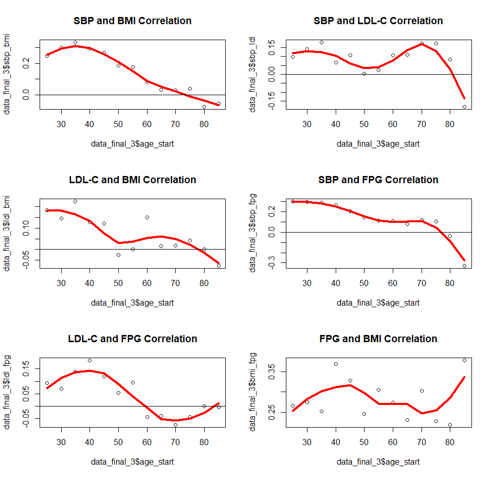

.. _2023_sbp_ldlc_fpg_bmi:

-------------------------------------------------------
SBP, LDL-C, FPG, and BMI Risk Factor Correlation - 2023
-------------------------------------------------------

Risk Exposure Overview
----------------------

SBP, LDL-C, FPG, and BMI are all continuous risk exposures that affect 
different cardiovascular disease outcomes. In the 2023 model for 
CVD, these outcomes are heart failure incidence, myocardial infarction, and 
ischemic stroke. 

It is also known that these 4 risks are correlated in the population. To properly 
account for the uneven distribution of risk, we are including a correlation between 
the relevant risk factors (more detail on which are included below). 

Risk Exposures in GBD 
----------------------

Links to documentation for relevant risk exposure pages include:

- :ref:`SBP risk exposure <2019_risk_sbp>`

- :ref:`LDL-C risk exposure <2019_risk_exposure_ldl>`

- :ref:`FPG risk exposure <2019_risk_exposure_fpg>`

- :ref:`BMI risk exposure <2019_risk_bmi>`

Vivarium Modeling Strategy
----------------------------

Correlation
++++++++++++

Correlation for all risk factors was derived from NHANES data. The dataset included 
surveys between 1988 and 2018. The data was examined and correlation coefficients were calculated in
the `R file here <https://github.com/ihmeuw/vivarium_research_nih_us_cvd/blob/main/correlation.R>`_. 

We saw that there was a relationship between age and correlation coefficient for some 
of the variables. This can be visualized in the graphs below. All graphs have age on the x-axis 
and the correlation coefficient on the y-axis. 

With our clinical expert, we used this information and decided that the correlation 
would be included in the following way: 

- For SBP and BMI, correlation would be age specific 
- For SBP/LDL-C, SBP/FPG, LDL-C/BMI, and FPG/BMI the age effects were limited and thought to be primarily noise. Therefore they are included at an overall level, not age specific. 
- LDL-C and FPG were not statistically significantly correlated for most ages and therefore correlation was set to 0 

The correlation was then recalculated based on the above (age specific or not) 
and the final values for correlation coefficients are stored in the csv file 
here: /mnt/team/simulation_science/costeffectiveness/artifacts/vivarium_nih_us_cvd/raw_data/correlation.csv 

The correlation is then used to create propensity values for all simulants. Therefore, the 
correlation will continue to be the same even as simulants age and their risk exposure values 
change. 

This is accomplished using a multivariate normal distribution with a defined 
correlation matrix matching our calculated correlation coefficients. From the 
multivariate, a cdf function is used to convert the values into a uniform distirbution 
between 1 and 0 with the same correlation between variables. 

The calculations are done `in this notebook <https://github.com/ihmeuw/vivarium_research_nih_us_cvd/blob/main/Correlation_Testing.ipynb>`_. This code can be used to generate propensity 
values for any number of simulants. 

Joint PAF Calculations
++++++++++++++++++++++

As the risks are now correlated, we will need adjust the PAF values to account for this. More 
information on why this is necessary can be found on `Vivarium here <https://vivarium-research.readthedocs.io/en/latest/model_design/vivarium_model_components/risk_factors/risk_correlation/index.html#pafs-for-correlated-risks>`_. 

We will be calculating the joint PAFs in a similar approach to the uncorrelated and 
unmediated PAF for BMI to heart failure. Therefore, we will initialize a large 
population once and then save the calculated PAF values to the artifact for future use.

As a proof of concept, the research team has done this calculation in `a notebook <https://github.com/ihmeuw/vivarium_research_nih_us_cvd/blob/main/PAF_interactive.ipynb>`_. However, at the 
time this workbook was made, the risks in the interactive sim were not correlated 
and mediation was not included in the model. Therefore, we expect that this calculation 
will be made significantly simpler by redoing it after correlation and mediation are 
included on initialization. 

To calculate the PAFs, we will follow the below steps: 

#. Initialize a population of 100,000 once correlation and mediation are included in the model 
#. Create BMI values to be used for heart failure calculations **ONLY** by truncating the exposure of BMI at 40.8 
#. Find the simulant level RR for each risk factor and cause pair with this equation: :math:`RR\text{simulant} = RR^{max((risk_i - TMREL),0)/scalar}`  
#. Find the joint RR for each cause by multiplying the relative risks for all relevant risk factors 
#. Find the mean joint RR for each age/sex group 
#. Find the PAF for each age/sex group with this equation: :math:`PAF(i) = (RR\text{mean}(i) - 1) / RR\text{mean}(i)`

Notes: 

- We truncate the exposures of BMI for heart failure based on literature values that have limited applicability in our model. 40.8 is 3 standard deviations above the mean BMI exposure for obese individuals in the paper being used. [Kenchaiah_2008]_ Without this truncation, there would be RR's that are 2000+ for only BMI to heart failure which makes mean PAF values very close to 1. We do not want to assume a continued relationship in BMI to RR for values 40 BMI units above the max used in the paper. This is not true for RR values found in GBD 
- SBP's effect on heart failure is categorical and therefore the exponential equation in step 3 is not applicable 
- In step 4, MI and stroke use all 4 risks (SBP, LDL-C, FPG, and BMI) while heart failure only includes SBP and BMI
- The final PAFs found above represent ALL risks impact on a particular cause 

Assumptions and Limitations
++++++++++++++++++++++++++++++

#. We assign a correlation at initialization that does not change over time. For SBP and BMI which we model to change over time, this means that as simulants age, they will retain their original correlation and increasly differ from the true correlation. 

#. To calculate the correlation, we included both treated and untreated individuals. This is due to how we initialize the population in the sim, which generates exposures for individuals including any relevant treatment effects. As treatment is also derived from NHANES, we feel this is a reasonable approach. However it likely includes some bias still.  

Validation Criteria
+++++++++++++++++++++

#. The exposure distribution for all risks in the baseline scenario should continue to validate to the GBD exposure distribution

#. The correlation we see with risk exposures should roughly match input values with the limitations listed above 
