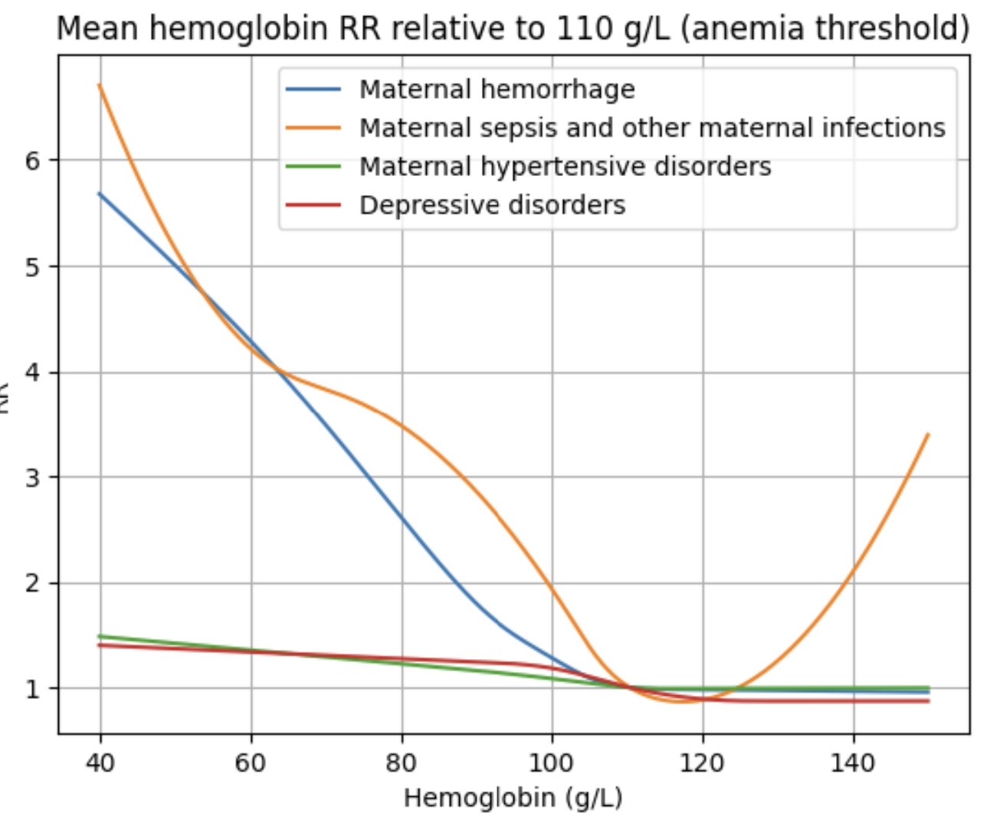

.. _2023_hemoglobin_effects:

..
  Section title decorators for this document:

  ==============
  Document Title
  ==============

  Section Level 1
  ---------------

  Section Level 2
  +++++++++++++++

  Section Level 3
  ^^^^^^^^^^^^^^^

  Section Level 4
  ~~~~~~~~~~~~~~~

  Section Level 5
  '''''''''''''''

  The depth of each section level is determined by the order in which each
  decorator is encountered below. If you need an even deeper section level, just
  choose a new decorator symbol from the list here:
  https://docutils.sourceforge.io/docs/ref/rst/restructuredtext.html#sections
  And then add it to the list of decorators above.

====================================
GBD 2023 Hemoglobin Risk Effects
====================================

.. contents::
   :local:
   :depth: 2

Risk Overview
-------------

.. todo::

  Provide overview and references for hemoglobin team's efforts for the hemoglobin burden of proof models when they are available

GBD 2023 Modeling Strategy
--------------------------

.. note::

  As of March 2025 it is undecided whether the hemoglobin risk factor will be included in the GBD 2023 publication. Regardless, risk effects estimates for the following affected outcomes have been uploaded to GBD shared functions.

In GBD 2023, the hemoglobin risk effects are modeled as continuous risk curves with 1,000 exposure estimates ranging between values of 40 and 150. Exposure values <40 are assigned a risk value consistent with an exposure of 40 and exposure values >150 are assigned a risk value consistent with an exposure of 150.

.. list-table:: Affected Entities
   :widths: 5 5 5 5 5
   :header-rows: 1

   * - Outcome
     - Outcome type
     - Outcome ID
     - Affected measure
     - Note
   * - Maternal hemorrhage
     - cause
     - 367
     - incidence (affects mortality and morbidity in GBD)
     - In GBD shared functions, but expected to be updated
   * - Maternal sepsis and other infections
     - cause
     - 368
     - incidence (affects mortality and morbidity in GBD)
     - In GBD shared functions, but expected to be updated
   * - Maternal hypertensive disorders
     - cause
     - 369
     - incidence (affects mortality and morbidity in GBD)
     - In GBD shared functions, but expected to be updated
   * - Depressive disorders
     - cause
     - 567
     - incidence (affects mortality and morbidity in GBD) 
     - In GBD shared functions, but expected to be updated

.. todo::

  Determine how GBD handles the fact that the hemoglobin risk factor is specific to the pregnant population but the depressive disorders cause is not when we get relevant documentation

The relative risk curves for maternal disorders affected outcomes in GBD shared functions as of March 2025 are shown below for reference. These values have been transformed to be relative to a hemoglobin exposure of 110 g/L (the threshold for anemia in pregnancy) for ease of interpretation. However, they are stored in GBD shared functions as relative to a hemoglobin exposure of 40 g/L.

The hemoglobin team has also estimated risk effects for several additional outcomes. A list of these affected outcomes is shown below and risk curve values for each of these outcomes can be found at :code:`/mnt/team/anemia/pub/bop/sim_studies/`.

- Low birth weight (Operationalized as categorical for <2,500 grams and additional severities)

- Preterm birth (Operationalized as categorical for <37 weeks and additional severities)

- Small for gestational age

- Large for gestational age

- Neonatal sepsis and other neonatal infections

- Neonatal all-cause mortality

- Stillbirth

PAFs and attributable burden for hemoglobin on causes affected by LBWSG as mediated through LBWSG can be pulled using shared functions with release ID 33 and burdenator ID 393 (`as tracked here <https://hub.ihme.washington.edu/spaces/GBDdirectory/pages/229280354/GBD+2023+PAF+Burdenator+SEV+Calculator+Tracking>`_). These PAFs were calculated `the custom LBWSG PAF calculation <https://scicomp-docs.ihme.washington.edu/ihme_cc_paf_calculator/current/custom_pafs.html#mortality-paf-calculation-for-subcauses-of-the-aggregate-lbwsga-outcome>`_ and they did not consider the direct (unmediated) effect of hemoglobin on neonatal sepsis.

Risk curves for selected neonatal outcomes are shown below:

Vivarium Modeling Strategy: MNCNH Portfolio Simulation
------------------------------------------------------

Note that we will not be modeling direct effects of hemoglobin on the affected outcomes of stillbirth or outcomes related to gestational age or birth weight exposures. Instead, these effects will be implicitly included in the effects of the :ref:`iron-containing antenatal supplementation <maternal_supplementation_intervention>` and :ref:`intravenous iron <intervention_iv_iron_antenatal_mncnh>` interventions, which will affect these outcomes with effect sizes that are inclusive of mediated effects through hemoglobin. We chose this modeling strategy because we obtained total effects of IFA/MMS on these outcomes from the literature and modeling direct effects from hemoglobin would require us to adjust the IFA/MMS effects for mediation through hemoglobin. So instead, we added simulated effects from IV iron on these outcomes that are calculated to be 100% mediated through hemoglobin. The modeling strategy for neonatal sepsis is different, however. This is because we do not have estimates of the total effect of either intervention on neonatal sepsis like we do for stillbirth and LBWSG outcomes. So we will model a direct effect of hemoglobin on neonatal sepsis, adjusted for mediation through LBWSG.

.. list-table:: Risk Outcome Relationships for Vivarium
   :header-rows: 1

   * - Category
     - Outcome
     - Outcome type
     - Outcome ID
     - Affected measure
     - Note
   * - Maternal disorders
     - :ref:`Maternal hemorrhage <2021_cause_maternal_hemorrhage_mncnh>`
     - cause
     - c367
     - :math:`ir`
     - 
   * - Maternal disorders
     - :ref:`Maternal sepsis and other maternal infections <2021_cause_maternal_sepsis_mncnh>`
     - cause
     - c368
     - :math:`ir`
     - 
   * - Maternal disorders
     - Maternal hypertensive disorders
     - cause
     - c369
     - TBD
     - Modeling strategy for hypertensive disorders cause in the MNCNH model is still outstanding. The risk effects model for this cause may require a custom approach to account for the complexity of pre-eclampsia and related interventions in the MNCNH model.
   * - Maternal disorders
     - :ref:`Postpartum depression <2021_cause_postpartum_depression_mncnh>`
     - cause
     - custom
     - :math:`ir`
     - A modeling strategy for maternal depressive disorders in the MNCNH model is still outstanding.
   * - Neonatal outcomes
     - :ref:`Neonatal sepsis <2021_cause_neonatal_sepsis_mncnh>`
     - cause
     - c383
     - :math:`\text{CSMRisk}`
     - We will be modeling the direct effect, adjusted for mediation through LBWSG

.. todo::

  Update this page with hypertension cause model links when ready

Maternal disorders
++++++++++++++++++++

Use the modeling strategy described below for the following maternal disorders subcauses:

- :ref:`Maternal hemorrhage <2021_cause_maternal_hemorrhage_mncnh>`
- :ref:`Maternal sepsis and other maternal infections <2021_cause_maternal_sepsis_mncnh>`
- Maternal hypertensive disorders
- :ref:`Postpartum depression <2021_cause_postpartum_depression_mncnh>`

.. todo::

  Link hypertension cause model documents when ready and write custom strategy for hypertensive disorders as necessary

There may be individual exposure values assigned that are outside of the defined risk curves in GBD. In this case, for exposures <40, assign the risk corresponding to an exposure value of 40. For exposures >150, assign the risk corresponding to an exposure value of 150.

Use the population attributable fraction values pulled from GBD shared functions such that the maternal disorder incidence rate for an individual :math:`i` for a given affected maternal disorder subcause is as follows:

.. math::

  ir_i = ir * (1 - PAF) * RR_i

Validation and Verification Criteria
^^^^^^^^^^^^^^^^^^^^^^^^^^^^^^^^^^^^

- Overall incidence and mortality of each affected maternal disorder cause should continue to validate to GBD

- Overall hemoglobin exposure should continue to validate to GBD

- Individual-level incidence and mortality of each affected maternal disorder outcome should vary according to hemoglobin exposure and corresponding risk

  - Note that while the mortality rate should vary in accordance with hemoglobin risk, the case fatality rate (per incident case) should not 

Assumptions and Limitations
^^^^^^^^^^^^^^^^^^^^^^^^^^^

1. We are using population attributable fractions that do not account for correlation with confounding factors.

  To minimize bias, the PAFs of hemoglobin on affected maternal disorder outcomes should account for the joint effects of any additional modeled factors that (1) are correlated with hemoglobin exposure and (2) affect the same outcome. A list of potential factors that satisfy these criteria are listed below:

    - Cesarean section and maternal hemorrhage

    - Intrapartum azithromycin intervention and maternal sepsis

    - Preeclampsia prevention/treatment interventions and maternal hypertensive disorders

  All of these interventions may be expected to be positively correlated with hemoglobin exposure through access to the health care system or other factors. Therefore, by not considering the joint effects of these factors with the hemoglobin risk effect in baseline calibration of our model, we are likely underestimate the PAF for maternal hemorrhage and overestimate the PAF for maternal sepsis and hypertensive disorders. 

  This will likely result in an overestimate of the impact of interventions that work through reductions in anemia (MMS, IV iron) on maternal hemorrhage and overestimate the impact on maternal sepsis and hypertensive disorders.

2. We do not consider how hemoglobin exposure and/or risk effects vary with gestational age at birth in this model.

Neonatal sepsis
++++++++++++++++++++

The effect estimates of hemoglobin on neonatal sepsis mortality as we receive them from the hemoglobin team are estimates of the total effect. However, given that there are also effects of hemoglobin on birth weight and gestational age and there is also an effect of low birth weight and short gestation (LBWSG) on neonatal sepsis, the relationship between hemoglobin and neonatal sepsis is mediated by LBWSG. We model the indirect/mediated pathway between hemoglobin and neonatal sepsis in the MNCNH portfolio model by including both the effect of hemoglobin on LBWSG (through the effects of the :ref:`iron-containing antenatal supplementation <maternal_supplementation_intervention>` and :ref:`intravenous iron <intervention_iv_iron_antenatal_mncnh>` interventions) and the effect of LBWSG on neonatal sepsis (through the :ref:`LBWSG risk effects <2019_risk_effect_lbwsg>`). Therefore, when modeling the direct relationship between hemoglobin and neonatal sepsis, we must ensure that we use the direct effect estimates, which we can obtain by adjusting the total effect estimates from the hemoglobin team for mediation by LBWSG (see the :ref:`risk factor mediation documentation page <risk_mediation>` for background information on mediation.)

Effect derivation
^^^^^^^^^^^^^^^^^^^

.. todo::

  Revisit this section once we discuss who/where we should perform the derivation

  Investigate and document logical pairings of draws between hemoglobin and LBWSG relative risk values

Generally, in order to derive the direct (mediation-adjusted) effects of hemoglobin on neonatal sepsis for use in our simulation, we will use the following steps for each hemoglobin exposure level as well as each location/sex/draw pair, `as has been done for a single pair in this notebook <https://github.com/ihmeuw/vivarium_research_mncnh_portfolio/blob/main/data_prep/hemoglobin_mediation.ipynb>`_:

1. Load the estimates of the total effect of hemoglobin on neonatal sepsis (:math:`RR_\text{R1→O,total}`) as obtained from the hemoglobin team
2. Solve for the indirect (mediated) effect of hemoglobin on neonatal sepsis (:math:`RR_\text{R1→R2→O}`). This will be done in multiple sub-steps:

  a. Calculate the effect between hemoglobin and (separately) birth weight and gestational age at birth exposures. This will be done in a manner similar to the `GBD custom calculation for the PAF of a risk on the outcome as mediated through LBWSG <https://scicomp-docs.ihme.washington.edu/ihme_cc_paf_calculator/current/custom_pafs.html#mortality-paf-calculation-for-subcauses-of-the-aggregate-lbwsga-outcome>`_ where we optimize for the delta value that results in the relative effect of hemoglobin on dichotomous low birth weight (LBW) and preterm birth (PTB) outcomes as estimated by the hemoglobin team. Note that these estimates are also utilized in the :ref:`derivation of the effects of IV iron on GA and BW outcomes <intervention_iv_iron_antenatal_mncnh>`.

  b. Calculate :math:`RR_\text{R1→R2→O}` as the mean quotient of LBWSG relative risk on neonatal sepsis following application of the hemoglobin effects on birth weight and short gestation relative to the baseline value of LBWSG relative risk on neonatal sepsis. This will be done utilizing the Vivarium Interactive Context.

3. Calculate the direct effect (:math:`RR_\text{R1→O,direct}`) as :math:`RR_\text{R1→O,total} / RR_\text{R1→R2→O}` using the equation :math:`RR_\text{R1→O,total} = RR_\text{R1→O,direct} \times RR_\text{R1→R2→O}`.

Effect application
^^^^^^^^^^^^^^^^^^^

.. math::

  \text{CSMRisk}_i = \text{CSMRisk} \times (1 - \text{PAF}) \times \text{RR}_\text{hemoglobin}_i

Where,

.. list-table:: Parameters
  :header-row: 1

  * - Parameter
    - Definition
    - Value
    - Note
  * - :math:`\text{CSMRisk}`
    - Neonatal sepsis cause specific mortality risk
    - Defined on the :ref:`neonatal sepsis cause model document <>`
    - 
  * - :math:`\text{CSMRisk}_i`
    - Hemoglobin risk-adjusted neonatal sepsis cause-specific mortality risk for an individual simulated dyad, :math:`i`
    - See equation
    - 
  * - :math:`PAF`
    - Population attributable fraction of hemoglobin on neonatal sepsis
    - (mean_rr - 1) / mean_rr
    - Note that the PAF is calculated according to direct (not total) effects of hemoglobin on neonatal sepsis. We utilize this PAF rather than a joint PAF with the effect of LBWSG since we are not modeling correlation between hemoglobin and LBWSG in the MNCNH portfolio simulation.
  * - :math:`\text{RR}_\text{hemoglobin}_i`
    - Relative risk value for the direct effect of hemoglobin on neonatal sepsis, specific to that individual simulated dyad's hemoglobin exposure level at birth
    - Values derived as detailed in the `Effect derivation`_ section
    - 
  * - mean_rr
    - Population mean relative risk value (for the direct effect of hemoglobin on neonatal sepsis)
    - Calculated in the interactive simulation by initializing a population of pregnant simulants with hemoglobin exposures and taking the mean of assigned :math:`\text{RR}_\text{hemoglobin}_i` values
    - This value should not be stratified by maternal age group

.. todo::
  
  Revisit "mean_rr" section once we discuss who/where should generate these types of values

Verification and validation criteria
^^^^^^^^^^^^^^^^^^^^^^^^^^^^^^^^^^^^^^

- We should continue to meet neonatal sepsis V&V criteria in the baseline scenario
- Using the interactive sim, the expected relationship between hemoglobin exposures and neonatal sepsis mortality rates unaffected by LBWSG should match the expected pattern

Assumptions and limitations
^^^^^^^^^^^^^^^^^^^^^^^^^^^^^

- Our derivation of the effect of hemoglobin on GA and BW from estimates of PTB and LBW is limited in that it:

  - Assumes no change in the shape of the LBWSG exposure distribution ("shifts" are applied uniformly to the entire range of the distribution)
  - Does not utilize estimates of hemoglobin on additional severities of LBW or PTB 
  - Does not consider any correlation between hemoglobin and LBWSG exposures in the derivation of the estimates of IV iron's impact on LBWSG

- We do not model correlation between hemoglobin and LBWSG and therefore do not calculate the joint PAF of these risk factors on neonatal sepsis

References
----------

