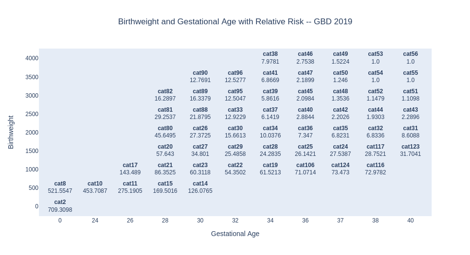

.. _2021_risk_effect_lbwsg:

..
  Section title decorators for this document:

  ==============
  Document Title
  ==============

  Section Level 1
  ---------------

  Section Level 2
  +++++++++++++++

  Section Level 3
  ^^^^^^^^^^^^^^^

  Section Level 4
  ~~~~~~~~~~~~~~~

  Section Level 5
  '''''''''''''''

  The depth of each section level is determined by the order in which each
  decorator is encountered below. If you need an even deeper section level, just
  choose a new decorator symbol from the list here:
  https://docutils.sourceforge.io/docs/ref/rst/restructuredtext.html#sections
  And then add it to the list of decorators above.

=========================================================
GBD 2021 Low Birthweight and Short Gestation Risk Effects
=========================================================

.. note::

  The LBWSG risk factor was "out of rotation" for GBD 2023. This means that there were no changes to the risk effects model between GBD 2021 and GBD 2023. This page can be used for GBD 2023 risk effects model as well as the GBD 2021 risk effects model for LBWSG.

  This page was copied from the :ref:`GBD 2019 LBWSG risk effects document <2019_risk_effect_lbwsg>`. There were no changes in the GBD or vivarium modeling strategies between these GBD rounds except for: 

    - Minor changes in how to access the relative risk estimates via shared functions, as shown in the :ref:`get_draws call in the code block linked here <get_draws_call>`
    - An update to our LBWSG risk effects modeling strategy used for the MNCNH Portfolio simulation related to impossibly high all-cause mortality rates for some LBWSG exposure categories in some age/sex/location/draw-specific instances, as discussed in the `Mortality Rate Inconsistencies`_ section

.. contents::
   :local:
   :depth: 2

Risk Overview
-------------

.. todo::

	Provide a brief description of the risk, including potential opportunities for confounding (factors that may cause or be associated with the risk exposure), effect modification/generalizability, etc. by any relevant variables. Note that literature reviews and speaking with the GBD risk modeler will be good resources for this.

GBD 2021 Modeling Strategy
--------------------------

.. note::

   This section will describe the GBD modeling strategy for risk effects. For a
   description of GBD modeling strategy for risk exposure, see the :ref:`Low
   Birthweight and Short Gestation (GBD 2021) <2021_risk_exposure_lbwsg>` page.

**The available data for deriving relative risk was only for all-cause
mortality.**
For each location, data were pooled across years, and the risk of all-cause
mortality at the **early neonatal period** and **late neonatal period** at joint
birthweight and gestational age combinations was calculated. In all datasets
except for the USA, sex-specific data were combined to maximise sample size. The
USA analyses were sex-specific.
**Relative risks of all-cause mortality were calculated for each 500g and 2wk
category of birthweight and gestational age.**
[GBD-2021-Risk-Factors-Appendix-LBWSG-Risk-Effects]_ (p. 176)

.. note::

  The risk appendix's description of 2-week age bins is not totally accurate
  --- there are two exceptions:

  - 2 of the 58 categories (cat2 and cat8) have an age range of 0-24 weeks.

  - 14 of the 58 categories have a 1-week age range, either 36-37 weeks or 37-38
    weeks, because 37 weeks is the usual cutoff for defining preterm birth.

  For simplicity, we will generally refer to "500g and 2wk categories," with
  the understanding that there are some exceptions.

Details of Relative Risk Estimation
+++++++++++++++++++++++++++++++++++

In the Norway, New Zealand, and USA Linked Birth/Death Cohort microdata
datasets, livebirths are reported with gestational age, birthweight, and an
indicator of death at 7 days and 28 days. For this analysis, gestational age was
grouped into two-week categories, and birthweight was grouped into 500-gram
categories. The Taiwan, Japan, and Singapore datasets were prepared in
tabulations of joint 500-gram and two-week categories. A pooled country analysis
of mortality risk in the early neonatal period and late neonatal period by
“small for gestational age” category in developing countries in Asia and
sub-Saharan Africa were also used to inform the relative risk analysis.

To calculate relative risk at each 500-gram and two-week combination, logistic
regression was first used to calculate mortality odds for each joint two-week
gestational age and 500-gram birthweight category. Mortality odds were smoothed
with Gaussian process regression, with the independent distributions of
mortality odds by birthweight and mortality odds by gestational age serving as
priors in the regression. A pooled country analysis of mortality risk in the
early neonatal period and late neonatal period by SGA category in developing
countries in Asia and sub-Saharan Africa were also converted into 500-gram and
two-week bin mortality odds surfaces.

The relative risk surfaces produced from microdata and the Asia and Africa
surfaces produced from the pooled country analysis were meta-analysed, resulting
in a meta- analysed mortality odds surface for each location. The meta-analysed
mortality odds surface for each location was smoothed using Gaussian process
regression and then converted into mortality risk.

To calculate mortality relative risks, the risk of each joint two-week
gestational age and 500-gram birthweight category were divided by the risk of
mortality in the joint gestational age and birthweight category with the lowest
mortality risk. [GBD-2021-Risk-Factors-Appendix-LBWSG-Risk-Effects]_ (p. 337)

.. note::

  Although the above description from the GBD 2021 risk appendix sometimes
  refers to location-specific mortality risks, the relative risks in GBD 2021
  are the same for all locations. Pulling LBWSG RR's with ``get_draws`` for any
  location returns RR's with location_id = 1 (Global), and they are stratified
  by year/age_group/sex. If we need clarification on exactly how the relative
  risks were calculated, we should consult the GBD modelers.

Affected Outcomes in GBD 2021
+++++++++++++++++++++++++++++

The available data for deriving relative risk was only for *all-cause mortality*
rather than for cause-specific outcomes. The exception was the USA linked infant
birth-death cohort data, which contained three-digit ICD causes of death, but
also had nearly 30% of deaths coded to causes that are ill-defined, or
intermediate, in the GBD cause classification system.

Therefore, the GBD modelers analysed the relative risk of all-cause mortality
across all available sources and selected outcomes based on criteria of
biological plausibility. **Some causes, most notably congenital birth defects,
haemoglobinopathies, malaria, and HIV/AIDS, were excluded based on the criteria
that reverse causality could not be excluded.**
[GBD-2021-Risk-Factors-Appendix-LBWSG-Risk-Effects]_ (p. 336)

.. _lbwsg_affected_causes_table_gbd_2021:

.. list-table:: Entities Affected by LBWSG in GBD 2021
   :widths: 5 5 5 5 5
   :header-rows: 1

   * - Outcome
     - Outcome type
     - Outcome ID
     - Affected measure
     - Note
   * - Diarrheal diseases
     - Cause
     - 302
     - Mortality (GBD YLLs)
     -
   * - Lower respiratory infections
     - Cause
     - 322
     - Mortality (GBD YLLs)
     -
   * - Upper respiratory infections
     - Cause
     - 328
     - Mortality (GBD YLLs)
     -
   * - Otitis media
     - Cause
     - 329
     - Mortality (GBD YLLs)
     -
   * - Meningitis
     - Cause
     - 332
     - Mortality (GBD YLLs)
     -
   * - Encephalitis
     - Cause
     - 337
     - Mortality (GBD YLLs)
     -
   * - Neonatal preterm birth
     - Cause (PAF-of-1)
     - 381
     - Mortality and Morbidity (GBD YLLs and YLDs)
     - 100% attributable to Low birthweight and short gestation
   * - Neonatal encephalopathy due to birth asphyxia and trauma
     - Cause
     - 382
     - Mortality (GBD YLLs)
     -
   * - Neonatal sepsis and other neonatal infections
     - Cause
     - 383
     - Mortality (GBD YLLs)
     -
   * - Hemolytic disease and other neonatal jaundice
     - Cause
     - 384
     - Mortality (GBD YLLs)
     -
   * - Other neonatal disorders
     - Cause
     - 385
     - Mortality (GBD YLLs)
     -
   * - Sudden infant death syndrome
     - Cause
     - 686
     - Mortality (GBD YLLs)
     -

.. note::

  There are 12 causes affected by LBWSG in GBD 2019 and 2021, whereas GBD 2017 included
  15 affected causes. The only difference is that meningitis (c332) had four
  subcauses in GBD 2017 (c333, c334, c335, c336, corresponding to different
  etiologies), whereas in GBD 2019 and 2021, c332 is the most detailed cause, and the
  subcauses have been removed.

Restrictions
++++++++++++

.. list-table:: Age, Sex, and Outcome Restrictions for LBWSG Relative Risks in GBD 2021
  :widths: 15 15 20
  :header-rows: 1

  * - Restriction Type
    - Value
    - Notes
  * - Male only
    - False
    -
  * - Female only
    - False
    -
  * - YLL only
    - True
    - Except for Neonatal preterm birth; see :ref:`note <note_on_preterm_birth_DALYs>` below
  * - YLD only
    - False
    -
  * - Age group start
    - Early neonatal (0-7 days, age_group_id = 2)
    -
  * - Age group end
    - Late neonatal (7-28 days, age_group_id = 3)
    - Except for Neonatal preterm birth; see :ref:`note <note_on_preterm_birth_DALYs>` below

.. _note_on_preterm_birth_DALYs:

.. note::

  GBD attributes 100% of the DALYs due to Neonatal Preterm Birth to the LBWSG
  risk factor. In particular, the attribution includes YLDs as well as YLLs, and
  the age restrictions for the LBWSG-attributable DALYs are the same as the age
  restrictions for Neonatal Preterm Birth.

  * **YLLs due to Neonatal preterm birth**, 100% attributable to LBWSG:

    - Age group start = 2 (Early neonatal, 0-7 days)
    - Age group end = 5 (1 to 4)

  * **YLDs due to Neonatal preterm birth**, 100% attributable to LBWSG:

    - Age group start = 2 (Early neonatal, 0-7 days)
    - Age group end = 235 (95+)

  Note that this attribution of DALYs is **not** based on the relative risks for
  all-cause mortality, but instead is based on the logic that all preterm births
  are due to short gestation by definition. Thus, if we include Neonatal Preterm
  Birth in our models, the relative risks likely must be handled differently for
  this cause.

Risk Exposure Categories and TMREL
++++++++++++++++++++++++++++++++++

Here is a plot `created by Kjell <kjell_lbwsg_category_rr_notebook_>`_ that
shows the LBWSG exposure categories and the mean relative risk estimate in each
category (the mean is taken across all all sexes, age groups, and draws):

Based on the GBD data as shown above, there are **four TMREL categories** where
the relative risk is always at the minimum 1.0 regardless of sex, age group, or
draw (recall that the relative risks are the same for all locations):

- cat53 (38-40 weeks, 4000-4500 g)
- cat54 (38-40 weeks, 3500-4000 g)
- cat55 (40-42 weeks, 3500-4000 g)
- cat56 (40-42 weeks, 4000-4500 g)

Here is the description of the modeling procedure for the TMREL in
[GBD-2021-Risk-Factors-Appendix-LBWSG-Risk-Effects]_ (p. 337):

  For each of the country-derived relative risk surfaces, the 500-gram and
  two-week gestational age joint bin with the lowest risk was identified. This
  bin differed within each country dataset. To identify the universal 500-gram
  and two-week gestational age category that would serve as the universal TMREL
  for our analysis, we chose the bins that was identified to be the TMREL in
  each country dataset to contribute to the universal TMREL. Therefore, the
  joint categories that served as our universal TMREL for the LBWSG risk factor
  were “38-40 weeks of gestation and 3500-4000 grams”, “38-40 weeks of gestation
  and 4000-4500 grams”, and “40-42 weeks of gestation and 4000-4500 grams”. As
  the joint TMREL, all three categories were assigned to a relative risk equal
  to 1.

.. note::

  The above description from the risk appendix indicates that there are only
  **three** universal TMREL categories (cat54, cat53, and cat56), whereas the RR
  data in GBD 2021 indicates that cat55 is also a TMREL category.

  Moreover, digging further into the RR data reveals that in addition to the 4 categories that have RR=1 for all sexes, age groups, and draws (cat53, cat54, cat55, cat56):

  - There is one additional category (cat52) that has RR=1 for early neonatal
    females for all draws;
  - The two categories cat51 and cat52 have RR=1 in more than 75% of draws in
    the early neonatal age group for both males and females;
  - There are 4 additional categories (cat44, cat48, cat49, cat50) that have
    RR=1 in at least one age/sex/draw combination.

  Thus, it may be worth discussing with the GBD modeler whether using the four
  categories cat53, cat54, cat55, cat56 as the TMREL regardless of sex, age
  group, or draw is a reasonable approach.

.. _kjell_lbwsg_category_rr_notebook: https://github.com/KjellSwedin/investigate_lbwsg_categories/blob/main/LSFF_Expose_RR.ipynb

Vivarium Modeling Strategy
--------------------------

.. note::

   This section will describe the Vivarium modeling strategy for risk effects.
   For a description of Vivarium modeling strategy for risk exposure, see the
   :ref:`Low Birthweight and Short Gestation (GBD 2021)
   <2021_risk_exposure_lbwsg>` page.

.. _lbwsg_2021_rr_interpolation_section:

Interpolation of LBWSG Relative Risks
+++++++++++++++++++++++++++++++++++++

The GBD LBWSG modelers estimated the relative risk for all-cause mortality on
each 500g and 2wk category of birthweight (BW) and gestational age (GA). If we
assume a constant relative risk on each rectangular LBWSG category, these
relative risk estimates define a `piecewise constant function`_ on the union of
the LBWSG categories, which is a subset of the GAxBW rectangle
:math:`[0,42\text{wk}] \times [0,4500\text{g}]`.

This piecewise constant relative risk function is `discontinuous <continuous
function_>`_, jumping from one value to another at the linear boundaries between
the LBWSG categories (usually when GA is a multiple of 2 or BW is a multiple of
500), and the relative risk does not change at all within each LBWSG category.
Therefore, any simulated intervention that affects birthweight or gestational
age (e.g. a nutritional supplement given to pregnant mothers to increase the
birthweight of their newborns) can only have an effect on a small percentage of
our simulants, namely those whose birthweight or gestational age is near the
boundary of one of the LBWSG categories.

To correct for this deficiency, we are interested in coming up with a
continuously varying risk surface that interpolates between the relative risks
estimated by GBD. In addition to (probably) being a better model of reality,
this would allow every simulant the opportunity to get the effect of an
intervention that affects birthweight or gestational age. The practical effect
of this interpolation will be that every treated simulant will experience a
small change in relative risk, vs. a small proportion of treated simulants
experiencing a larger change in relative risk if we used the piecewise constant
risk surface.

.. _piecewise constant function: https://mathworld.wolfram.com/PiecewiseConstantFunction.html
.. _continuous function: https://en.wikipedia.org/wiki/Continuous_function

Strategy for Interpolating Relative Risks
^^^^^^^^^^^^^^^^^^^^^^^^^^^^^^^^^^^^^^^^^

Since the region on which the GBD RRs are defined is `non-convex <convex
set_>`_, interpolating between the RRs is not completely straightforward. Using
`SciPy's interpolation package <scipy.interpolate_>`_, it required a two-step
process of first *extrapolating* the relative risks to a complete rectangular
grid, and then *interpolating the extrapolated values* to the full rectangular
GAxBW domain. Here is a description of the procedure Nathaniel used to
interpolate the LBWSG RRs for the `large-scale food fortification project`_ in
March 2021.

#.  **Start at category midpoints:** We will assume that the relative risk at
    the *midpoint* of each rectangular LBWSG category is equal to the relative
    risk for that category as estimated by GBD. That is, if
    :math:`\mathit{RR}_\text{cat}` is the GBD relative risk for the LBWSG
    category ':math:`\text{cat}`', and the midpoint of :math:`\text{cat}` is
    :math:`(x_\text{cat}, y_\text{cat})`, we will assume that
    :math:`\mathit{RR}(x_\text{cat},y_\text{cat}) = \mathit{RR}_\text{cat}`,
    where :math:`\mathit{RR}(x,y)` denotes the relative risk at gestational age
    :math:`x` and birthweight :math:`y`. Our goal is to assign an interpolated
    value to :math:`\mathit{RR}(x,y)` for all :math:`(x,y)\in [0,42\text{wk}]
    \times [0,4500\text{g}]`, starting with the values
    :math:`\mathit{RR}(x_\text{cat},y_\text{cat})` at the 58 category midpoints.

    .. note::

      One could consider using points other than the category midpoints to
      anchor the RRs. For example, perhaps it would be better to assign the GBD
      relative risk to the "average location of the category" with respect to
      prevalence, or to choose a point so that the average RR for the category
      matches the RR from GBD. However, this would (1) require using exposure
      data as well as RR data, which varies by location, and would (2) require
      more time on the parts of the human and the computer to implement.

#.  **Take logarithms:** Since the LBWSG relative risks vary widely between
    categories (from 1.0 in the TMREL up to more than 1600 in the highest risk
    category in some draws), we will do the interpolation in log space to keep
    everything at a reasonable scale, and then exponentiate the results. Thus,
    we compute :math:`\log(\mathit{RR}(x_\text{cat}, y_\text{cat}))` for each of
    the 58 category midpoints :math:`(x_\text{cat}, y_\text{cat})`, where
    :math:`\mathit{RR}` denotes the relative risk function as defined above, and
    :math:`\log` denotes the natural logarithm.

#.  **Define a rectangular grid:** In order to get SciPy's interpolation
    functions to work well, it helps to have the initial data points defined on
    a rectangular grid. The LBWSG category midpoints :math:`(x_\text{cat},
    y_\text{cat})` define a *partial* rectangular grid, so our strategy will be
    to use a simple interpolation method (`nearest-neighbor <nearest-neighbor
    interpolation_>`_) to extrapolate values of :math:`\log(\mathit{RR})` to the
    "missing" points on the full grid :math:`G` spanned by the category
    midpoints, and then use a more sophisticated method (`bilinear
    interpolation`_) to fill in values of :math:`\log(\mathit{RR})` between the
    grid points.

    In addition to the category midpoints, we will also include grid points on
    the GAxBW rectangle's boundary to guarantee that our interpolation will
    cover the entire domain defined by the LBWSG categories. To define the
    rectangular grid :math:`G` precisely, we first take the the unique GA and BW
    coordinates of the 58 category midpoints, plus the boundary values,

    .. math::

      \text{ga_grid} &=
        \{ x_\text{cat} : \text{cat is a LBWSG category}\}
        \cup \{0,42\}\\
      \text{bw_grid} &=
        \{ y_\text{cat} : \text{cat is a LBWSG category}\}
        \cup \{0,4500\},

    and then define the rectangular grid :math:`G` as the `Cartesian product`_
    of these coordinates,

    .. math:: G = \text{ga_grid} \times \text{bw_grid}.

    More explicitly, we can list the 13 :math:`x`-coordinates in
    :math:`\text{ga_grid}` and 11 :math:`y`-coordinates in
    :math:`\text{bw_grid}` in increasing order,

    .. math::
      :nowrap:

      \begin{alignat*}{7}
      x_0&=0,\, &x_1&=12,\, &x_2&=25, &&\ldots,\,
        &x_9&=37.5,\, &x_{10}&=39,\,
        &&x_{11}=41, x_{12}=42\\
      y_0&=0,\, &y_1&=250,\, &y_2&=750,\, &&\ldots,\,
        &y_9&=4250,\, &y_{10}&=4500,\,
        &&
      \end{alignat*}

    and then the rectangular grid of 143 points is

    .. math:: G = \{(x_i,y_j) : 0\le i\le 12, 0\le j\le 10\}.

    We can think of the grid :math:`G` as a "stepping stone" on our path to
    interpolating :math:`\log(\mathit{RR})` on the entire GAxBW rectangle
    :math:`[0,42\text{wk}] \times [0,4500\text{g}]`.

#.  **Extrapolate to the rectangular grid:** Use `nearest-neighbor
    interpolation`_ to extrapolate :math:`\log(\mathit{RR})` from the category
    midpoints :math:`(x_\text{cat}, y_\text{cat})` to all points on the
    rectangular grid :math:`G`. When doing this extrapolation, we rescale both
    the GA and BW coordinates to the interval :math:`[0,1]` before computing
    distances since the scales of gestational age and birthweight are
    incomparable and drastically different (0-42wk vs. 0-4500g). Explicitly,

    - Divide all the GA coordinates of points in :math:`G` by 42, and divide
      all the BW coordinates of points in :math:`G` by 4500.

    - For each rescaled grid point :math:`(x_i/42, y_i/4500)`, find the
      nearest rescaled category midpoint :math:`(x_\text{cat}/42,
      y_\text{cat}/4500)`, and set :math:`\log (\mathit{RR}(x_i,
      y_j)) = \log(\mathit{RR}(x_\text{cat}, y_\text{cat}))`.

    The rescaled nearest-neighbor interpolation can be easily implemented using
    SciPy's `griddata`_ function (with ``method='nearest'`` and
    ``rescale='True'``) or `NearestNDInterpolator`_ class (with
    ``rescale='True'``).

#.  **Interpolate to the full rectangle:** Use `bilinear interpolation`_ to
    fill in all values of :math:`\log(\mathit{RR})` in the entire GAxBW
    rectangle :math:`[0,42\text{wk}] \times [0,4500\text{g}]` from the
    extrapolated values of :math:`\log(\mathit{RR})` on the grid :math:`G`. The
    interpolating function :math:`f = \log(\mathit{RR})` is continuous and
    piecewise bilinear. On each rectangle whose corners are neighboring grid
    points, it has has the form

    .. math::

      \log(\mathit{RR}(x,y)) = f(x,y) = a + bx + cy + dxy
      \quad (x_i\le x\le x_{i+1}, y_j\le y\le y_{j+1}),

    where :math:`x` is gestational age, :math:`y` is birthweight, and
    :math:`a,b,c,d` are constants that depend on the function values at the
    rectangle's corners. There are 120 such rectangles indexed by :math:`i` and
    :math:`j`, and  each such rectangular "piece" of :math:`f` is linear in
    :math:`x` and :math:`y` separately and is quadratic as a function of two
    variables. The bilinear interpolation can be easily implemented using either
    SciPy's `RectBivariateSpline`_ class (with ``kx=1,ky=1``), or `interp2d`_
    function (with ``kind='linear'``), or `RegularGridInterpolator`_ class (with
    ``method='linear'``).

#.  **Exponentiate:** Once we interpolate :math:`f = \log(\mathit{RR})`, we
    recover the relative risks by computing :math:`\mathit{RR}(x,y) =
    \exp(f(x,y))`. The above interpolation strategy guarantees that the
    interpolated RRs will remain between the minimum and maximum RR values in
    GBD.

#.  **Reset RRs in TMREL categories to 1:** Since we assumed that the RR values
    were equal to the GBD RRs at the *midpoints* of the LBWSG categories, and
    the interpolated RRs vary continuously, the interpolated RRs in the TMREL
    categories will be greater than 1 as GA or BW approaches a category of
    higher relative risk. In order to be consistent with GBD, we reset the RR to
    1.0 in each of the four TMREL categories (cat53, cat54, cat55, cat56) after
    interpolation. This will introduce some discontinuity at the boundaries of
    the TMREL categories, but that is an acceptable tradeoff for consistency
    with GBD.

    .. note::

        It may be worth discussing the strategy of resetting the RRs to 1 with
        the GBD modelers to see if it matches their conception of the TMREL, or
        if it would actually be better to keep the interpolated RRs even though
        they are greater than 1 in some regions of the TMREL categories.

        Another option would be to add grid points at the corners of the TMREL
        categories, and set the RRs of these points to 1 before interpolating.
        This would force the the interpolated RRs to be 1 on the entire TMREL
        region while keeping the RR function continuous. This strategy would
        introduce 2 new :math:`x`-coordinates and 2 new :math:`y`-coordinates,
        increasing the grid size to :math:`15\times 13 = 195` and the number of
        interpolation rectangles to :math:`14\times 12 = 168`. This may or may
        not slow down the interpolation by a noticeable amount. Some care should
        be taken if using this approach, as it's possible that the interpolated
        RR values near the TMREL categories could change in undesirable ways.

.. _large-scale food fortification project: https://github.com/ihmeuw/vivarium_research_lsff

.. _convex set: https://en.wikipedia.org/wiki/Convex_set
.. _nearest-neighbor interpolation: https://en.wikipedia.org/wiki/Nearest-neighbor_interpolation
.. _bilinear interpolation: https://en.wikipedia.org/wiki/Bilinear_interpolation
.. _Cartesian product: https://en.wikipedia.org/wiki/Cartesian_product

.. _scipy.interpolate: https://docs.scipy.org/doc/scipy/reference/interpolate.html
.. _griddata: https://docs.scipy.org/doc/scipy/reference/generated/scipy.interpolate.griddata.html
.. _NearestNDInterpolator: https://docs.scipy.org/doc/scipy/reference/generated/scipy.interpolate.NearestNDInterpolator.html
.. _RectBivariateSpline: https://docs.scipy.org/doc/scipy/reference/generated/scipy.interpolate.RectBivariateSpline.html
.. _interp2d: https://docs.scipy.org/doc/scipy/reference/generated/scipy.interpolate.interp2d.html
.. _RegularGridInterpolator: https://docs.scipy.org/doc/scipy/reference/generated/scipy.interpolate.RegularGridInterpolator.html

Implementation of RR Interpolation in SciPy
^^^^^^^^^^^^^^^^^^^^^^^^^^^^^^^^^^^^^^^^^^^

Here are two Jupyter notebooks in the `Vivarium Research LSFF repo`_ that
demonstrate how to implement the above interpolation steps using
`scipy.interpolate`_:

- `Step-by-step demonstration of LBWSG RR interpolation`_
- `Self-contained code for LBWSG RR interpolation by age and sex`_

The self contained notebook requires this :download:`LBWSG category data .csv
<lbwsg_category_data.csv>` for input (viewable `online here <lbwsg_category_data
online_>`__), as well as the `lbwsg_plots module`_ if you want to plot the
interpolated RRs.

.. _Vivarium Research LSFF repo: `large-scale food fortification project`_
.. _Step-by-step demonstration of LBWSG RR interpolation: https://github.com/ihmeuw/vivarium_research_lsff/blob/main/nanosim_models/notebooks/2021_06_04a_lbwsg_rr_interpolation_step_by_step.ipynb
.. _Self-contained code for LBWSG RR interpolation by age and sex: https://github.com/ihmeuw/vivarium_research_lsff/blob/main/nanosim_models/notebooks/2021_06_25a_lbwsg_rr_interpolation_by_age_sex.ipynb
.. _lbwsg_category_data online: https://github.com/ihmeuw/vivarium_research_lsff/blob/main/nanosim_models/notebooks/lbwsg_category_data.csv
.. _lbwsg_plots module: https://github.com/ihmeuw/vivarium_research_lsff/blob/main/nanosim_models/lbwsg_plots.py

Omitting some of the helper functions, here is the relevant interpolation code
from the self-contained notebook, including the correct call to pull LBWSG RRs
using ``get_draws``:

.. _get_draws_call:

.. code-block:: Python

  import pandas as pd, numpy as np
  from get_draws.api import get_draws
  from scipy.interpolate import griddata, RectBivariateSpline

  # `read_cat_df` requires `cats_to_ordered_categorical` and
  # `string_to_interval` helper functions from the notebook
  def read_cat_df(filename: str) -> pd.DataFrame:
    """Reads in the LBWSG category data .csv as a DataFrame, and converts the category column into a
    pandas ordered Categorical and the GA and BW interval columns into Series of pandas Interval objects.
    """
    cat_df = pd.read_csv(filename)
    cat_df['lbwsg_category'] = cats_to_ordered_categorical(cat_df['lbwsg_category'])
    cat_df['ga_interval'] = string_to_interval(cat_df['ga_interval'])
    cat_df['bw_interval'] = string_to_interval(cat_df['bw_interval'])
    return cat_df

  # `get_rr_data` requires `cats_to_ordered_categorical`
  # helper function from the notebook
  def get_rr_data(source='get_draws', rr_key=None, draw=None, preprocess=False) -> pd.DataFrame:
    """Reads GBD's LBWSG relative risk data from an HDF store or DataFrame or pulls it using get_draws,
    and, if preprocess is True, reformats the RRs into a DataFrame containing a single RR value for
    each age group, sex, and category.
    The DataFrame is indexed by age_group_id and sex_id, and the columns are the LBWSG categories.
    The single RR value will be from the specified draw, or the mean of all draws if draw=='mean'.
    If preprocess is False, the raw GBD data will be returned instead.
    """
    if isinstance(source, pd.DataFrame):
        # Assume source is raw rr data from GBD
        rr = source
    elif source == 'get_draws':
        # Call get draws
        LBWSG_REI_ID = 339
        CAUSE_ID = 1061 # Low birth weight and short gestation outcomes
          # Note that this a new cause ID to represent all affected causes of the LBWSG risk factor rather than copying the RRs for each affected outcome
          # Specifying a cause ID of a cause affected by LBWSG (such as diarrheal diseases) will not return data
        GLOBAL_LOCATION_ID = 1 # Passing any location will return RRs for Global
        GBD_2021_RELEASE_ID = 9
        rr = get_draws(
            gbd_id_type=('rei_id','cause_id'), # specifying cause_id is optional
            gbd_id=(LBWSG_REI_ID, CAUSE_ID), # specifying a cause ID is optional (cause_id=1061 is returned by default)
            source='rr',
            location_id=GLOBAL_LOCATION_ID, # specifying a location ID is optional (location_id=1 is returned by default)
            year_id=2021,
            gbd_release_id=GBD_2021_RELEASE_ID,
        )
    else:
        # Assume source is a string representing a filepath, a Path object,
        # or an HDFStore object. Will raise an error if rr_key is None and
        # source hdf contains more than one pandas object.
        rr = pd.read_hdf(source, rr_key)

    if preprocess:
        draw_cols = rr.filter(like='draw').columns
        rr = rr.assign(lbwsg_category=lambda df: cats_to_ordered_categorical(df['parameter'])) \
               .set_index(['age_group_id', 'sex_id', 'lbwsg_category'])[draw_cols]

        if draw is None:
            raise ValueError("draw must be specified if preprocess is True")
        elif draw == 'mean':
            rr = rr.mean(axis=1)
        else:
            rr = rr[f'draw_{draw}']
        # After unstacking, each row is one age group and sex, columns are categories
        # Categories will be sorted in natural sort order because they're stored in an ordered Categorical
        rr = rr.unstack('lbwsg_category')
    return rr

  def get_tmrel_mask(
      ga_coordinates: np.ndarray, bw_coordinates: np.ndarray, cat_df: pd.DataFrame, grid: bool
  ) -> np.ndarray:
      """Returns a boolean mask indicating whether each pair of (ga,bw) coordinates is in a TMREL category.

      The calling convention using the `grid` parameter is the same as for the scipy.interpolate classes:

          If grid is True, the 1d arrays ga_coordinates and bw_coordinates are interpreted as lists of
          x-axis and y-axis coordinates defining a 2d grid, i.e. the coordinates to look up are the pairs
          in the Carteian product ga_coordinates x bw_coordinates, and the returned mask will have shape
          (len(ga_coordinates), len(bw_coordinates)).

          If grid is False, the 1d arrays ga_coordinates and bw_coordinates must have the same length and are
          interpreted as listing pairs of coordinates, i.e. the coordinates to look up are the pairs in
          zip(ga_coordinates, bw_coordinates), and the returned mask will have shape (n,), where n is the
          common length of ga_coordinates and bw_coordinates.
      """
      TMREL_CATEGORIES = ('cat53', 'cat54', 'cat55', 'cat56')

      # Set index of cat_df to a MultiIndex of pandas IntervalIndex objects to enable
      # looking up LBWSG categories by (GA,BW) coordinates via DataFrame.reindex
      cat_data_by_interval = cat_df.set_index(['ga_interval', 'bw_interval'])

      # Create a MultiIndex of (GA,BW) coordinates to look up,
      # one row for each interpolation point
      if grid:
          # Interpret GA and BW coordinates as the x and y coordinates of a grid
          # (take Cartesian product)
          ga_bw_coordinates = pd.MultiIndex.from_product(
              (ga_coordinates, bw_coordinates), names=('ga_coordinate', 'bw_coordinate')
          )
      else:
          # Interpret GA and BW coordinates as a sequence of points (zip the coordinate arrays)
          ga_bw_coordinates = pd.MultiIndex.from_arrays(
              (ga_coordinates, bw_coordinates), names=('ga_coordinate', 'bw_coordinate')
          )

      # Create a DataFrame to store category data for each (GA,BW) coordinate in the grid
      ga_bw_cat_data = pd.DataFrame(index=ga_bw_coordinates)

      # Look up category for each (GA,BW) coordinate and check whether it's a TMREL category
      ga_bw_cat_data['lbwsg_category'] = (
        cat_data_by_interval['lbwsg_category'].reindex(ga_bw_coordinates))
      ga_bw_cat_data['in_tmrel'] = ga_bw_cat_data['lbwsg_category'].isin(TMREL_CATEGORIES)

      # Pull the TMREL mask out of the DataFrame and convert to a numpy array,
      # reshaping into a 2D grid if necessary
      tmrel_mask = ga_bw_cat_data['in_tmrel'].to_numpy()
      if grid:
          # Make a 2D mask the same shape as the grid,
          tmrel_mask = tmrel_mask.reshape((len(ga_coordinates), len(bw_coordinates)))
      return tmrel_mask

  def make_lbwsg_log_rr_interpolator(rr: pd.DataFrame, cat_df: pd.DataFrame) -> pd.Series:
    """Returns a length-4 Series of RectBivariateSpline interpolators for the logarithms of
    the given set of LBWSG RRs, indexed by age_group_id and sex_id.
    """
    # Step 1: Get coordinates of LBWSG category midpoints, indexed by category
    # Category index will be in natural sort order
    interval_data_by_cat = cat_df.set_index('lbwsg_category')
    ga_midpoints = interval_data_by_cat['ga_midpoint']
    bw_midpoints = interval_data_by_cat['bw_midpoint']

    # Step 2: Take logs of LBWSG relative risks
    # Each row of RR is one age group and sex, columns are LBWSG categories
    # Categories (columns) are in natural sort order because they're stored
    # in an ordered Categorical
    log_rr = np.log(rr)

    # Make sure z values are correctly aligned with x and y values
    # (should hold because categories are ordered)
    assert ga_midpoints.index.equals(log_rr.columns)\
      and bw_midpoints.index.equals(log_rr.columns),\
      "Interpolation (ga,bw)-points and rr-values are misaligned!"

    # Step 3: Define intermediate grid $G$ for nearest neighbor interpolation
    # Intermediate grid G = Category midpoints plus boundary points
    ga_min, bw_min = interval_data_by_cat[['ga_start', 'bw_start']].min()
    ga_max, bw_max = interval_data_by_cat[['ga_end', 'bw_end']].max()

    ga_grid = np.append(np.unique(ga_midpoints), [ga_min, ga_max]); ga_grid.sort()
    bw_grid = np.append(np.unique(bw_midpoints), [bw_min, bw_max]); bw_grid.sort()

    # Steps 4 and 5a: Create an interpolator for each age_group and sex
    # (4 interpolators total)
    def make_interpolator(log_rr_for_age_sex: pd.Series) -> RectBivariateSpline:
        # Step 4: Use `griddata` to extrapolate to $G$ via nearest neighbor interpolation
        logrr_grid_nearest = griddata(
            (ga_midpoints, bw_midpoints),
            log_rr_for_age_sex,
            (ga_grid[:,None], bw_grid[None,:]),
            method='nearest',
            rescale=True
        )
        # Step 5a: Create a `RectBivariateSpline` object from the extrapolated values on G
        return RectBivariateSpline(ga_grid, bw_grid, logrr_grid_nearest, kx=1, ky=1)

    # Apply make_interpolator function to each of the 4 rows of log_rr
    log_rr_interpolator = log_rr.apply(
      make_interpolator, axis='columns').rename('lbwsg_log_rr_interpolator')
    return log_rr_interpolator

  # Step 5: Interpolate log(RR) to the rectangle [0,42wk]x[0,4500g]
  # via bilinear interpolation

  # First create a test population to which we'll assign relative risks
  def generate_uniformly_random_population(pop_size, seed=12345):
      """Generate a uniformly random test population of size pop_size, with attribute columns
      'age_group_id', 'sex_id', 'gestational_age', 'birthweight'.
      """
      rng=np.random.default_rng(seed)
      pop = pd.DataFrame(
          {
              'age_group_id': rng.choice([2,3], size=pop_size),
              'sex_id': rng.choice([1,2], size=pop_size),
              'gestational_age': rng.uniform(0,42, size=pop_size),
              'birthweight': rng.uniform(0,4500, size=pop_size),
          }
      ).rename_axis(index='simulant_id')
      return pop

  # Step 5b: Interpolate log(RR) to (GA,BW) coordinates for a simulated population

  def interpolate_lbwsg_rr_for_population(
        pop: pd.DataFrame, log_rr_interpolator: pd.Series, cat_df: pd.DataFrame) -> pd.Series:
        """Return the interpolated RR for each simulant in a population."""
        # Initialize log(RR) to 0, and mask out points in TMREL when we interpolate (Step 7)
        logrr_for_pop = pd.Series(0, index=pop.index, dtype=float)
        tmrel = get_tmrel_mask(pop['gestational_age'], pop['birthweight'], cat_df, grid=False)

        # Step 5b: Interpolate log(RR) to (GA,BW) coordinates for a simulated population
        for age, sex in log_rr_interpolator.index:
            to_interpolate = (pop['age_group_id']==age) & (pop['sex_id']==sex) & (~tmrel)
            subpop = pop.loc[to_interpolate]
            logrr_for_pop.loc[to_interpolate] = log_rr_interpolator[age, sex](
                subpop['gestational_age'], subpop['birthweight'], grid=False)

        # Step 6: Exponentiate to recover the relative risks
        rr_for_pop = np.exp(logrr_for_pop).rename("lbwsg_relative_risk")
        return rr_for_pop

  # Step 0: Get input data
  # Pick a draw in the range 0-999, or 'mean' for mean RR over all draws
  draw = 29
  # Create a DataFrame of LBWSG RRs for the specified draw, indexed by
  # age_group_id, sex_id, with LBWSG categories as columns.
  rr = get_rr_data('get_draws', draw=draw, preprocess=True)
  # Read the .csv and convert LBWSG categories to ordered pandas Categorical
  # and string representations of intervals to pandas Interval objects.
  cat_df = read_cat_df('lbwsg_category_data.csv')

  # Steps 1 - 5a: Create interpolators by age/sex for log(RR)
  log_rr_interpolator = make_lbwsg_log_rr_interpolator(rr, cat_df)
  # Steps 5b - 7: Interpolate RRs on a population
  pop = generate_uniformly_random_population(10_000)
  rr_for_pop = interpolate_lbwsg_rr_for_population(pop, log_rr_interpolator, cat_df)

.. Note::

  For reference, here are the original notebooks in the `Vivarium Data Analysis
  repo`_ where I figured out how to do the RR interpolation (with pictures!):

  - `Interpolate and plot LBWSG RRs using SciPy's griddata function <Notebook for LBWSG RR interpolation with griddata_>`_
  - `Try 2-step interpolation with an intermediate grid, illustrating some potential pitfalls <Notebook for 2-step interpolation and pitfalls_>`_
  - `Compare 2-step interpolations using different SciPy interpolators <Notebook comparing 2-step interpolations_>`_

  Here's a link to Jupyter nbviewer in case GitHub sucks:

  - https://nbviewer.jupyter.org/

  And here's my implementation of RR interpolation for a nanosim (the
  interpolation step is quite slow; the above Python code from the
  `self-contained notebook <Self-contained code for LBWSG RR interpolation by
  age and sex_>`_ should be faster):

  - `LBWSGRiskEffectRBVSpline class`_

.. _Vivarium Data Analysis repo: https://github.com/ihmeuw/vivarium_data_analysis
.. _Notebook for LBWSG RR interpolation with griddata: https://github.com/ihmeuw/vivarium_data_analysis/blob/main/pre_processing/lbwsg/2021_03_09b_plot_lbwsg_rr_interpolation_using_griddata.ipynb
.. _Notebook for 2-step interpolation and pitfalls: https://github.com/ihmeuw/vivarium_data_analysis/blob/main/pre_processing/lbwsg/2021_03_10a_plot_two_step_interpolated_rrs_for_lbwsg.ipynb
.. _Notebook comparing 2-step interpolations: https://github.com/ihmeuw/vivarium_data_analysis/blob/main/pre_processing/lbwsg/2021_03_16a_lbwsg_compare_two_step_interpolation_plots.ipynb
.. _LBWSGRiskEffectRBVSpline class: https://github.com/ihmeuw/vivarium_research_lsff/blob/main/nanosim_models/lbwsg.py#L722

Mortality Rate Inconsistencies
++++++++++++++++++++++++++++++

In the implementation of GBD 2021 LBWSG risk effects for the MNCNH Portfolio Simulation,
which models mortality risks in the neonatal period rather than mortality rates, we 
discovered that the calculated all-cause mortality risk according to the GBD all-cause
mortality risk, LBWSG PAF, and LBWSG RR values for some LBWSG exposure category/sex/age/location/draw
combinations was greater than 1, which is an illogical value for such a measure, which should 
have a maximum value of 1. While we believe this issue is present in the GBD's model of
LBWSG and mortality, it is not surfaced in their model as they do not report LBWSG exposure
category-specific mortality.

To address this issue in our simulation, we enforced maximum values of the LBWSG relative
risk values that would ensure no LBWSG exposure category for a given sex/age/location/draw
pair would exceed 1. Details of this strategy are discussed on the 
:ref:`MNCNH neonatal mortality cause model document <2021_cause_neonatal_disorders_mncnh>`.
This strategy should be generalized to future simulations that utilize the GBD LBWSG risk 
effects model (and perhaps integrated into this document).

PAF Calculation for Interpolated Relative Risks
+++++++++++++++++++++++++++++++++++++++++++++++

.. note::

  The PAF calculation should utilize the "capped" relative risk values as 
  discussed in the `Mortality Rate Inconsistencies`_ section above.

The Population Attributable Fraction (PAF) is used to compute "risk-deleted"
transiton rates in our simulations. In the present context, the deleted risk
will be LBWSG, and the affected rate will be the simulants' mortality hazard.
Since the interpolated relative risk function described :ref:`above
<lbwsg_2021_rr_interpolation_section>` is different from the piecewise constant
relative risk function used by GBD, we will need to compute our own PAF for the
interpolated relative risks rather than using the PAF calculated by GBD.

As always, the formula for the PAF is

.. math::

  \mathrm{PAF}
  = \frac{E(\mathit{RR}) - 1}{E(\mathit{RR})}
  = 1 - \frac{1}{E(\mathit{RR})}
  = 1 - \frac{1}{\int \mathit{RR}\, d\rho},

where :math:`\textit{RR}` is the relative risk function, :math:`\rho` is the
risk exposure distribution, and :math:`E` is expectation_ with respect to the
probability measure :math:`\rho`. Thus the PAF computation comes down to
computing an integral representing the average relative risk in the population.
In our case the relevant integral is

.. math::

  \int \mathit{RR}\, d\rho
  = \int_{\mathrm{GA}\times \mathrm{BW}}
    \mathit{RR}(x,y)\, d\rho(x,y),

where :math:`\mathrm{GA} = [0,42\text{wk}]`, :math:`\mathrm{BW} =
[0,4500\text{g}]`, :math:`\mathit{RR}(x,y)` is the interpolated relative risk at
gestational age :math:`x \in \mathrm{GA}` and birthweight :math:`y \in
\mathrm{BW}`, and :math:`\rho` is the LBWSG exposure distribution.

Note that the above formula employs the notation ":math:`d\rho`" from measure
theory. If the exposure distribution :math:`\rho` is absolutely continuous with
density function :math:`p` (e.g., if :math:`\rho` is defined by the piecewise
constant density function described on the :ref:`GBD 2021 LBWSG exposure page
<2021_risk_exposure_lbwsg>`), we can rewrite :math:`d\rho(x,y)` in terms of the
probability density function :math:`p` for the LBWSG exposure distribution
:math:`\rho`:

.. math::

  d\rho(x,y)
  = \frac{d\rho(x,y)}{dx\, dy}\, dx\, dy
  = p(x,y)\, dx\, dy,

where :math:`dx\, dy` represents two-dimensional Lebesgue measure, and the
Radon-Nikodym derivative :math:`p(x,y) = d\rho(x,y) / dx\,dy` is the probability
density function of the LBWSG exposure distibution at the point :math:`(x,y)\in
\mathrm{GA}\times \mathrm{BW}`. On the other hand, if :math:`\rho` is a discrete
distribution (e.g., the polytomous LBWSG distribution described by GBD), then
the integral with respect to :math:`d\rho` is by definition a sum over the
discrete exposure categories.

Computing the PAF via Monte Carlo Integration
^^^^^^^^^^^^^^^^^^^^^^^^^^^^^^^^^^^^^^^^^^^^^

One way to compute the average relative risk :math:`\int \mathit{RR}\, d\rho`
for the PAF calculation is to use `Monte Carlo integration`_. We can implement a
simple version of Monte Carlo integration by leveraging the Vivarium
microsimulation framework. Namely, we can initialize a population of simulants
according to the LBWSG risk exposure distribution :math:`\rho`, then compute the
average relative risk and the PAF for the simulated population. Here is Python
(pseudo-)code to achieve this, continuing from the relative risk interpolation
code above:

.. note::

  For the nutrition optimization child simulation, we have conducted this PAF calculation
  slightly differently than done in the code block below. For the nutrition
  optimization simulation LBWSG PAF calculation, we have likewise utilized
  the vivarium microsimulation to initialze a population of simulants, assess their LBWSG
  relative risks, and then compute the PAF among the simulated population. 

  However, in the nutrition optimization simulation, we have stratified the initialized 
  population by LBWSG exposure category. This allow us avoid having small counts in the 
  low-exposure categories and reduces the influence of stochastic variation for these
  categories.

  Additionally, we further reduce the influence of stochastic variation by enforcing an exact 
  uniform exposure distribution within each LBWSG exposure category rather than randomly
  sampling an exposure from a uniform distribution for each simulant.

  We have evaluated the influence of the population size for each LBWSG exposure category 
  within a given age/sex/location group (`see notebook here 
  <https://github.com/ihmeuw/vivarium_research_nutrition_optimization/blob/data_prep/data_prep/LBWSG%20PAF%20population%20size%20check.ipynb>`_) 
  and have determined that **529 simulants per LBWSG category/age/sex/location group** is adequate.

.. todo::
  
  Link to the code for LBWSG PAF calculation used for the nutrition optimization simulation.

.. code-block:: Python

  def initialize_population_from_lbwsg_exposure(
    pop_size: int,
    age_group_id: int,
    sex_id: int,
    draw: int,
    lbwsg_exposure: pd.DataFrame, # e.g. rescaled prevalence data from get_draws
    ) -> pd.DataFrame:
    """
    Initializes a population of size pop_size according to the given LBWSG exposure distribution,
    with attribute columns 'age_group_id', 'sex_id', 'gestational_age', 'birthweight'.
    """
    # This function can be implemented using the Vivarium Framework
    # if we already have a component for initializing a population with
    # LBWSG exposure data from GBD.
    # The main thing it needs to do is convet the categorical LBWSG
    # distribution from GBD into a continuous joint distribution of
    # (birthweight, gestational_age). See the GBD 2021 LBWSG Risk Exposure
    # documentation here:
    # https://vivarium-research.readthedocs.io/en/latest/models/risk_exposures/low_birthweight_short_gestation/gbd_2021/index.html
    ...

  def paf_from_mean_rr(mean_rr: float)->float:
    """Calculates the PAF from the mean relative risk."""
    return 1 - 1/mean_rr

  # Variables and functions defined previously:
  # -------------------------------------------
  # pd, np
  # draw, log_rr_interpolator, cat_df
  # interpolate_lbwsg_rr_for_population

  # Sample code to calculate the LBWSG PAF for Early Neonatal Females
  # -----------------------------------------------------------------
  EARLY_NEONATAL_ID = 2
  FEMALE_ID = 2
  pop_size = 100_000 # Choose a sufficiently large population size

  lbwsg_exposure = ... # e.g., call get_draws for desired location, then rescale prevalence
  enn_female_pop = initialize_population_from_lbwsg_exposure(
    pop_size, EARLY_NEONATAL_ID, FEMALE_ID, draw, lbwsg_exposure
  )
  assert set(['age_group_id', 'sex_id', 'gestational_age', 'birthweight']) \
    .issubset(enn_female_pop.columns), \
    "Insufficient attribute columns to interpolate LBWSG RRs for population!"
  assert (enn_female_pop['age_group_id'] == EARLY_NEONATAL_ID).all() \
    and (enn_female_pop['sex_id'] == FEMALE_ID).all(), \
    "Population has simulants of the wrong age or sex!"

  enn_female_lbwsg_rrs = interpolate_lbwsg_rr_for_population(
    enn_female_pop, log_rr_interpolator, cat_df
  )
  enn_female_paf = paf_from_mean_rr(enn_female_lbwsg_rrs.mean())

As the number of simulants gets larger, the Law of Large Numbers implies that
the mean RR of the simulated population will converge to the mean RR of a
population with LBWSG exposure distribution :math:`\rho` (represented by the
``lbwsg_exposure`` DataFrame in the above code). Therefore, the PAF computed by
the above code will converge to the true PAF of the population as the number of
simulants gets larger.

.. important::

  In order to get an idea of how large of a population we need to get a mean RR
  and PAF close enough to the right value, we should do the Monte Carlo PAF
  calculation for several small population sizes (e.g., 10, 100, 1000, 10,000),
  and record some descriptive statistics for each calculation. Namely, it will
  be useful to record the **mean RR**, the **sample standard deviation of the
  RRs**, and the `standard error`_ **of the mean RR** for each simulation:

  .. code-block:: Python

    enn_female_rr_mean = enn_female_lbwsg_rrs.mean()
    enn_female_rr_std_dev = np.sqrt(enn_female_lbwsg_rrs.var())
    enn_female_rr_standard_error = enn_female_rr_std_dev / np.sqrt(len(enn_female_lbwsg_rrs))

  These statisics will help us evaluate whether the PAF we get for a given
  simulation is likely to be close to the true PAF, and will help us choose a
  sufficiently large population size for a desired level of precision if we deem
  that the original population size was insufficient.

.. todo::

  Describe a strategy for choosing a large enough population size for the Monte
  Carlo calculation. See this `post in Slack
  <https://ihme.slack.com/archives/C018BLX2JKT/p1639696957071600?thread_ts=1639685855.069100&cid=C018BLX2JKT>`_.

.. todo::

  Add link to Nathaniel's nanosim for LSFF as an example of working code that
  performs the Monte Carlo PAF calculation.

.. todo::

  Determine if any alternative sampling strategies for the Monte Carlo
  calculation may be more efficient. For example, rather than sampling the
  continuous LBWSG distribution directly, it may be better to estimate the mean
  RR in each category separately, then take a weighted average of the mean RR in
  each category, weighting by the category prevalences.

.. todo::

  Try using SciPy's integration tools to compute the PAF as an alernative to the
  Monte Carlo approach.

.. _expectation: https://en.wikipedia.org/wiki/Expected_value
.. _Monte Carlo integration: https://en.wikipedia.org/wiki/Monte_Carlo_integration
.. _standard error: https://en.wikipedia.org/wiki/Standard_error

Affected Outcomes in Vivarium
+++++++++++++++++++++++++++++

We will follow the same strategy detailed in the :ref:`GBD 2017 LBWSG
documentation <riks_effects_vivarium_section>`, with modifications to account
for the continuous relative risk function defined by the interpolation method
described above. In particular, we will need to compute a PAF for the
interpolated RRs rather than using the PAF from GBD.

The relative risk of each LBWSG category in GBD is for *all-cause mortality* in
the early and late neonatal periods. However, GBD identifies only a *subset* of
causes (not *all* causes) that are affected by LBWSG, listed in the
:ref:`affected entities table above <lbwsg_affected_causes_table_gbd_2021>`.
Therefore, despite the RR's being measured for *all*-cause mortality, **we are
interested in applying the relative risks only to the cause-specific mortality
rates of the causes that GBD considers to be affected by LBWSG.**

First we decompose the all-cause mortality rate (ACMR) as the sum of:

   - Mortality from causes **affected** by LBWSG and **modeled** in the sim
   - Mortality from causes **affected** by LBWSG but **not modeled** in the sim
   - Mortality from causes **unaffected** by LBWSG and **modeled** in the sim
   - Mortality from causes **unaffected** by LBWSG but **not modeled** in the sim

We want to apply the relative risk and PAF only to the causes in the first two
categories above. Specifically, we will apply the relative risks to the *excess
mortality rate* (EMR) of modeled affected causes, and to the *cause-specific
mortality rate* (CSMR) of unmodeled affected causes, as indicated in the
following table.

.. list-table:: Risk-Outcome Relationships for Vivarium
   :widths: 5 5 5 5 5
   :header-rows: 1

   * - Outcome
     - Outcome type
     - Outcome ID
     - Affected measure
     - Note
   * - Diarrheal diseases
     - Cause
     - 302
     - CSMR if unmodeled, EMR if modeled
     -
   * - Lower respiratory infections
     - Cause
     - 322
     - CSMR if unmodeled, EMR if modeled
     -
   * - Upper respiratory infections
     - Cause
     - 328
     - CSMR if unmodeled, EMR if modeled
     -
   * - Otitis media
     - Cause
     - 329
     - CSMR if unmodeled, EMR if modeled
     -
   * - Meningitis
     - Cause
     - 332
     - CSMR if unmodeled, EMR if modeled
     -
   * - Encephalitis
     - Cause
     - 337
     - CSMR if unmodeled, EMR if modeled
     -
   * - Neonatal preterm birth
     - Cause (PAF-of-1)
     - 381
     - CSMR if unmodeled, EMR if modeled
     - **Note:** Preterm birth may need to be handled differently if explicitly modeled
   * - Neonatal encephalopathy due to birth asphyxia and trauma
     - Cause
     - 382
     - CSMR if unmodeled, EMR if modeled
     -
   * - Neonatal sepsis and other neonatal infections
     - Cause
     - 383
     - CSMR if unmodeled, EMR if modeled
     -
   * - Hemolytic disease and other neonatal jaundice
     - Cause
     - 384
     - CSMR if unmodeled, EMR if modeled
     -
   * - Other neonatal disorders
     - Cause
     - 385
     - CSMR if unmodeled, EMR if modeled
     -
   * - Sudden infant death syndrome
     - Cause
     - 686
     - CSMR if unmodeled, EMR if modeled
     -

Validation and Verification Criteria
^^^^^^^^^^^^^^^^^^^^^^^^^^^^^^^^^^^^

Here is a validation that can be run in isolation prior to putting the LBWSG model into a full simulation with other model components:

#.  Initialize a birth cohort with birthweights and gestational ages
    distributed according to the LBWSG exposure distribution at birth
    (age_group_id=164).

#.  Age the population to 7 days and to 28 days, subjecting the population to
    the LBWSG relative risks of all-cause mortality based on their LBWSG
    category.

#.  Record the person-time in the early neonatal age group (0-7 days) and late
    neonatal age group (7-28 days) **in each of the 58 LBWSG categories**. Use
    the person time to compute the person-time-weighted average prevalence of
    each LBWSG catgory in each age group as

    .. math::

      \left(\genfrac{}{}{0}{}
        {\text{person-time-weighted}}
        {\text{average prevalence}}\right)
      = \frac
        {\text{person-time in category for age group}}
        {\text{total person time for age group}},

    and compare the simulated prevalences with the ENN and LNN category
    prevalences pulled from GBD.

#.  Record deaths in the ENN and LNN age groups, and compare the mortality
    rates with the corresponding all-cause mortality rates in GBD. Deaths could
    also be stratified by LBWSG category to verify simulated RRs against the RR
    input data.

This validation could be run with increasing degrees of complexity:

a.  Apply the RRs directly to the all-cause mortality rate of the simulants. (Or
    did we already try this and decide it was a bad idea? See this :ref:`Todo
    about different approaches <2017_risk_lbwsg_todo_alternative_approaches>`
    and the :ref:`assumptions and limitations of our approach to applying the
    relative risks <2017_risk_lbwsg_rr_strategy_assumptions_limitations>` in the
    GBD 2017 LBWSG model.)

b.  Do not explicitly model any causes, but distinguish between causes affected
    by LBWSG vs. unaffected by LBWSG, and apply the RRs only to the CSMRs of the
    affected causes.

c.  Add in one or more explicitly modeled causes, and apply the the RRs to the
    EMR or CSMR of the affected causes, depending on whether the cause is
    explicitly modeled.

d.  The validation could also be done by initializing a cohort in the ENN age
    group or LNN age group based on GBD prevalences, to ensure that the LBWSG
    relative risks will work correctly for simulants initialized into these age
    groups in our models.

This validation strategy requires recording outputs stratified by all 58 LBWSG
exposure categories, so it would be best to do the validation with as few model
components as possible, then remove the stratified outputs once satisfactory
behavior has been verified. In fact, it would be worth writing a reusable
simulation specifically to do the (a), (b), and (d) validations above,
independent of any specific project we're working on, and do the (c) validation
for each project that uses LBWSG, depending on which causes are modeled.

.. note::

  We should ask the GBD modelers exactly how to interpret the ENN and LNN
  prevalences pulled from GBD. According to
  [GBD-2021-Risk-Factors-Appendix-LBWSG-Risk-Effects]_ (p. 335), the final step
  of modeling LBWSG exposure is:

    **Step C: Model joint distributions from birth to the end of the neonatal period, by l/y/s**

    Early neonatal prevalence and late neonatal prevalence were estimated using
    life table approaches for each 500g and 2-week bin. Using the all-cause
    early neonatal mortality rate for each location-year-sex, births per
    location-year-sex-bin, and the relative risks for each location-year-sex-bin
    in the early neonatal period, the all-cause early neonatal mortality rate
    was calculated for each location-year-sex- bin. The early neonatal mortality
    rate per bin was used to calculate the number of survivors at seven days and
    prevalence in the early neonatal period. Using the same process, the
    all-cause late neonatal mortality rate for each location-year-sex was paired
    with the number of survivors at seven days and late neonatal relative risks
    per bin to calculate late neonatal prevalence and survivors at 28 days.

  Specifically, we should ask the following:

  - How exactly were the ENN and LNN prevalences computed in the above life
    table approach? In particular:

    - Can we interpret the ENN and LNN prevalences as person-time-weighted
      average LBWSG category prevalences for the 0-7 day period and 7-28 day
      periods, as described in the validation strategy above?

    - Should the ENN and LNN prevalences instead be interpreted as the point
      prevalence at the *midpoint* of each interval? The point prevalence at the
      midpoint approximates the person-time-weighted average prevalence using the
      midpoint rule with one rectangle, so these should be close to the average
      prevalences but perhaps slightly different.

    - Is there some other interpretation that would be more accurate?

  - In addition to the ENN and LNN prevalences from GBD, can the modelers give
    us the prevalences *at* 7 days and 28 days, since the above description
    indicates that these point prevalences were computed as well?

  The answers to these questions may dictate some adjuststments to the
  validation strategy outlined above.

Assumptions and Limitations
^^^^^^^^^^^^^^^^^^^^^^^^^^^

This model of LBWSG risk effects is limited in that the LBWSG RRs are derived from 
all-cause mortality data. Given that there are concerns around reverse causality
between some causes of neonatal mortality and LBWSG (such as congenital abnormalities
with high mortality rates *causing* preterm birth/low birth weight rather than preterm
birth/low birth weight causing mortality due to congenital abnormalities), these RR
estimates are likely somewhat exaggerated from the true causal impact of LBWSG on 
neonatal mortality.

  The GBD modeling strategy (and the compatible vivarium modeling strategy)
  attempts to address this limitation by applying these RR values derived from 
  all-cause mortality data not to all causes of mortality, but instead to a subset 
  of causes that are thought to be biologically plausible in their relation to 
  LBWSG and without concern for reverse causality, thereby decreasing the 
  exaggerated effect of LBWSG on neonatal mortality that would otherwise result 
  from the application of these RR estimates to all causes of neonatal mortality.

An additional limitation of this model related to the lack of cause-specificity
of the LBWSG RR estimates is that there is not a clear way to reconcile the LBWSG
RR values with the 100% PAF value that GBD applies to the neonatal preterm cause
of death, which by definition is experienced by the preterm (GA<37 weeks) population 
only.

  As a result, we can conclude that the effect of LBWSG as informed from the GBD RR 
  values among the population with gestational ages less than 37 weeks is underestimated 
  for the preterm birth complications cause and overestimated on average for the 
  remaining causes affected by LBWSG. This will affect our estimates of impact on 
  neonatal mortality from any interventions that act on neonatal mortality at the
  cause-specific level and that are targeted on the basis of LBWSG exposure.

    Note that we are able to make conclusions on the direction of bias due to
    the lack of cause-specific effects of LBWSG in the case of the preterm birth 
    cause of death due to the special circumstance that the preterm birth cause of
    death is definitionally related to LBWSG exposure. A similar bias almost 
    certainly exists for the remaining causes affected by LBWSG (and possibly
    additional causes that are not considered as affected outcomes of LBWSG in GBD);
    however, we are not able to make conclusions about the direction of this bias
    without additional data in these cases. 

Bias in the Population Attributable Fraction
~~~~~~~~~~~~~~~~~~~~~~~~~~~~~~~~~~~~~~~~~~~~

If we assume that measures such as low socioeconomic status and/or lack of access to health care is a confounding factor between LBWSG and neonatal mortality, then there will be an underestimation of the LBWSG PAF on neonatal mortality according to the framework detailed on the :ref:`measure of risk reference document <measures_of_risk>`.

References
----------

.. [GBD-2021-Risk-Factors-Appendix-LBWSG-Risk-Effects]
 Pages 326-338 in `Supplementary appendix 1 to the GBD 2021 Risk Factors Capstone <2021_risk_factors_methods_appendix_>`_:
   **(GBD 2021 Risk Factors Capstone)** GBD 2021 Risk Factors Collaborators.
   :title:`Global burden and strength of evidence for 88 risk factors in 204 countries and 811 subnational locations, 1990–2021: a systematic analysis for the Global Burden of Disease Study 2021`. Lancet 2024; **403:** 2162-2203. DOI: https://doi.org/10.1016/s0140-6736(24)00933-4
.. _2021_risk_factors_methods_appendix: https://www.thelancet.com/cms/10.1016/S0140-6736(24)00933-4/attachment/e175b500-3467-4cc5-aff8-ded0c0eea399/mmc1.pdf