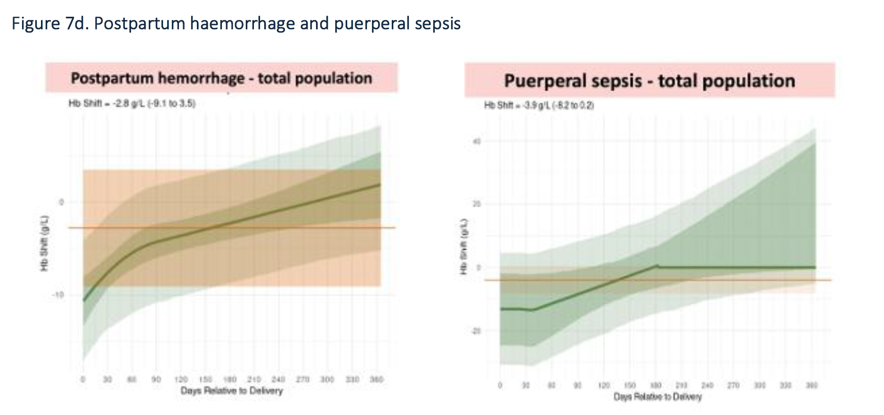

.. _2023_risk_effect_maternal_hemorrhage:

..
  Section title decorators for this document:

  ==============
  Document Title
  ==============

  Section Level 1
  ---------------

  Section Level 2
  +++++++++++++++

  Section Level 3
  ^^^^^^^^^^^^^^^

  Section Level 4
  ~~~~~~~~~~~~~~~

  Section Level 5
  '''''''''''''''

  The depth of each section level is determined by the order in which each
  decorator is encountered below. If you need an even deeper section level, just
  choose a new decorator symbol from the list here:
  https://docutils.sourceforge.io/docs/ref/rst/restructuredtext.html#sections
  And then add it to the list of decorators above.

===========================================
GBD 2023 Maternal Hemorrhage Risk Effects
===========================================

.. contents::
   :local:
   :depth: 2

Risk Overview
-------------

This page describes the Vivarium modeling strategy for risk effects.
For a description of Vivarium modeling strategy for risk exposure (in this case a cause model document), see the
:ref:`antepartum hemorrhage <2023_cause_antepartum_hemorrhage_mncnh>` and
:ref:`postpartum hemorrhage <2023_cause_postpartum_hemorrhage_mncnh>` pages.

GBD 2023 Modeling Strategy
-------------------------------

GBD does not explicitly model maternal hemorrhage as a risk factor. However, GBD models a hemoglobin shift associated with maternal hemorrhage in the :ref:`anemia causal attribution process <2019_anemia_impairment>`.
Newly for GBD 2023, this hemoglobin shift is time-dependent (by days relative to delivery) and is informed by an observational analysis of US MarketScan data about *postpartum* hemorrhage only.
The graph below is from the nonfatal methods appendix.
Note that it compares postpartum people with postpartum hemorrhage to postpartum people without postpartum hemorrhage, so the hemoglobin shift values are *in addition*
to the hemoglobin changes associated with pregnancy itself.

Vivarium Modeling Strategy
--------------------------

.. list-table:: Risk Outcome Relationships for Vivarium
   :widths: 5 5 5 5 5
   :header-rows: 1

   * - Outcome
     - Outcome type
     - Outcome ID
     - Affected measure
     - Note
   * - Hemoglobin concentration during the first six weeks after the end of pregnancy
     - Risk exposure
     - 376
     - Hemoglobin concentration
     - During the first six weeks after the end of pregnancy only
   * - Hemoglobin concentration between 6 weeks and 39 weeks after the end of pregnancy
     - Modelable entity
     - 27596
     - Hemoglobin concentration
     - During the period from 6 weeks to 39 weeks after the end of pregnancy only; this is the "non-pregnant" hemoglobin distribution

Hemoglobin effects after the end of pregnancy
+++++++++++++++++++++++++++++++++++++++++++++

For simulants who experience an incident case of postpartum hemorrhage (moderate or severe) as determined in the :ref:`postpartum hemorrhage <2023_cause_postpartum_hemorrhage_mncnh>` page,
we will decrease the simulant's hemoglobin concentration during two distinct time periods: the first six weeks after the end of pregnancy and the period from 6 weeks to 39 weeks after the end of pregnancy.
We chose the 39 week cutoff because this is the point at which the GBD 2023 shift curve for postpartum hemorrhage returns to approximately 0, indicating no difference in hemoglobin concentration between those with and without postpartum hemorrhage;
we do not find the positive shifts after 39 weeks postpartum to be biologically plausible and therefore do not apply a positive hemoglobin shift after 39 weeks postpartum.
The magnitude of the decrease will be determined by the postpartum hemorrhage hemoglobin effect estimated in GBD 2023,
which is time-dependent by days relative to delivery.
For each time period, we take an average of the continuous hemoglobin shift curve across that time period to determine the hemoglobin shift value applied during that time period.
The curve was provided to us by the anemia modelers at ``/mnt/team/anemia/pub/emotive/mat_hem/``, specifically in the ``pred_data.csv`` file in that directory.
We will copy this file to our simulation repository for tracking purposes.

Hemoglobin effects at antepartum hemorrhage
+++++++++++++++++++++++++++++++++++++++++++++

For simulants who experience an incident case of antepartum hemorrhage as determined in the :ref:`antepartum hemorrhage <2023_cause_antepartum_hemorrhage_mncnh>` page,
we will decrease the simulant's hemoglobin concentration during two distinct time periods: from antepartum hemorrhage incidence
until six weeks after the end of pregnancy and from 6 weeks after the end of pregnancy until 39 weeks after the end of pregnancy.
We chose the 39 week cutoff for consistency with postpartum hemorrhage effects, see section above.

As with postpartum hemorrhage, the magnitude of the decrease will be determined by an average of the continuous hemoglobin shift curve from GBD 2023.
This was calculated for postpartum hemorrhage and used days relative to delivery.
We will apply the same curve for antepartum hemorrhage, but we will shift the curve to be relative to antepartum hemorrhage incidence rather than delivery.
Also, to simplify the calculation of shifts, we will assume that all incident antepartum hemorrhage cases occur a week before delivery;
so the shift for the first time period (from antepartum hemorrhage incidence until six weeks after the end of pregnancy) will be an average of the curve from 0 to 49 days after delivery and the shift for the second time period (from 6 weeks after the end of pregnancy until 39 weeks after the end of pregnancy) will be an average of the curve from 49 days after delivery to 280 days after delivery.
This approximation prevents us from having to calculate a unique shift curve for each simulant based on their specific timing of antepartum hemorrhage incidence, which would be computationally intensive.

Validation and Verification Criteria
~~~~~~~~~~~~~~~~~~~~~~~~~~~~~~~~~~~~~

The hemoglobin concentration stratified by both antepartum and postpartum hemorrhage incidence (also stratified by anemia status in pregnancy to avoid confounding by this factor) should differ along each axis by the magnitude of the relevant hemoglobin shift, in each post-pregnancy time step.

Assumptions and Limitations
~~~~~~~~~~~~~~~~~~~~~~~~~~~~

- This modeling strategy does not consider that the impact of maternal hemorrhage is already reflected in the pregnancy adjustment factor used for the :ref:`hemoglobin model <2019_hemoglobin_model>` and therefore we may slightly underestimate hemoglobin concentration (and therefore overestimate anemia prevalence) on average during the pregnancy and lactation period by applying additional negative hemoglobin shifts associated with maternal hemorrhage.
- This modeling strategy applies an average hemoglobin shift over discrete time periods, which does not capture the continuous nature of hemoglobin changes over time.
  The continuous curves could result in simulants moving between several anemia categories over the course of a single time period, which is not captured here.
  This also means that the (relatively arbitrary) choices of durations of these periods are impactful.
- We currently apply the same hemoglobin shift for all incident postpartum hemorrhage cases, but in reality the hemoglobin shift likely differs by severity of postpartum hemorrhage (moderate vs severe), which is not captured here.
  We may address this in the future based on our approach in the :ref:`previous maternal hemorrhage effects model <2019_2021_risk_effect_maternal_hemorrhage>`.
- The GBD shift is derived from USA MarketScan data, which may not be generalizable to other locations.
  In particular, treatment in the USA may be more effective at mitigating the hemoglobin shift associated with postpartum hemorrhage than treatment in other locations, which could lead to an underestimation of the hemoglobin shift in locations with less effective treatment.
  Additionally, the USA has more access to ultrasound than our modeled locations which could lead to better prevention.
- We apply a shift calculated from postpartum hemorrhage data to both postpartum hemorrhage and antepartum hemorrhage, which may not be accurate if the hemoglobin shift associated with antepartum hemorrhage differs from that of postpartum hemorrhage.
- We apply the shift curve to antepartum hemorrhage cases by assuming that all incident antepartum hemorrhage cases occur a week before delivery, which may not be accurate at the simulant level.

.. todo::

  Consider a modeling strategy that calibrates the pregnancy-specific hemoglobin exposure to the baseline level of maternal hemorrhage in the population

References
----------