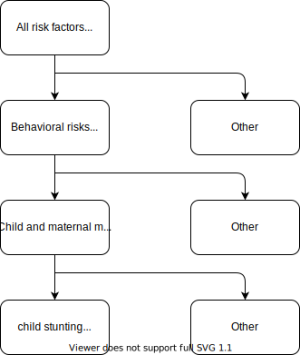

.. role:: underline
    :class: underline

..
  Section title decorators for this document:

  ==============
  Document Title
  ==============

  Section Level 1 (#.0)
  +++++++++++++++++++++
  
  Section Level 2 (#.#)
  ---------------------

  Section Level 3 (#.#.#)
  ~~~~~~~~~~~~~~~~~~~~~~~

  Section Level 4
  ^^^^^^^^^^^^^^^

  Section Level 5
  '''''''''''''''

  The depth of each section level is determined by the order in which each
  decorator is encountered below. If you need an even deeper section level, just
  choose a new decorator symbol from the list here:
  https://docutils.sourceforge.io/docs/ref/rst/restructuredtext.html#sections
  And then add it to the list of decorators above.

.. _2020_risk_exposure_child_stunting:

==============
Child stunting
==============

.. contents::
  :local:

+-------------------------------------------------+
| List of abbreviations                           |
+=======+=========================================+
| TMREL | theoretical minimum risk exposure level |
+-------+-----------------------------------------+
| CGF   | child growth failure composed of wasting|
|       | stunting and underweight                |
+-------+-----------------------------------------+
| HAZ   | Height for age                          |
+-------+-----------------------------------------+
| DD    | Diarrheal disease                       |
+-------+-----------------------------------------+
| LRI   | lower respiratory tract infection       |
+-------+-----------------------------------------+
| MSLS  | measles                                 |
+-------+-----------------------------------------+

.. note:: 
   
   Should we call this 2020 and have this under 2020 exposure? How do we deal with the different age groups? 

.. _stunting1.0:

Risk Exposure Overview
++++++++++++++++++++++

Malnutrition is an imbalance between the body’s needs and its use and intake of nutrients. The imbalance can be caused by poor or lacking diet, poor hygiene, disease states, lack of knowledge, and cultural practices, among others. Underweight, stunting, wasting, obesity, and vitamin and mineral deficiencies are all forms of malnutrition. 

**Chronic malnutrition**, also referred to as stunting ...

.. note::
  Include here a clinical background and overview of the risk exposure you're modeling. Note that this is only for the exposure; you will include information on the relative risk of the relevant outcomes, and the cause models for those outcomes, in a different document.

.. _stunting1.1:

Risk Exposures Description in GBD
+++++++++++++++++++++++++++++++++

.. _stunting1.1.1:

Case definition
---------------

Stunting, a sub-component indicator of child growth failure (CGF), is based on a categorical definition using the WHO 2006 growth standards for children 0-59 months. Definitions are based on Z-cores from the growth standards, which were derived from an international reference population. Mild, moderate and severe categorical prevalences were estimated for each of the three indicators. Theoretical minimum risk exposure level (TMREL) for stunting was assigned to be greater than or equal to one standard deviation below the mean (-1 SD) of the WHO 2006 standard **height-for-age (HAZ)** z-score curve. This has not changed since GBD 2010.

+----------------------------------------------+
| Stunting category definition (range -7 to +7)|
+=======+======================================+
| TMREL |  >= -1                               |            
+-------+--------------------------------------+
| Mild  |  < -1 to -2 Z score                  |
+-------+--------------------------------------+
| Mod   |  < -2 to -3 Z score                  |
+-------+--------------------------------------+
| Sev   |  < -3 Z score                        |
+-------+--------------------------------------+

.. _stunting1.1.2:

Input data
----------

Two types of input data are used in CGF estimation:  

  1. **Tabulated report data**. This data does not report individual anthropometric measurements. It only reports the prevalence of forms of CGF in a sample size. For example, this data would may report a 15% prevalence of moderate stunting out of a nationally representative sample of 5,000 children.

  2. **Microdata**. This data does have individual anthropometric measurements. From these datasources, GBD can see entire distributions of CGF, while also collapsing them down to point prevalences like moderate and severe CGF. 

.. _stunting1.1.3:

Exposure estimation
------------------- 

In modeling CGF, all data types go into ST-GPR modeling. We have STGPR models for moderate, severe, and mean stunting, wasting, and underweight. The output of these STGPR models is an estimate of moderate, severe, and mean stunting, wasting, and underweight for all under 5 age groups, all locations, both sexes, and all years. 

We also take the microdata sources and fit ensemble distributions to the shapes of the stunting, wasting, and underweight distributions. By doing this we can find characteristic shapes of stunting, wasting, and underweight curves. Once we have ST-GPR output as well as weights that define characteristic curve shapes, the last step is to combine them. We anchor the curves at the mean output from ST-GPR, use the curve shape from the ensemble distribution modeling, and then use an optimization function to find the standard deviation value that allows us to stretch/shrink the curve to best match the moderate and severe CGF estimates we got from ST-GPR. The final CGF estimates are the area under the curve for this optimized curve.

.. note::
  
  Note that the z-score ranges from -7 to +7. If we limit ourselves to Z-scores between -4 and +4, we will be excluding a lot of kids.

  In the paper that Ryan Fitzgeral (GBD 2020 modeller for CGF and LBWSG) is working on right now, he presents the first results ever for "extreme" stunting which we define as kids with stunting Z scores below -4. For Ethiopia, that's about 7% of kids. So it's non-trivial!

.. _stunting1.1.4:

Outcomes affected by stunting
-----------------------------

CGF burden does not start until *after* neonatal age groups (from 1mo onwards). In the neonatal age groups (0-1mo), burden comes from LBWSG. From post-neonatal (1mo+) age onwards, CGF outcomes affected include lower-respiratory disease (LRI), diarrheal disease (DD), measles. 

For GBD 2020, the RRs were updated. This text is from unpublished GBD 2020:

  There is a high degree of correlation between stunting, wasting, and underweight. Failing to account for their covariance and assuming independence would overestimate the total burden significantly and misrepresent the attributable burden of individual CGF indicators. Inability to address these correlations is the main reason that GBD 2010 only included childhood underweight.
  In order to account for the high degree of correlation between CGF indicators, GBD uses a constrained optimization method to adjust the observed univariate RRs of Olofin and colleagues. First we created a joint distribution of stunting, underweight, and wasting from a population of children. Second, we generated one thousand RR draws for each univariate indicator and severity based upon the cause-specific RRs and their deviations from Olofin et al. Third, we altered these univariate RRs for the three causes (diarrhea, LRI, and measles) based upon interactions among the CGF indicators. An interaction occurs when the effect of one CGF indicator variable (e.g., stunting) has a different effect on the outcome depending on the value of another CGF indicator variable (e.g., underweight). Interaction terms alter the risk of the outcome among children with more than one indicator of CGF. These interaction terms were extracted from a pooled cohort analysis of all-cause mortality published by McDonald et al. 4 Lastly, we optimized the adjusted relative risks by minimizing the error between the observed RRs (generated from Olofin et al.) and the altered RRs derived from the joint distribution and accounting for the interaction terms.
  For GBD 2020, we made several changes to improve the four main steps of RR adjustment. From GBD 2013 to GBD 2019, a simulated joint distribution of stunting, underweight, and wasting measures was created from the Olofin et al. meta-analysis. Sources in this meta-analysis were cross-sectional Demographic and Health Surveys (DHS). In GBD 2020, we created age-specific joint distributions of stunting, underweight, and wasting measures from 15 longitudinal studies (from 26 locations) in the Bill and Melinda Gates Foundation’s Knowledge Integration (Ki) database6.  (Study details are provided in Table 5). The RR adjustment method was strengthened in GBD 2020 by constraining optimization in two ways. Optimization was only permitted to alter the RR for an indicator/severity in draws where the observed RR was greater than 1, and constraints were placed on the error that penalize larger alterations to the RR. These changes enabled the estimation and utilization of age-specific adjusted RRs for GBD 2020 burden estimation.

+------------------------------------------------------------+
|Age-specific adjusted RR for HAZ risk-outcome pair GBD 2020 |
+=======+=======+=======================+====================+
|28d-5m | TMREL |  >= -1                | 1                  |            
+-------+-------+-----------------------+--------------------+
| DD    | MILD  | < -1 to -2 Z score    | 1.3 (1.1 - 1.6)    |
|       +-------+-----------------------+--------------------+
|       | MOD   | < -2 to -3 Z score    | 1.7 (1.4 - 2.1 )   |        
+       +-------+-----------------------+--------------------+
|       | SEV   | < -3 Z score          | 3.6 (2.6 - 4.8)    |
+-------+-------+-----------------------+--------------------+
| LRI   | MILD  | < -1 to -2 Z score    | 1.4 (1.0 - 1.9)    |
|       +-------+-----------------------+--------------------+
|       | MOD   | < -2 to -3 Z score    | 1.8 (1.3 -2.6)     |
|       +-------+-----------------------+--------------------+
|       | SEV   | < -3 Z score          | 4.5 (2.9 - 7.0)    |
+-------+-------+-----------------------+--------------------+
| MSLS  | MILD  | < -1 to -2 Z score    | 1.2 (0.6 - 2.3)    |
|       +-------+-----------------------+--------------------+
|       | MOD   | < -2 to -3 Z score    | 2.4 (1.4 - 4.9)    |
|       +-------+-----------------------+--------------------+
|       | SEV   | < -3 Z score          | 5.0 (2.7 - 10.3)   |
+-------+-------+-----------------------+--------------------+

+-------+-------+-----------------------+--------------------+
|6m-11m | TMREL |  >= -1                | 1                  |            
+-------+-------+-----------------------+--------------------+
| DD    | MILD  | < -1 to -2 Z score    | 1.2 (1.1 - 1.4)    |
|       +-------+-----------------------+--------------------+
|       | MOD   | < -2 to -3 Z score    | 1.5 (1.2 - 1.8)    |        
+       +-------+-----------------------+--------------------+
|       | SEV   | < -3 Z score          | 2.8 (2.1 - 3.9)    |
+-------+-------+-----------------------+--------------------+
| LRI   | MILD  | < -1 to -2 Z score    | 1.2 (1.0 - 1.7)    |
|       +-------+-----------------------+--------------------+
|       | MOD   | < -2 to -3 Z score    | 1.5 (1.2 - 2.2)    |
|       +-------+-----------------------+--------------------+
|       | SEV   | < -3 Z score          | 3.3 (2.1 - 5.5)    |
+-------+-------+-----------------------+--------------------+
| MSLS  | MILD  | < -1 to -2 Z score    | 1.2 (0.6 - 2.2)    |
|       +-------+-----------------------+--------------------+
|       | MOD   | < -2 to -3 Z score    | 2.2 (1.3 - 4.7)    |
|       +-------+-----------------------+--------------------+
|       | SEV   | < -3 Z score          | 4.3 (2.1 - 9.6)    |
+-------+-------+-----------------------+--------------------+

+-------+-------+-----------------------+--------------------+
|12m-23m| TMREL |  >= -1                | 1                  |            
+-------+-------+-----------------------+--------------------+
| DD    | MILD  | < -1 to -2 Z score    | 1.2 (1.1 - 1.3)    |
|       +-------+-----------------------+--------------------+
|       | MOD   | < -2 to -3 Z score    | 1.4 (1.2 - 1.6)    |        
+       +-------+-----------------------+--------------------+
|       | SEV   | < -3 Z score          | 2.5 (1.9 - 3.4)    |
+-------+-------+-----------------------+--------------------+
| LRI   | MILD  | < -1 to -2 Z score    | 1.2 (1.0 - 1.5)    |
|       +-------+-----------------------+--------------------+
|       | MOD   | < -2 to -3 Z score    | 1.4 (1.1 - 1.9)    |
|       +-------+-----------------------+--------------------+
|       | SEV   | < -3 Z score          | 2.7 (1.7 - 4.4)    |
+-------+-------+-----------------------+--------------------+
| MSLS  | MILD  | < -1 to -2 Z score    | 1.1 (0.6 - 1.8)    |
|       +-------+-----------------------+--------------------+
|       | MOD   | < -2 to -3 Z score    | 2.0 (1.3 - 3.5)    |
|       +-------+-----------------------+--------------------+
|       | SEV   | < -3 Z score          | 3.7 (2.0 - 8.0)    |
+-------+-------+-----------------------+--------------------+

+-------+-------+-----------------------+--------------------+
|2y-4y  | TMREL |  >= -1                | 1                  |            
+-------+-------+-----------------------+--------------------+
| DD    | MILD  | < -1 to -2 Z score    | 1.2 (1.1 - 1.3)    |
|       +-------+-----------------------+--------------------+
|       | MOD   | < -2 to -3 Z score    | 1.4 (1.2 - 1.6)    |        
+       +-------+-----------------------+--------------------+
|       | SEV   | < -3 Z score          | 2.5 (1.9 - 3.4)    |
+-------+-------+-----------------------+--------------------+
| LRI   | MILD  | < -1 to -2 Z score    | 1.2 (1.0 - 1.5)    |
|       +-------+-----------------------+--------------------+
|       | MOD   | < -2 to -3 Z score    | 1.4 (1.1 - 1.9)    |
|       +-------+-----------------------+--------------------+
|       | SEV   | < -3 Z score          | 2.7 (1.8 - 4.5)    |
+-------+-------+-----------------------+--------------------+
| MSLS  | MILD  | < -1 to -2 Z score    | 1.1 (0.6 - 1.9)    |
|       +-------+-----------------------+--------------------+
|       | MOD   | < -2 to -3 Z score    | 2.0 (1.2 - 3.8)    |
|       +-------+-----------------------+--------------------+
|       | SEV   | < -3 Z score          | 3.7 (2.0 - 8.0)    |
+-------+-------+-----------------------+--------------------+

.. code-block:: Python

  #2020 RRs 

  get_draws("rei_id",
     gbd_id = 241,
     source = "rr", 
     gbd_round_id = 7, 
     decomp_step = "iterative", 
     year_id = 2020)

  #make sure you have the right version of get_draws package: pip install -U get_draws==3.1.3 (latest is 4.0.2)

Note about using GBD 2020 Reference: as we are building this model before the completion of GBD 2020, we will need to calculate the PAFs ourselves, using the following equation:

:math:`\frac{(\sum_{stunting\_category_i} prevalence_{i} * rr_{ci})-1}{\sum_{stunting\_category_i} prevalence_{i} * rr_{ci}}`

Vivarium Modeling Strategy
++++++++++++++++++++++++++

Child stunting in GBD has an **ordered polytomous variable**. It has **rei_id 241**

We will use a 'propensity exposure model' for child stunting, in which each simulant is initialized with a “propensity” for a stunting category (cat 1,2,3,4), and the simulant’s stunting category is determined by comparing this propensity to the overall stunting exposure prevalence distributions in the population. This propensity determines at what percentile of the risk exposure they are. To obtain the propensity, assign each simulant a random number using  uniform distribution between 0 and 1 ``np.random.uniform()``. 

Restrictions
------------

.. list-table:: GBD 2020 Risk Exposure Restrictions
   :widths: 15 15 20
   :header-rows: 1

   * - Restriction Type
     - Value
     - Notes
   * - Male only
     - False
     -
   * - Female only
     - False
     -
   * - YLL only
     - False
     -
   * - YLD only
     - False
     -
   * - YLL age group start
     - post-neonatal 
     - 1 - 5 month, age_group_id = 388 
   * - YLL age group end
     - 2y - 4y
     - 2 - 5 year age_group_id = 34
   * - YLD age group start
     - post-neonatal 
     - 1 - 5 month, age_group_id = 388 
   * - YLD age group end
     - 2y - 4y
     - 2 - 5 year age_group_id = 34

.. code-block:: Python
	  
    #GBD 2020 age-group ids

    early nn = 2
    late nn = 3
    1m-5m = 388
    6m-11m = 389
    12m-23m = 238
    2y-4y = 34

.. _stunting2.2:

Risk Exposure Model Diagram
---------------------------

Data Description Tables
+++++++++++++++++++++++

The following code can be used to access draw-level exposure data for the child_stunting risk factor, after additionally specifying desired location, age_group, and sex IDs. Exposure category cat 1,2,3 is severe, moderate and mild and exposure category cat4 is the TMREL.

The following code can be used to access the category prevalences (2020).

.. code-block:: python
 
 #2020

 get_draws(gbd_id_type='rei_id',
    gbd_id=241,
    source='exposure',
    year_id=2020,
    gbd_round_id=7,
    status='best',
    location_id = [179],
    decomp_step = 'iterative')

  # 2019
 
  get_draws(gbd_id_type='rei_id',
    gbd_id=241,
    source='exposure',
    year_id=2019,
    gbd_round_id=6,
    status='best',
    location_id = [179],
    decomp_step ='step4')

The following code can be used to access the summary-exposure value (2020).

.. code-block:: python
  
  #2020
  #get_output = go
  stunting_sev = go(
              "rei", 
              rei_id= [241], 
              measure_id=29, #summary exposure value
              metric_id=3, #rate
              gbd_round_id=7, 
              location_id=[179], 
              year_id=2020, 
              decomp_step = 'iterative')
  

  #2019
  stunting_sev = go(
            "rei",
            rei_id= [241],
            measure_id=29, #summary exposure value
            metric_id=3, #rate
            gbd_round_id=6,
            location_id=[179],
            year_id=2019, 
            decomp_step = 'step5')

  

Assumptions and Limitations
+++++++++++++++++++++++++++

Validation Criteria
+++++++++++++++++++

1. age, sex distribution of stunting prevalence categories matches GBD 2020
2. age, sex, mean z-scores matches GBD 2020
3. correlation between stunting and wasting matches GBD 2020
4. RRs for cause incidence matches GBD 2020

..  todo::
  Fill in directives for this section

References
----------