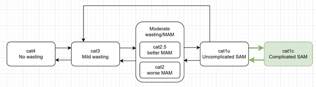

.. role:: underline
    :class: underline

..
  Section title decorators for this document:

  ==============
  Document Title
  ==============

  Section Level 1 (#.0)
  +++++++++++++++++++++
  
  Section Level 2 (#.#)
  ---------------------

  Section Level 3 (#.#.#)
  ~~~~~~~~~~~~~~~~~~~~~~~

  Section Level 4
  ^^^^^^^^^^^^^^^

  Section Level 5
  '''''''''''''''

  The depth of each section level is determined by the order in which each
  decorator is encountered below. If you need an even deeper section level, just
  choose a new decorator symbol from the list here:
  https://docutils.sourceforge.io/docs/ref/rst/restructuredtext.html#sections
  And then add it to the list of decorators above.

.. _2021_risk_exposure_wasting_with_complicated_sam:

====================================================================
Wasting dynamic transition model with complicated SAM (GBD 2021)
====================================================================

.. note::

  This page has been adapted from the :ref:`2021 wasting risk exposure page <2021_risk_exposure_wasting_state_exposure>`
  used in the :ref:`nutrition optimization child simulation <2021_concept_model_vivarium_nutrition_optimization_children>`.

  The wasting exposure model on this page has been extended to subdivide the severe acute malnutrition (SAM) exposure state into two separate exposures: uncomplicated and complicated SAM and is intended for use in the 
  :ref:`nutrition optimization extension simulation <nutrition_optimization_extension>`.

  For brevity, background research information has been removed from this document. Consult the :ref:`2021 wasting risk exposure page <2021_risk_exposure_wasting_state_exposure>` for more information

.. contents::
  :local:

Vivarium Modeling Strategy
++++++++++++++++++++++++++

**Risk exposure model diagram**

.. note::

  A summary of changes for the nutrition optimization extension model include:

    - Renaming of super/substates for clarity 
    - Separation of SAM superstate into complicated and uncomplicated substates
    - Subtraction of moderate wasting with oedema from MAM superstate prevalence
    - Addition of moderate wasting of oedema to SAM superstate prevalence 
    - Edits to the Initialization_ section to detail specific behavior for all modeled substates (substates treated the same as their superstates without any other structural or parameter changes to modeling strategy).

.. list-table:: Modeled wasting exposure states
  :header-rows: 1

  * - Parameter
    - Definition
    - Value
    - Note
  * - **cat4**
    - Child wasting TMREL (susceptible to child wasting)
    - gbd_cat4
    - No change from prior model
  * - **cat3**
    - Mild wasting
    - gbd_cat3
    - No change from prior model
  * - cat2_superstate 
    - Total moderate acute malnutrition
    - gbd_cat2 - moderate_wasting_with_oedema
    - Note cat2_superstate here refers to the combination of the "better" and "worse" MAM substates. Update from prior version includes subtraction of moderate wasting with oedema prevalence
  * - **cat2.5_better** MAM
    - "Better" moderate acute malnutrition
    - cat2_superstate * (1 - worse_fraction)
    - 
  * - **cat2.0_worse** MAM
    - "Worse" moderate acute malnutrition
    - cat2_superstate * worse_fraction
    - Note potential for confusion around "cat2" naming: at risk of confusing cat2 substate with superstate
  * - cat1_superstate
    - Total severe acute malnutrition
    - gbd_cat1 + moderate_wasting_with_oedema
    - Note this superstate is inclusive of the two cat1_uncomplicated and cat1_complicated substates. Update from prior version includes addition of moderate wasting with oedema prevalence
  * - **cat1_uncomplicated** SAM
    - Uncomplicated severe acute malnutrition (SAM)
    - cat1_superstate * (1 - complicated_fraction)
    - 
  * - **cat1_complicated** SAM 
    - Complicated severe acute malnutrition (SAM)
    - cat1_superstate * complicated_fraction
    - 
  
.. list-table:: Exposure parameter data values
  :header-rows: 1

  * - Parameter
    - Definition
    - Value
    - Note
  * - gbd_cat4
    - GBD prevalence of no child wasting (TMREL)
    - ``get_draws(source='exposure', gbd_id_type='rei_id', gbd_id=240)['parameter'=='cat4]``
    - 
  * - gbd_cat3
    - GBD prevalence of mild child wasting
    - ``get_draws(source='exposure', gbd_id_type='rei_id', gbd_id=240)['parameter'=='cat3]``
    - 
  * - gbd_cat2
    - GBD prevalence of moderate child wasting
    - ``get_draws(source='exposure', gbd_id_type='rei_id', gbd_id=240)['parameter'=='cat2]``
    - 
  * - gbd_cat4
    - GBD prevalence of no child wasting (TMREL)
    - ``get_draws(source='exposure', gbd_id_type='rei_id', gbd_id=240)['parameter'=='cat1]``
    - 
  * - moderate_wasting_with_oedema
    - GBD prevalence of the moderate protein energy malnutrition with oedma sequela
    - ``get_draws(source='como', measure_id=5, gbd_id_type='sequela', gbd_id=190)``
    - 
  * - worse_fraction
    - Fraction of MAM cases in "worse" substate
    - Values found in `simulation repository raw data directory here <https://github.com/ihmeuw/vivarium_gates_nutrition_optimization_child/blob/main/src/vivarium_gates_nutrition_optimization_child/data/raw/worse_exp_frac_only_loc.csv>`__. No changes required for nutrition optimization extension simulation.
    - See detail of the derivation of this parameter on the :ref:`2021 wasting risk exposure page <2021_risk_exposure_wasting_state_exposure>`
  * - complicated_sam_fraction
    - Fraction of MAM cases in the "complicated" substate
    - Values will be output at the draw/age/sex/subnational-specific level from the wasting calibration. TODO: post link when ready
    - TODO: include reference used to inform input range for this parameter

.. todo::

  Add data for complicated_sam_fraction parameter

Initialization
--------------

Simulants will be initialized into a wasting state **at birth** according to the wasting risk exposure
distribution specific to the 1-5 month (ID 388) age group.

Wasting state at initialization will be entirely dependent on :ref:`infant LBWSG exposure <2019_risk_exposure_lbwsg>`, 
such that low birth weight (LBW) infants with birth weight exposures equal to or below 2,500 grams will have a greater 
probability of being wasted than adequate birth weight (ABW) infants with birth weight exposures greater than 2,500 grams.

.. list-table:: Parameter definitions
  :header-rows: 1

  * - Parameter
    - Definition
    - Note
  * - :math:`p_\text{cat(i)}` for i in [4, 3, 2.5_better, 2.0_worse, 1_uncomplicated, 1_complicated]
    - Population level prevalence of wasting category i in the 1-5 month age group (ID=388)
    - 
  * - :math:`p_\text{cat(i),LBW}`
    - Prevalence of wasting category i among the low birth weight population
    - Low birth weight as BW =< 2,500 grams
  * - :math:`p_\text{cat(i),ABW}`
    - Prevalence of wasting catgory i among the adequate birth weight population
    - Adequate birth weight as BW > 2,500 grams
  * - RR
    - Relative risk of wasting (cat1 and cat2 combined) at 30 days of life among LBW relative to ABW babies
    - 
  * - :math:`p_\text{LBW}`
    - Prevalence of low birth weight among infants who survive to 30 days of life
    - This value is specific to the baseline scenario

Given the following equations:

1. :math:`p_\text{cat1,LBW} * p_\text{LBW} + p_\text{cat1,ABW} * (1 - p_\text{LBW}) = p_\text{cat1}`

2. :math:`RR = p_\text{cat1,LBW} / p_\text{cat1,ABW}` 

We can then solve for the ABW and LBW probabilities of initialization into wasting categories 1 and 2. We then assume that the difference between the ABW and LBW probabilities for categories 1 and 2 with the population-level probabilities is equally distributed amongst categories 3 and 4.

.. list-table:: Wasting state probabilities by birth weight status
  :header-rows: 1

  * - Wasting category
    - Birth weight status
    - Wasting exposure
  * - cat1_superstate
    - ABW
    - :math:`p_\text{cat1_superstate} / (RR * p_\text{LBW} + (1 - p_\text{LBW}))`
  * - cat1_superstate
    - LBW
    - :math:`p_\text{ABW,cat1_superstate} * RR`
  * - cat2_superstate
    - ABW
    - :math:`p_\text{cat2_superstate} / (RR * p_\text{LBW} + (1 - p_\text{LBW}))`
  * - cat2_superstate
    - LBW
    - :math:`p_\text{ABW,cat2_superstate} * RR`
  * - cat3
    - ABW
    - :math:`(p_\text{cat1_superstate} + p_\text{cat2_superstate} - p_\text{ABW,cat1_superstate} - p_\text{ABW,cat2_superstate}) * p_\text{cat3} / (p_\text{cat3} + p_\text{cat4}) + p_\text{cat3}`
  * - cat3
    - LBW
    - :math:`(p_\text{cat1_superstate} + p_\text{cat2_superstate} - p_\text{LBW,cat1_superstate} - p_\text{LBW,cat2_superstate}) * p_\text{cat3} / (p_\text{cat3} + p_\text{cat4}) + p_\text{cat3}`
  * - cat4
    - ABW
    - :math:`(p_\text{cat1_superstate} + p_\text{cat2_superstate} - p_\text{ABW,cat1_superstate} - p_\text{ABW,cat2_superstate}) * p_\text{cat4} / (p_\text{cat3} + p_\text{cat4}) + p_\text{cat4}`
  * - cat4
    - LBW
    - :math:`(p_\text{cat1_superstate} + p_\text{cat2_superstate} - p_\text{LBW,cat1_superstate} - p_\text{LBW,cat2_superstate}) * p_\text{cat4} / (p_\text{cat3} + p_\text{cat4}) + p_\text{cat4}`
  * - cat1_uncomplicated
    - ABW
    - :math:`p_\text{ABW,cat1_superstate} * (1 - \text{complicated_fraction})`
  * - cat1_uncomplicated
    - LBW
    - :math:`p_\text{LBW,cat1_superstate} * (1 - \text{complicated_fraction})`
  * - cat1_complicated
    - ABW
    - :math:`p_\text{ABW,cat1_superstate} * \text{complicated_fraction}`
  * - cat1_complicated
    - LBW
    - :math:`p_\text{LBW,cat1_superstate} * \text{complicated_fraction}`
  * - cat2.5_better
    - ABW
    - :math:`p_\text{ABW,cat2_superstate} * (1 - \text{worse_fraction})`
  * - cat2.5_better
    - LBW
    - :math:`p_\text{LBW,cat2_superstate} * (1 - \text{worse_fraction})`
  * - cat2.0_worse
    - ABW
    - :math:`p_\text{ABW,cat2_superstate} * \text{worse_fraction}`
  * - cat2.0_worse
    - LBW
    - :math:`p_\text{LBW,cat2_superstate} * \text{worse_fraction}`

.. note::

  The values in the *Wasting state probabilities by birth weight status* should **not**
  change between scenarios as LBWSG exposures change.

  ^This note is intended to mean that the probability of a given wasting exposure conditional on birthweight status should be calibrated to the values in the baseline scenario and not be recalculated in each scenario. However, as LBWSG exposure changes between scenario (and shifts individual-level low vs. adequate birth weight status), wasting exposure at birth may change between scenarios. This is not a change from the original nutrition optimization model.

.. list-table:: Parameter values
  :header-rows: 1

  * - Parameter
    - Value
    - Note/Source
  * - RR
    - 1.82 (95% CI: 1.35, 2.45), assume a lognormal distribution of uncertainty
    - Calculated using meta-analysis of most recent available DHS round 7 or 8 as of 10/2023. `Analysis performed and resulting forest plot can be found here <https://github.com/ihmeuw/vivarium_research_nutrition_optimization/pull/95>`_
  * - :math:`p_\text{LBW}`
    - Exposure of LBWSG categories with BW < 2500 grams for the late neonatal age group in GBD
        * :code:`get_draws(source='exposure', rei_id=339, age_group_id=3)`
        * decomp_step='step4' for GBD 2019
        * Sum over the following categories: *['cat10', 'cat106', 'cat11', 'cat116', 'cat117', 'cat123', 'cat124', 'cat14', 'cat15', 'cat17', 'cat19', 'cat2', 'cat20', 'cat21', 'cat22', 'cat23', 'cat24', 'cat25', 'cat26', 'cat27', 'cat28', 'cat29', 'cat30', 'cat31', 'cat32', 'cat34', 'cat35', 'cat36', 'cat8', 'cat80']*
    - :ref:`LBWSG exposure document found here for reference <2019_risk_exposure_lbwsg>`. List of LBW categories was `generated from this notebook <https://github.com/ihmeuw/vivarium_research_nutrition_optimization/blob/data_prep/data_prep/LBW%20categories.ipynb>`_

Transitions
------------

Draw-specific values for transition rates (defined in the table below) for Ethiopia, Nigeria, and Pakistan (GBD 2019 cause data and GBD 2021 CGF data for use in Nutrition Optimization Wave I) can be found listed below. Values in these files are defined in terms of transitions per person-year in the source state. 

- `Ethiopia wasting transition rates <https://github.com/ihmeuw/vivarium_research_nutrition_optimization/blob/data_prep/data_prep/cgf_correlation/ethiopia/ethiopia_2019_wasting_transitions_5.csv>`_ 

  - `Ethiopian values were generated in this notebook as of 11/20/2023 <https://github.com/ihmeuw/vivarium_research_nutrition_optimization/blob/data_prep/data_prep/cgf_correlation/ethiopia/wasting_transition_sampling.ipynb>`_

- `Nigeria wasting transition rates <https://github.com/ihmeuw/vivarium_research_nutrition_optimization/blob/data_prep/data_prep/cgf_correlation/nigeria/nigeria_2019_wasting_transitions_5.csv>`_ 

  - `Nigerian values were generated in this notebook as of 11/20/2023 <https://github.com/ihmeuw/vivarium_research_nutrition_optimization/blob/data_prep/data_prep/cgf_correlation/nigeria/wasting_transition_sampling.ipynb>`_

- `Pakistan wasting transition rates <https://github.com/ihmeuw/vivarium_research_nutrition_optimization/blob/data_prep/data_prep/cgf_correlation/pakistan/pakistan_2019_wasting_transitions_5.csv>`_ 

  - `Pakistan values were generated in this notebook (11/20/2023) <https://github.com/ihmeuw/vivarium_research_nutrition_optimization/blob/data_prep/data_prep/cgf_correlation/pakistan/wasting_transition_sampling.ipynb>`_

.. list-table:: Transition Data
 :header-rows: 1

 * - Transition
   - Source State
   - Sink State
 * - ux_rem_rate_sam
   - CAT 1
   - CAT 2
 * - tx_rem_rate_sam
   - CAT 1
   - CAT 3
 * - rem_rate_mam
   - CAT 2
   - CAT 3
 * - rem_rate_mild
   - CAT 3
   - CAT 4
 * - inc_rate_sam
   - CAT 2
   - CAT 1
 * - inc_rate_mam
   - CAT 3
   - CAT 2
 * - inc_rate_mild
   - CAT 4
   - CAT 3

Validation 
++++++++++

Wasting model

  - prevalence of cat 1-4 (including the MAM sub-states)
  - model transition rates

Note that validation of this model is dependent on validation of wasting-specific mortality rates, which are dependent on the following models meeting their individual validation criteria:

  - Stunting and underweight exposure models
  - CGF risk exposure correlation
  - CGF risk effects
  - Cause-specific and all-cause mortality rates

Deriving the wasting transition rates
--------------------------------------

We utilized information from several sources to develop a wasting transition model.

- **Wasting risk exposure:** GBD 2021 risk prevalence
- **Wasting-specific mortality rates:** 

  - :ref:`GBD 2021 CGF risk effects <2021_risk_effect_cgf>`
  - :ref:`GBD 2019 PEM risk-attributable cause model <2021_pem>`
  - GBD 2019 cause models for diarrheal diseases, lower respiratory infections, measles, and malaria (as linked on the :ref:`nutrition optimization child concept model <2021_concept_model_vivarium_nutrition_optimization>`)

- **Treated MAM and SAM recovery rates:** :ref:`wasting treatment intervention model <intervention_wasting_tx_combined_protocol>`
- **Incidence rates from less to more severe wasting categories:** BMGF Knowledge Integration (KI) longitudinal database. `A description of included studies is available here <https://github.com/ihmeuw/vivarium_research_nutrition_optimization/blob/data_prep/data_prep/cgf_correlation/ethiopia/KI%20studies.xlsx>`_

However, recovery from MAM and SAM states for those who do not receive treatment is very limited in the case of MAM and not observable in the case of SAM as it would be unethical for researchers to track the natural history of SAM without providing access to treatment. Therefore, we utilized a Markov model to solve for the untreated wasting recovery rates that would result in a steady state equilibrium of the system below and the values from the sources described above.

.. note::

  The previous implementation of this model relied on literature estimates of untreated recovery rates from SAM and MAM (observed indirectly in the case of untreated SAM) and used the markov steady state model to solve for wasting incidence rates. This update is an improvement upon the previous implementation in that it relies on directly observed data as inputs to the model and outputs values for limited/un-observable parameters rather than the other way around. Additionally, this implementation results in values that better validate to KI transition rate data where applicable. 

:download:`See this word document for a description of these parameters and the equations used to solve the system <WASTING CALIBRATION.docx>`

.. image:: calibration_transitions.svg

A small-level individual-based simulation has demonstrated the system of equations used in the derivation of these rates successfully maintains steady state. `See a demonstration of the steady state equilibrium maintained by this system of equations in this notebook <https://github.com/ihmeuw/vivarium_research_nutrition_optimization/blob/data_prep/data_prep/cgf_correlation/ethiopia/wasting_calibration_solved_from_incidence_rates.ipynb>`_

The process of generating draw-level values for all wasting transitions is outlined below. `See the code for generating draw-specific transition values in this notebook here <https://github.com/ihmeuw/vivarium_research_nutrition_optimization/blob/data_prep/data_prep/cgf_correlation/ethiopia/wasting_transition_sampling.ipynb>`_

1. Load all input data values (in accordance with documentation linked above)

2. Exclude studies in the KI database that have inappropriate study populations. A list of excluded studies and there reasons for exclusion are provided below.

  - AKU_EE: Infants with insufficient response to RUTF
  - DIVIDS: Small for gestational age infants, not SAM, not ill
  - Ilins-Dose: LNS supplementation
  - Ilins-Dyad: LNS supplementation
  - SAS_LBW: LBW babies

3. At the sex, age, and draw-specific level, randomly sample a study from the remaining KI studies 

4. Randomly sample event count values (numerator values) for i1, i2, and i3 transition rates under the assumption that the event counts follow a Poisson distribution of uncertainty, divide by person-time denominators (child days in provided KI data), and then convert to daily transition probabilities

5. Calculate r4, r3 (as well as r3_treated and r3_untreated), r2 recovery probabilities according to draw-specific input parameters and sampled i1, i2, and i3 values

6. Assess validity of results according to the following rules:

  - r4, r3, r3_untreated, and r2 must be positive
  - t1 must be greater than r2
  - r3_treated must be greater than r3_untreated
  - result for r3 value solved by two different methods must be within 10% of one another

7. If any of the rules in step #6 fail, begin again at step #3 until valid result is obtained. Repeat until 1,000 valid draws are generated for each age/sex group

8. Convert daily probabilities to annual rates and output as .csv

Assumptions and Limitations
---------------------------

- We do not consider seasonal variation in wasting exposure or transition rates

- We do not consider individual heterogeneity in wasting transition rates beyond what is modeled in the :ref:`wasting x-factor <2019_risk_exposure_x_factor>` model when it is included in the simulation

- We rely on treatment data with sparse availability and assume that child wasting measured by WHZ is a reasonable proxy for acute malnutrition (often measured by MUAC)

- We cannot directly observe recovery time of untreated wasting as it would be unethical. Therefore, we must indirectly estimate this parameter

- We assume that those successfully treated for SAM transition directly to the mild wasting state without transitioning through the MAM state. By definition, a transition through the MAM state must occur in reality. However, this design was selected for convenient compatibility with the standard discharge criteria for SAM treatment used in studies that report treated SAM recovery rates. Additionally, there is some data to suggest that immunologic recovery (and therefore reduction in mortality risk) of SAM cases lags behind anthropomorphic recovery. 

References
++++++++++

.. todo::

  Link GBD 2021 methods appendix when finished