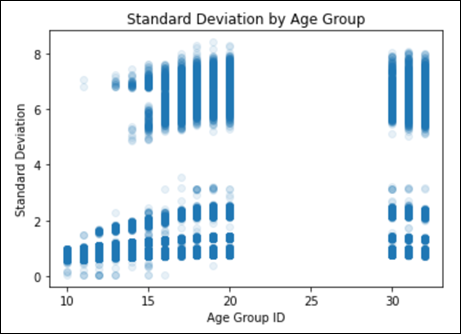

.. _2019_risk_exposure_fpg:

======================
Fasting Plasma Glucose 
======================

Risk Exposure Overview
----------------------

Glucose is the primary energy source of the cells of the human body. Homeostasis of glucose metabolism is assessed by measuring plasma glucose levels either by 
measuring fasting plasma glucose (FPG), performing an oral glucose tolerance test (OGTT), or analyzing glycated hemoglobin (HbA1c). These measurements can be used 
to classify subjects as having normal glucose metabolism (FPG <100 mg/dL, OGTT <140 mg/dL, HbA1c <5.7%), impaired glucose metabolism (FPG 100 to <126 mg/dL, 
OGTT 140 to 199 mg/dL, HbA1c 5.7 to 6.4%), or diabetes mellitus (FPG >=126 mg/dL, OGTT >=200 mg/dL, HbA1c >=6.5%). HbA1c is specific for diabetes but not very sensitive 
and has greater utility to monitor diabetes control over 2 to 3 months.

[Normal-FPG-Levels]_

GBD 2019 Modeling Strategy
--------------------------

In GBD, FPG is modeled as a continuous variable using ST-GPR based on estimates of mean FPG in a representative population, individual-level data of fasting plasma glucose measured from surveys, or    
estimates of diabetes prevalence in a representative population. 

Fasting plasma glucose is frequently tested or reported in surveys aiming at assessing the prevalence of diabetes mellitus. In these surveys, the case definition of diabetes may include both a glucose 
test and questions about treatment for diabetes. People with positive history of diabetes treatment may be excluded from the FPG test. Thus, the mean FPG in these surveys would not represent the mean FPG 
in the entire population. In this event, we estimated the prevalence of diabetes assuming a definition of FPG>126 mg/dL (7mmol/L), then crosswalked it to our reference case definition, and then predicted 
mean FPG.   

The theoretical minimum-risk exposure level (TMREL) for FPG is 4.8-5.4 mmol/L for those risk-outcome pairs where risk is assessed on a continuous basis. This was calculated by taking the person-year 
weighted average of the levels of FPG that were associated with the lowest risk of mortality in the pooled analyses of prospective cohort studies. The TMREL is no diabetes for those outcomes where risk 
is assessed on a categorical basis. The risk-outcome pairs are listed below, along with whether they are continuous or categorical.  

[Prospective-cohort-studies]_

.. list-table:: FPG Risk-Outcomes Pairs
   :widths: 15 20
   :header-rows: 1

   * - Type
     - Outcome
   * - Continuous
     - Ischemic heart disease
   * - Continuous
     - Ischemic stroke
   * - Continuous
     - Subarachnoid hemorrhage
   * - Continuous
     - Intracerebral hemorrhage
   * - Continuous
     - Peripheral vascular disease
   * - Continuous
     - Type 1 diabetes
   * - Continuous
     - Type 2 diabetes
   * - Continuous
     - Chronic kidney disease due to Type 1 diabetes
   * - Continuous
     - Chronic kidney disease due to Type 2 diabetes
   * - Categorical
     - Drug-resistant tuberculosis
   * - Categorical
     - Drug-susceptible tuberculosis
   * - Categorical
     - Multidrug-resistant tuberculosis without extensive drug resistance
   * - Categorical
     - Extensively drug-resistant tuberculosis
   * - Categorical
     - Liver cancer due to NASH
   * - Categorical
     - Liver cancer due to other causes
   * - Categorical
     - Pancreatic cancer
   * - Categorical
     - Ovarian cancer
   * - Categorical
     - Colorectal cancer
   * - Categorical
     - Bladder cancer
   * - Categorical
     - Lung cancer
   * - Categorical
     - Breast cancer
   * - Categorical
     - Glaucoma
   * - Categorical
     - Cataracts
   * - Categorical
     - Dementia

Vivarium Modeling Strategy
--------------------------

Scope
+++++

Mean FPG is a continuous exposure modelled in GBD using an ensemble distribution. FPG will be a target of lifestyle interventions in the simulation; 
the outcomes affected are described in the overall concept model document.

Restrictions
++++++++++++

.. list-table:: GBD 2019 Risk Exposure Restrictions
   :widths: 15 15 20
   :header-rows: 1

   * - Restriction Type
     - Value
     - Notes
   * - Male only
     - False
     -
   * - Female only
     - False
     -
   * - YLD only
     - False
     -
   * - YLL only
     - False
     -
   * - Age group start
     - 10
     - [25, 29 years) 
   * - Age group end
     - 235
     - [95, 125 years) 

Assumptions and Limitations
+++++++++++++++++++++++++++

The quantity of interest is exposure to the mean fasting plasma glucose level regardless of whether that 
level is naturally occurring or occurs via use of medication; we assume full reversibility of risk and 
do not account for duration of exposure to elevated FPG.

The values for FPG generated include exposures outside of a reasonably expected 
range. In addition, we do not think relative risks continue in a log 
linear pattern indefinitely, as is implemented in this model. A natural ceiling of 
risk associated with a single risk factor probably exists. 

To account for this, we implemented maximum and minimum 
exposures based on NHANES. The maximum was set to include 99.5% of NHANES data, meaning 
that 0.5% or fewer participants had values more extreme than the maximum. 

The minimum FPG is 1 and the maximum is 16 mmol/L. 

Another noticed issue with GBD data is striations in the standard deviation values. The graph below 
visually shows this issue. After speaking with GBD modelers, it seems that these are known issues 
and will not be addressed in GBD 2021. These striations are causing higher than expected FPG exposures. 
To account for this, we are instead using standard deviations derived from NHANES data. 

To create these new standard deviation draws, we bootstrapped the NHANES data to a random resampling of the original 
dataset, and then calculated the standard deviations by age/sex. The full workbook can be `found here <https://github.com/ihmeuw/vivarium_research_nih_us_cvd/blob/main/fpg_std_nhanes.R>`_

Data Description Tables
+++++++++++++++++++++++

The rei_id for FPG is 105.

.. list-table:: Components
   :widths: 15 15 20
   :header-rows: 1

   * - Components
     - ME_ID
     - Notes
   * - Mean exposure 
     - 8909 
     -
   * - Standard deviation 
     - /ihme/costeffectiveness/artifacts/vivarium_nih_us_cvd/raw_data/fpg_std_nhanes_draw_level.csv
     - Due to limited sample size in older age groups, please use the 80-85 age group for all simulants 80+ 
   * - Relative risk, continuous 
     - 9056 
     - Must be accessed with get_draws 
   * - Relative risk, categorical 
     - 9057 
     - Must be accessed with get_draws 

The exposure values should be used to represent the distribution of mean fasting plasma glucose 
levels that the simulants will be assigned in the model. 

Validation Criteria
+++++++++++++++++++

1. Does the mean in the model match the mean in GBD? 
2. Does the standard deviation in the model match the std in the artifact? 

References
----------

.. [Normal-FPG-Levels]
    Gurung, Purnima. `Plasma Glucose.` StatPearls [Internet]., U.S. National Library of Medicine, 2 Sept. 2020, www.ncbi.nlm.nih.gov/books/NBK541081/. 

.. [Prospective-cohort-studies]
    Singh GM, Danaei G, Farzadfar F, Stevens GA, Woodward M, Wormser D, et al. (2013) `The Age-Specific Quantitative Effects of Metabolic Risk Factors on Cardiovascular Diseases and Diabetes: A Pooled Analysis.` PLoS ONE 8(7): e65174. https://doi.org/10.1371/journal.pone.0065174