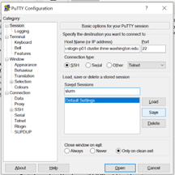
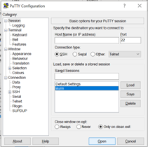
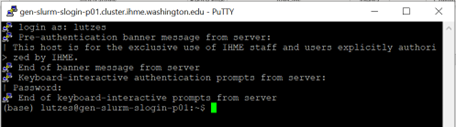

.. _computing:

==================================
Computing References and Resources
==================================
..
  Section title decorators for this document:

  ==============
  Document Title
  ==============

  Section Level 1 (#.0)
  +++++++++++++++++++++
  
  Section Level 2 (#.#)
  ---------------------

  Section Level 3 (#.#.#)
  ~~~~~~~~~~~~~~~~~~~~~~~

.. contents::
  :local:
  :depth: 3

.. _computing_interfaces:

1.0 Computing tools and how they interact
+++++++++++++++++++++++++++++++++++++++++

There are many different computing tools used at IHME and on Sim Science 
in particular. Many of these tools have their own trainings and in-depth 
resources available on the Hub or IHME Learn. Here, we seek to give an 
overview of how these tools interact and helpful links to other sources 
of information. 

It is worth noting that versions of this document exist for other teams on 
the Hub such as the `Cancer team <https://hub.ihme.washington.edu/display/CT/Setting+Up+Your+System>`_, 
and the `Demography team <https://hub.ihme.washington.edu/pages/viewpage.action?pageId=83205636>`_. 
This document seeks to add in Sim Science specific information and common practices. 

**The Cluster:**  a group of powerful computers provided by IHME for 
computationally intensive tasks.These computers can all access a shared 
file system.For researchers on sim science, 
the most common task we use the cluster for is opening Jupyter notebooks 
to run code. We will go into more depth on how to access the cluster and 
other tasks below. 

For general information on the cluster, please see the Module 3 within the 
IHME Learn training `Computational Infrastructure Level 1 <https://ihme.brightspace.com/d2l/home/7028>`_.

**Terminals:** You will need to use a terminal for both accessing the cluster 
and updating Vivarium documents. There are many options for terminals you can 
use. In section 2, we will review how to use terminals and how to select one 
for different applications. 

**GitHub:** GitHub is an internet hosting service we use to control versioning for 
code and documentation. It uses **Git** to track changes and allows for multiple 
users to contribute to the same files simultaneously without overwriting each other’s 
work. 

You will use GitHub by “cloning” a repository to your local machine or the cluster, 
allowing you to make changes to the documents in that repository, and then 
uploading those changes to Github again so other users can review and access the edits. 

GitHub is the online system we use, but the program you will use on your local machine or on the cluster 
is called “Git”. Git is a "version control system" used to track changes to projects. 
It can be used whenever you are operating within a GitHub repository. 

You can find a training for how to use Git and some basic commands in Module 2 within 
the IHME Learn training `Computational Infrastructure Level 1 <https://ihme.brightspace.com/d2l/home/7028>`_. 
We will see an example of how to clone and make edits using Git in the next section. 
It is worth noting that you can use Git and GitHub from BOTH the cluster and from 
terminals on your local computer. 

**Miniconda:** Miniconda aims to simplify package management and deployment for Python 
and R programming. On Sim Science, we use it for updating Vivarium documents. An 
example of this will be in the next section. 

Link to download `Miniconda <https://docs.conda.io/en/latest/miniconda.html>`_ 

**Text Editors:** For updating Vivarium documents, a text editor is needed. Most of 
the Sim Science team uses Sublime Text. Others on the team prefer Atom, which was 
created by GitHub and so works well with their system or Visual Studio Code. In addition to these, 
there are **many** other options including: Vim, Notepad++, and Gedit. 
If you have a prior favorite text editor, please use that! 

Link to download `Sublime Text <https://www.sublimetext.com/3>`_ 

Link to download `Atom <https://github.blog/2022-06-08-sunsetting-atom/>`_

**Python:** 

Python is the programming language most commonly used by the Sim Science team. 

Link to download `Python <https://www.python.org/downloads/>`_
Please see the below information on versioning for Python. 

**PyCharm:** PyCharm is an integrated development environment (IDE) for running 
Python code that is designed to be user friendly. 

Link to download `PyCharm <https://www.jetbrains.com/pycharm/download/#section=windows>`_ 

**R:** 

R is another programming language that is commonly used at IHME, but less commonly 
used on the Sim Science team. 

Link to download `R and R Studio <https://www.dataquest.io/blog/installing-r-on-your-computer/>`_ 

**R Studio:** R Studio is another IDE, similar to PyCharm, but for running R code that is designed to be user friendly. 

Link to download `R and R Studio <https://www.dataquest.io/blog/installing-r-on-your-computer/>`_ 

**Jupyter:** 

Jupyter is a web-based IDE. That essentially means it’s a place 
to write code and store code that is online and can integrate well with GitHub and the cluster. 
You can code in multiple languages in Jupyter including Python and R. This is more commonly 
used by the Sim Science team than PyCharm. Information on installing and using Jupyter is 
in the Accessing the Cluster section below. 

.. _terminal_access:

2.0 How to Access a Terminal
++++++++++++++++++++++++++++

A lot of work you will do requires you to access a terminal. A terminal is a way for you, a 
user, to communicate with a computer or computing system. There are many options for 
terminals. This section is written for someone not familiar with terminals, so if 
you have familiarity or favorite software please feel free to use those! 

Writing code into a terminal is called using the command line. IHME has a helpful training 
on the command line in Module 1 of the IHME Learn training `Computational Infrastructure Level 1 <https://ihme.brightspace.com/d2l/home/7028>`_. Command lines technically interact with an 
operating system on your computer. 

Operating systems are things like Windows or macOS (for Mac computers) that help a computer run and provide some basic 
infrastructure. Opening and saving files all happen through your operating system. You can change or 
install multiple operating systems, but that is quite uncommon. 

Some operating systems require different command lines to accomplish the same task. The IHME 
cluster uses the operating system Linux, and so the trainings provided are designed for Linux. 
Linux and macOS are very similar (they are both `Unix like <https://en.wikipedia.org/wiki/Unix-like>`_), but Windows is quite different. Therefore, we recommend for 
Windows users to install a terminal that can accept command lines written for Linux while 
still allowing you to "speak" with your Windows computer. 

**Recommended Terminals for Windows Users:** 

For updating Vivarium docs and interacting with GitHub, we recommend using Git Bash. This 
installs automatically with Git for Windows. However, some prefer 
the Windows Subsystem for Linux (WSL) for its user interface and tools. 

Link to download `Git and Git Bash <https://git-scm.com/>`_

Link to download `WSL <https://learn.microsoft.com/en-us/windows/wsl/install>`_

For accessing the cluster, we recommend using PuTTy or Bitvise. How to access the cluster 
is included in more depth in Section 3. 

**Recommended Terminals for Mac Users:** 

Since macOS is similar to Linux and is the base operating system on Mac computers, the 
pre-installed Terminal app can be used for all your terminal needs. 

**Other Options:**

Most terminals can also be used to access the cluster, although the common practice for 
Windows users on the Sim Science team is to use separate terminals for working on our local machine and 
for cluster access. 

Git can be used for updating Vivarium docs from Command Prompt.
Command Prompt is the terminal that is pre-installed on Windows computers,
but it is not Linux based. Therefore the command line
trainings will not be applicable if you use this option.

For Mac users, there are other terminal options such as iTerm2 which provides more 
features than Terminal. 

**Git Tokens:**

"Pushing" things to GitHub will create a prompt asking for a username and password. 
Counterintuitively, the username is your GitHub username, but the password is **NOT** 
your GitHub password, but instead is a unique token that you will need to create. 
`This website <https://techglimpse.com/git-push-github-token-based-passwordless/>`_ 
has information on creating a token. Many Sim Science users set their token to 
never expire and save the token where they can reference it later. However, this 
might compromise security in some cases, so regenerating a token periodically is 
best practice. 

There are also ways to set up terminals so that you do not have to enter this information 
every time. This is covered in the aliases section below. 

**How to Install Conda:**

Conda is an open-source, cross-platform, language-agnostic package manager and 
environment management system. In order to accomplish most tasks at IHME, you will 
need to install it. 

For your local computer, you can use this link to install Miniconda. We recommend installing 
Miniconda3 in 64 bit. 

Link to download `Miniconda <https://docs.conda.io/en/latest/miniconda.html>`_ 

On the cluster, you can use the version of conda provided by the Central Comp team. This is simplest and 
recommended. To do this, log into the cluster and then enter the code 
:code:`/ihme/code/central_comp/miniconda/bin/conda init`. This adds information on how to 
access conda to your bashrc file. You will need to restart the terminal for the 
changes to take effect. 

There are other ways to install conda, but the above is simplest. 

.. _cluster_access:

3.0 How to Access the Cluster
+++++++++++++++++++++++++++++

For this section, we will review cluster set up for a first-time user. Multiple other teams 
have versions of this information available on the Hub and there is duplicated information 
with the IHME Learn training for the Cluster. This will be a high-level overview focused on 
Sim Science specific tasks. 

Some Hub pages on accessing the cluster: 

- `Science and Engineering <https://hub.ihme.washington.edu/pages/viewpage.action?pageId=72807457>`_
- `Cost Effectiveness team <https://hub.ihme.washington.edu/display/CE/Setting+up+cluster+access>`_

The cluster is accessed through the Secure Shell protocol or SSH for short. 
To access the cluster, an SSH "client" is needed. The client is an application 
that can make SSH connections. 

Both Mac and Windows include command-line SSH clients by default. This means 
that most terminals can be used to access the cluster. As mentioned above, 
feel free to use any terminal you are familiar with! 

IHME Learn provides information on accessing the cluster from the command line in 
Module 3 within the IHME Learn training `Computational Infrastructure Level 1 <https://ihme.brightspace.com/d2l/home/7028>`_.

Mac users have to use the above method for cluster access. 
For Windows users, there are some SSH clients that come with a graphical user 
interface (e.g., you can "click" on things rather than type commands only) 
which are more intuitive and we recommend if you are new to this type of 
computing work. 

As mentioned above, for Windows users this is PuTTY or Bitvise 

Link to download `PuTTY or Bitvise <https://www.putty.org/>`_

.. _cluster_access_putty:

Accessing the Cluster from PuTTY
--------------------------------

We provide step by step instructions for accessing the cluster for the 
first time. These instructions are for PuTTY, if you are using a different 
SSH client search for similar information on the Hub or ask a team member for help. 

For your first time on PuTTY, you will set up and save the instructions for a slurm session. To do this: 

#. Open up PuTTY 
#. Under “Host Name” enter: gen-slurm-slogin-p01.cluster.ihme.washington.edu 
#. Under “Port” enter: 22 
#. Select SSH connection type 
#. Under “Saved Sessions” enter: slurm (or any other name you choose!) 
#. Hit “Save” 

Next and for all future times accessing the cluster, you can simply select slurm from the list of saved sessions and hit “Open”. 

Once you open a PuTTY terminal, you will have to enter your username and IHME 
password. After that you are connected to the cluster and can enter command 
lines from your trainings!  

.. _cluster_access_bash:

Your Bash Configuration Files 
-----------------------------

Bash files contain commands you would enter into a command line, but 
specifically ones you will use very often. For example, every time you 
want to open a Jupyter session, the cluster needs certain information 
and requirements. To find this information, it looks in your Bash files 
rather than asking you to enter the same information every time. 

However, Bash files can be confusing since it is less obvious when the 
information is being used or what it is used for. Therefore, we have 
provided a copy-and-paste formatting for information to be added to 
your Bash files. 

.. todo::

  - Confirm and paste in bash files 
  - Get Zeb's help in explaining Bash files better 
  - Moving up since this is needed for a lot of things below 

.. _cluster_access_command:

Command Line 
------------

Once you have accessed the cluster, you can do a number of things! These are best 
covered through a few different trainings: 

#. You can move files, check permissions, and explore directories using the command line. More information on this can be found in Module 1 within the IHME Learn training `Computational Infrastructure Level 1 <https://ihme.brightspace.com/d2l/home/7028>`_.
#. You can start jobs on the cluster, simple tasks are covered in Module 3 within the IHME Learn training `Computational Infrastructure Level 1 <https://ihme.brightspace.com/d2l/home/7028>`_. 

If you need help applying any of these trainings to a practical situation, please ask! 

.. _cluster_access_jupyter:

Accessing Jupyter or RStudio from the Cluster
---------------------------------------------

The other most common task for a Sim Science researcher on the cluster is to 
start a Jupyter session. Information on how to do this can be found on the Hub 
page `here <https://hub.ihme.washington.edu/display/DataScience/My+first+Jupyter+Notebook>`_. You will also need to update your Bash configuration files in order to complete 
this, which is covered in depth in the section :ref:`Your Bash Files <cluster_access_bash>`. 

Once you have started a session, you will be able to create code, test simulation 
results, or do quick calculations. Once you have finished coding, you’ll want to 
follow the same steps as outlined above in the :ref:`Contributing New Documentation <contributing>` 
section to save the information on GitHub. All of the same Git commands work on 
the cluster the same way as on your local machine. 

You will need to make sure that you have cloned your repository and are in the 
appropriate working directory while logged into the cluster. Then you can add, 
check the status, commit, and push information in a similar way.
Researchers will generally create a new GitHub repository with a name starting 
with :code:`vivarium_research`, e.g. :code:`vivarium_research_ciff_sam`.
This will store code written by researchers, but not the simulation code itself, which is managed by
the engineers in a different repository. Having separate repositories ensures that 
researchers do not disturb engineering workflow. 

.. _cluster_access_other:

Aliases and Other Cluster Tips
------------------------------

**Aliases:**

Often, it can be annoying to type the same information repeatedly everytime you 
access the cluster. To help account for this you can create aliases. These are 
short-hand commands for commonly typed things. 

Here is a Hub page written by the `Cost Effectiveness team <https://hub.ihme.washington.edu/display/CE/Setting+up+cluster+access>`_ on how to set up aliases. 

Here, we provide a few copy and paste aliases you can add to your bashrc file. Be 
sure to update the names to match your project and username. Also, note that once 
you include these you will need to restart your cluster connection for them to take 
effect. 

The aliases below are: 

#. Starting a Jupyter notebook in your project's repository 
#. Starting an srun session (note: you can change the memory or other parameters before saving)
#. Checking on your current jobs on the cluster 

.. code-block:: bash 
  :linenos:

  $ alias jupyter="sh /ihme/singularity-images/rstudio/shells/jpy_rstudio_sbatch_script.sh -e <INSERT_ENVIRONMENT_NAME> -c /ihme/code/central_comp/miniconda/bin/activate -t lab -d /ihme/code/<INSERT_USERNAME>/<INSERT_PROJECT_REPO> -A proj_simscience -p i.q" 
  $ alias srun="srun --mem=5G -c 1 -A proj_simscience -p all.q --pty bash" 
  $ alias squeue="squeue -u <INSERT_USERNAME>" 

If you ever forget what settings you included in an alias you can enter the command :code:`type <ALIAS_NAME>` 
into the terminal and the full alias code will be displayed. 

This is useful if you want to change the parameters of a command as well - simply display the alias code, copy 
and paste the command into the terminal, and then make needed adjustments before running. 

**Setting up Easier Cluster Access:**

There are ways to configure access so that getting on the cluster is fewer steps. 

For those using PuTTY, you can configure settings such that you do not need to type 
your username and password every time you access the cluster. This 
`Hub page <https://hub.ihme.washington.edu/display/IHD/PuTTY>`_ 
does a very good job of outlining the steps. However, note that for step 2 of 
"Configure PuTTY Itself", this author needed to enter "gen-slurm-slogin-p01.cluster.ihme.washington.edu" 
instead of "cluster-submit1.ihme.washington.edu", which is listed on the page. 

A similar procedure can be used for Bitvise, instructions are on `this webpage <https://www.bitvise.com/getting-started-public-key-bitvise>`_. 

For those using command line to access the cluster, you can do two things for 
easier access: 

#. Set up an alias to allow for a shorter command line to access the cluster 
#. Configure your computer to not need your username and password everytime 

For both of these, this Hub page by the `Cost Effectiveness team <https://hub.ihme.washington.edu/display/CE/Setting+up+cluster+access>`_ has a good step by step guide to configuring your 
setup. If you need help with this process, reach out to someone on the team. 

**Long Cluster Jobs:**
When your computer falls asleep, it will stop access to the cluster and cut 
off any interactive jobs (i.e. :code:`srun` sessions) that were currently 
running. This can be problematic if a command needs to run overnight. There 
are a few different options to account for this including: screen, MOSH, or 
tmux. If you need to use these, ask a teammate.

.. _cluster_access_files:

File Systems and Storage 
------------------------

The cluster can be confusing with where to store code and data. Our 
team has created some best practices to use for data storage. 

For code, please create a new directory under :code:`/ihme/code` with your 
username. For example, this might be :code:`/ihme/code/lutzes`. 
You should clone GitHub respositories to this location and have 
all Jupyter notebooks and other code stored here. 

For data files, there are two locations based on the size of the 
data file. 

#. For small data files, store these on GitHub in the same location as your code. Examples might include: a list of nicknames, disease severity proportions by age/sex group, or drug efficacy data. The absolute maximum file size on GitHub is 100 megabytes, but be mindful of including any file over 10 megabytes, especially if there are many such files or if the file changes frequently. Too many large files can slow down the process of making new clones of the repository.
#. For large files, store these in a shared location on the cluster. Considering making a new folder for each project for data storage. 
#. When you decide where to store data, please also consider any data restrictions that might exist. 

Regardless of where you store data, it is important to track updates 
to data files carefully. Engineers might copy and paste a file into a 
new location, so updating the file might not actually change what is 
being used in the sim. Therefore, follow these steps: 

#. Use the naming conventions below to ensure consistency. 
#. Always version up rather than replacing a data file that is used by engineering or is not tracked in GitHub (e.g., create a new file with the current date rather than just replacing with a different file of the same name). 
#. Include the exact file name and location in the docs. This means if you version up a data file, you will need to update the docs to reflect the new name. This ensures the engineers are aware of any changes. 

For consistency, please use this naming convention for all files: :code:`FILENAME_20230309.ext`. 
For example, this might be :code:`heart_failure_proportions_20230310.csv` 

.. _conda_environments:

4.0 Conda Environments
++++++++++++++++++++++

A conda environment is a "workspace" in which you can run code with certain 
packages installed. You can install a package in a conda environment without 
affecting any other conda environments: they are **isolated** from one another.

This allows you to have multiple projects that each have their own separate set 
of packages and package versions. Below are some common questions on environments.

**What is an environment again?**
It’s a "workspace" that contains a specific collection of packages that 
you have installed. Basically, it is a shortcut to have all the relevant 
packages you need for a project in one place. 

**What are the advantages to having separate environments?**
Over time, new versions of packages come out. 
It can therefore be helpful to create new environments to ensure you have 
the latest package versions. 

While you can uninstall and reinstall new versions of packages in existing 
environments, this can sometimes cause errors in existing code. Therefore, 
it is helpful to keep environments that work with existing code 
and to create new environments for new projects and install the 
latest versions of packages in those. 

**What environments are available for me to use?**
The Central Computation team maintains an environment, which anyone at IHME can use,
that includes all the packages necessary for accessing GBD results (plus some other 
common packages). However, this environment is read-only. Read-only means you can 
use it, but you can't change it. So if you want any packages not included there, 
you will need to make your own environment.

Another option is to copy the engineering team's environment for a particular 
project. For this option, you will technically make your own environment, but rather 
than selecting packages by yourself, you will just install everything the engineering 
team is using. However, since you are making your own environment you can also add 
new packages or update as needed. 

If you are not familiar with environments, we recommend this option as it is straightforward 
but still allows you to make a personal environment. 

Instructions for how to do this are found in the readme section of the engineering GitHub page 
for your project. For example, these are the `CVD environment instructions <https://github.com/ihmeuw/vivarium_nih_us_cvd>`_. If you are having trouble locating these for your projects, ask an engineering team member. 

Another common option is to make a make your own environment for a project. 
If you are familiar with environments, this is a recommended approach. It is 
common practice for each researcher to make a new environment for each 
project they work on. They may even make multiple if they want to use different 
versions in different parts of a project.

**How do you make a new environment?** 
Before you can make a new environment, ensure that you have git and conda installed. 
Instructions for this can be found above if needed. 

Once these are installed, navigate in your preferred terminal. Ensure that you are 
in the right location to have this environment on your local machine or on the cluster 
as needed. Then, follow the below code: 

.. code-block:: bash 
  :linenos:

  $ conda create --name=INSERT_NAME_HERE python=3.8
  $ #conda will download python and base dependencies
  $ conda activate ENVIRONMENT_NAME 
  (ENVIRONMENT_NAME) $ pip install <INSERT PACKAGE NAME HERE> 

From here, repeat the pip install line for all packages you wish to include. 

**How do I install new information to an existing environment?**
Once you have made a new environment, you can add some commonly used packages 
using :code:`pip install package`. A list of common packages to install is provided 
below. You can also include multiple packages in a single command. For convenience, 
a code snippet you can copy and paste is included here with some common packages. 

.. code-block:: bash 
  :linenos:

  $ pip install numpy pandas scipy risk_distributions statsmodels matplotlib seaborn db_queries get_draws gbd_mapping 

**Common Packages:**

Packages for data manipulation and statistics: 

- NumPy (usually imported as np)
- Pandas (usually imported as pd)
- SciPy 
- risk_distributions (`more information <https://risk-distributions.readthedocs.io/en/latest/>`_)
- statsmodels (usually imported as sm or smf)

Packages for visualization: 

- Matplotlib (usually imported as plt)
- Seaborn (usually imported as sns)

Packages for accessing GBD data (`shared function information <https://hub.ihme.washington.edu/display/SF/Shared+Functions+Home>`_):

- db_queries 
- get_draws 
- gbd_mapping (`further information <https://vivarium.readthedocs.io/projects/gbd-mapping/en/latest/gbd_mapping.html>`_)

**Trouble Shooting:**

Packages usually have to be in your environment before you can :code:`import` 
them in Python. If an :code:`import` command fails, try installing the package 
to the environment and restarting the Jupyter kernel (for example Kernel -> 
Restart in the Jupyter Notebook menu).

However, there are some common packages that do not require a pip install and come 
pre-loaded into Python. A partial list is included below for clarity. These do still need 
to be imported at the start of a notebook. 

- math 
- warnings 
- random 

The IHME specific packages for accessing GBD data should only be used on the cluster (db_queries, 
get_draws and gbd_mapping). If you are creating an environment on your local machine, these will 
not install correctly and should be removed from the pip statement above. 

Some packages have dependencies on other python packages or are not able to be 
installed using the pip command. If you attempt to install a package and find errors, 
ask a friend for help. 

**When should I use the GBD environment vs making my own?**
In general, it is best practice to use your own environment for project 
work. However, the GBD environment is helpful for small tasks and non-project work. 

**I installed a package to this environment on the cluster - why won't it work?** 
Your local machine and the cluster are different and don’t "speak" between environments. 
So if you install a package to an environment while on the cluster, it won't 
show on your local machine. 

**What is Python vs Conda Vs Anaconda?**
Python is the name of a programming language. It is the name for the syntax 
used in code. 

Conda is a package manager that we use to create and maintain environments. It is 
designed to allow for easier package installation and control across team members. 

Anaconda is a software you can use to install Python and conda, and create conda 
environments, on Windows. It is specifically designed for data science. 

